| ✅    | **Working**     |
|-------|-----------------|
| ⚠️    | **Problematic** |
| ❌    | **Not Working** |
| ❔    | **Unknown**     |

## Supported Devices

<b><strong>Exynos Devices</strong></b>

 

<b><strong>Exynos 9830 Devices</strong></b>

## Samsung Galaxy Note 20 5G

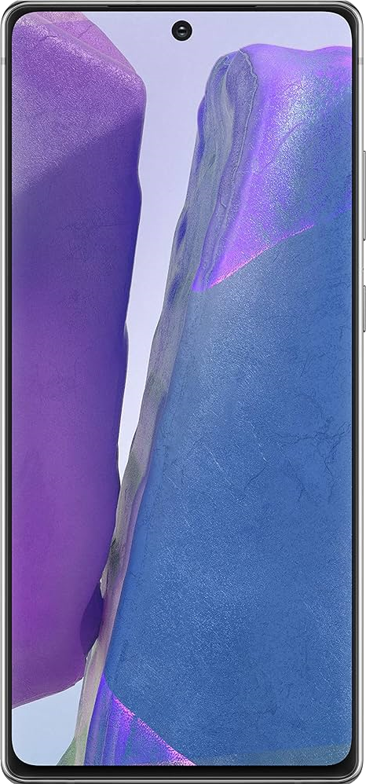

**State: Inactive**  
**Codename: c1s**  
**Maintainer: None**  
**Contributors: [halal-beef](https://github.com/halal-beef/), [BotchedRPR](https://github.com/BotchedRPR/)**  
**Tester: None**

### UEFI Status

| Feature            | Description | State |
|:-------------------|:------------|:-----:|
| Display            |             | ✅    |
| Internal Storage   |             | ❌    |
| Side Buttons       |             | ✅    |
| USB Host Mode      |             | ❌    |
| USB Device Mode    |             | ❌    |
| USB Power Delivery |             | ❌    |
| SD Card            |             | ❌    |
| Windows Boot       |             | ❌    |
| Linux Boot         |             | ❌    |

## Samsung Galaxy S20 5G

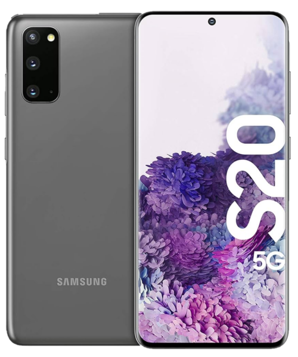

**State: Active**  
**Codename: x1s**  
**Maintainer: [halal-beef](https://github.com/halal-beef/)**  
**Contributors: [halal-beef](https://github.com/halal-beef/)**  
**Tester: [halal-beef](https://github.com/halal-beef/)**

### UEFI Status

| Feature            | Description | State |
|:-------------------|:------------|:-----:|
| Display            |             | ✅    |
| Internal Storage   |             | ❌    |
| Side Buttons       |             | ✅    |
| USB Host Mode      |             | ❌    |
| USB Device Mode    |             | ❌    |
| USB Power Delivery |             | ❌    |
| SD Card            |             | ❌    |
| Windows Boot       |             | ❌    |
| Linux Boot         |             | ❌    |

## Galaxy S20 FE

**State: Inactive**  
**Codename: r8s**  
**Maintainer: None**  
**Contributors: [halal-beef](https://github.com/halal-beef/), [Sota4Ever](https://github.com/Sota4Ever/)**  
**Tester: None**

### UEFI Status

| Feature            | Description | State |
|:-------------------|:------------|:-----:|
| Display            |             | ✅    |
| Internal Storage   |             | ❌    |
| Side Buttons       |             | ✅    |
| USB Host Mode      |             | ❌    |
| USB Device Mode    |             | ❌    |
| USB Power Delivery |             | ❌    |
| SD Card            |             | ❌    |
| Windows Boot       |             | ❌    |
| Linux Boot         |             | ❌    |

  

<b><strong>Exynos 9820 Devices</strong></b>

## Samsung Galaxy S10

**State: Inactive**  
**Codename: beyond1lte**  
**Maintainer: [Robotix](https://github.com/Robotix22/)**  
**Contributors: [Robotix](https://github.com/Robotix22/)**  
**Tester: [Robotix](https://github.com/Robotix22/)**

### UEFI Status

| Feature            | Description | State |
|:-------------------|:------------|:-----:|
| Display            |             | ✅    |
| Internal Storage   |             | ❌    |
| Side Buttons       |             | ✅    |
| USB Host Mode      |             | ❌    |
| USB Device Mode    |             | ❌    |
| USB Power Delivery |             | ❌    |
| SD Card            |             | ❌    |
| Windows Boot       |             | ❌    |
| Linux Boot         |             | ❌    |

  

<b><strong>Exynos 9810 Devices</strong></b>

## Samsung Galaxy S9

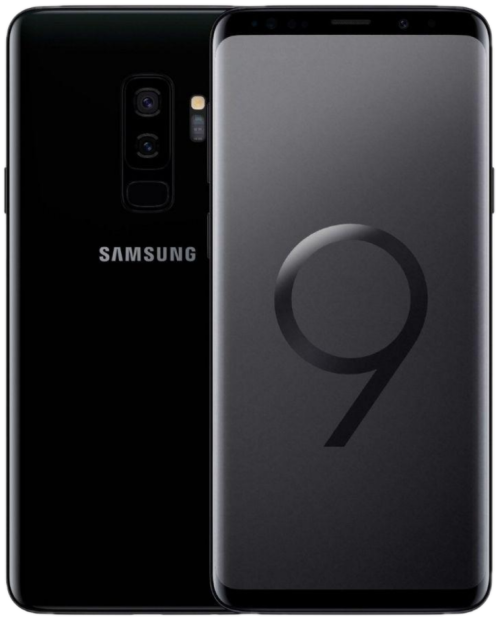

**State: Inactive**  
**Codename: starlte**  
**Maintainer: [Robotix](https://github.com/Robotix22/)**  
**Contributors: [Robotix](https://github.com/Robotix22/)**  
**Tester: [Robotix](https://github.com/Robotix22/)**

### UEFI Status

| Feature            | Description | State |
|:-------------------|:------------|:-----:|
| Display            |             | ✅    |
| Internal Storage   |             | ❌    |
| Side Buttons       |             | ✅    |
| USB Host Mode      |             | ❌    |
| USB Device Mode    |             | ❌    |
| USB Power Delivery |             | ❌    |
| SD Card            |             | ❌    |
| Windows Boot       |             | ❌    |
| Linux Boot         |             | ❌    |

  

<b><strong>Exynos 7885 Devices</strong></b>

## Samsung Galaxy A10

**State: Inactive**  
**Codename: a10**  
**Maintainer: None**  
**Contributors: [snaccy](https://github.com/sonic011gamer/)**  
**Tester: None**

### UEFI Status

| Feature            | Description | State |
|:-------------------|:------------|:-----:|
| Display            |             | ✅    |
| Internal Storage   |             | ❌    |
| Side Buttons       |             | ✅    |
| USB Host Mode      |             | ❌    |
| USB Device Mode    |             | ❌    |
| USB Power Delivery |             | ❌    |
| SD Card            |             | ❌    |
| Windows Boot       |             | ❌    |
| Linux Boot         |             | ❌    |

## Samsung Galaxy A7

**State: Inactive**  
**Codename: a7**  
**Maintainer: None** 
**Contributors: [Icesito](https://github.com/Icesito68/)**  
**Tester: None**

### UEFI Status

| Feature            | Description | State |
|:-------------------|:------------|:-----:|
| Display            |             | ✅    |
| Internal Storage   |             | ❌    |
| Side Buttons       |             | ✅    |
| USB Host Mode      |             | ❌    |
| USB Device Mode    |             | ❌    |
| USB Power Delivery |             | ❌    |
| SD Card            |             | ❌    |
| Windows Boot       |             | ❌    |
| Linux Boot         |             | ❌    |

  

  

---

<b><strong>Snapdragon Devices</strong></b>

 

<b><strong>Snapdragon 8 Gen 2 Devices</strong></b>

 

<b><strong>OnePlus Devices</strong></b>

## OnePlus 12R / Ace 3

**State: Inactive**  
**Codename: aston**  
**Maintainers: [Shandorman](https://github.com/jiganomegsdfdf/)**  
**Contributors: [Robotix](https://github.com/Robotix22/), [Shandorman](https://github.com/jiganomegsdfdf/)**  
**Testers: [Shandorman](https://github.com/jiganomegsdfdf/)**

### UEFI Status

| Feature            | Description | State |
|:-------------------|:------------|:-----:|
| Display            |             | ✅    |
| Internal Storage   |             | ✅    |
| Side Buttons       |             | ✅    |
| USB Host Mode      |             | ❌    |
| USB Device Mode    |             | ✅    |
| USB Power Delivery |             | ❌    |
| Mass Storage       |             | ✅    |
| Windows Boot       |             | ✅    |
| Linux Boot         |             | ✅    |

### OS Status

<table>
<tr><th>Windows</th><th>Linux</th></tr>
<tr><td>

> NOTE: Only Windows Builds that are Build Nr. 26090 or above work!

| Feature              | Description   | State |
|:---------------------|:--------------|:-----:|
| Internal Storage     |               | ✅    |
| Side Buttons         |               | ❌    |
| Proximity Sensor     |               | ❌    |
| Light Sensor         |               | ❌    |
| Accelerometer Sensor |               | ❌    |
| Compass Sensor       |               | ❌    | 
| Gyroscope Sensor     |               | ❌    |
| Fingerprint Sensor   |               | ❌    |
| NFC Sensor           |               | ❌    |
| Temperature Sensor   |  Only battery | ⚠️    |
| Battery              |               | ✅    |
| USB Host Mode        |               | ❌    |
| USB Device Mode      |               | ❔    |
| USB Power Delivery   |               | ❌    |
| Charging             | No indication | ⚠️    |
| WLAN                 |               | ❌    |
| CPU                  |               | ✅    |
| Touchscreen          |               | ❌    |
| Bluetooth            |               | ❌    |
| GPS                  |               | ❌    |
| Speakers             |               | ❌    |
| Microphone           |               | ❌    |
| GPU                  |               | ❌    |
| Camera               |               | ❌    |
| Mobile Data          |               | ❌    |
| Display              |               | ✅    | 
| Vibration            |               | ❌    |

</td>
<td>

> NOTE: Linux Requires: [Mainline kernel](https://github.com/jiganomegsdfdf/aston-mainline)

| Feature              | Description   | State |
|:---------------------|:--------------|:-----:|
| Internal Storage     |               | ✅    |
| Side Buttons         |               | ✅    |
| Proximity Sensor     |               | ❌    |
| Light Sensor         |               | ❌    |
| Accelerometer Sensor |               | ❌    |
| Compass Sensor       |               | ❌    | 
| Gyroscope Sensor     |Userspace issue| ⚠️    |
| Fingerprint Sensor   |               | ❌    |
| NFC Sensor           |    Untested   | ⚠️    |
| Temperature Sensor   |               | ✅    |
| Battery              |               | ✅    |
| USB Host Mode        |               | ❔    |
| USB Device Mode      |               | ✅    |
| USB Power Delivery   |               | ❌    |
| Charging             |  100W = 1.1W  | ⚠️    |
| WLAN                 |               | ✅    |
| CPU                  |               | ✅    |
| Touchscreen          |               | ✅    |
| Bluetooth            |               | ✅    |
| GPS                  |               | ❌    |
| Speakers             |               | ❌    |
| Microphone           |               | ❌    |
| GPU                  |               | ✅    |
| Camera               |               | ❌    |
| Mobile Data          |               | ❌    |
| Display              |               | ✅    | 
| Vibration            |               | ❌    |

</td></tr> </table>

  

---

  

<b><strong>Snapdragon 8 Gen 1/8+ Gen 1 Devices</strong></b>

 

<b><strong>Nothing Devices</strong></b>

## Nothing Phone (2)

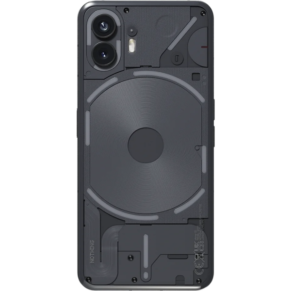

**State: Inative**  
**Codename: pong**  
**Maintainers: [index986](https://github.com/index986/)**  
**Contributors: [Robotix](https://github.com/Robotix22/), [N1kroks](https://github.com/N1kroks/), [index986](https://github.com/index986/)**  
**Testers: [index986](https://github.com/index986/), People from tg/discord nothing group**

### UEFI Status

| Feature            | Description       | State |
|:-------------------|:------------------|:-----:|
| Display            |                   | ✅    |
| Internal Storage   |                   | ✅    |
| Side Buttons       |                   | ✅    |
| USB Host Mode      |                   | ❌    |
| USB Device Mode    |                   | ✅    |
| USB Power Delivery |                   | ❌    |
| Mass Storage       |                   | ✅    |
| Windows Boot       |                   | ✅    |
| Linux Boot         |                   | ❌    |

### OS Status

<table>
<tr><th>Windows</th></tr>
<tr><td>

| Feature              | Description   | State |
|:---------------------|:--------------|:-----:|
| Internal Storage     |               | ✅    |
| Side Buttons         |               | ❌    |
| Proximity Sensor     |               | ❌    |
| Light Sensor         |               | ❌    |
| Accelerometer Sensor |               | ❌    |
| Compass Sensor       |               | ❌    | 
| Gyroscope Sensor     |               | ❌    |
| Fingerprint Sensor   |               | ❌    |
| NFC Sensor           |               | ❌    |
| Temperature Sensor   |               | ❌    |
| Battery              |               | ❌    |
| USB Host Mode        |               | ✅    |
| USB Device Mode      |               | ❌    |
| USB Power Delivery   |               | ❌    |
| Charging             |               | ❌    |
| WLAN                 |               | ❌    |
| CPU                  |               | ✅    |
| Touchscreen          |               | ❌    |
| Bluetooth            |               | ❌    |
| GPS                  |               | ❌    |
| Speakers             |               | ❌    |
| Microphone           |               | ❌    |
| GPU                  |               | ❌    |
| Camera               |               | ❌    |
| Mobile Data          |               | ❌    |
| Display              |               | ✅    | 
| Vibration            |               | ❌    |

</td></tr> </table>

  

<b><strong>Samsung Devices</strong></b>

## Samsung Galaxy Tab S8 5G

**State: Inactive**  
**Codename: gts8**  
**Maintainer: None**  
**Contributors: [Robotix](https://github.com/Robotix22/)**  
**Tester: None**

### UEFI Status

| Feature            | Description              | State |
|:-------------------|:-------------------------|:-----:|
| Display            |                          | ✅    |
| Internal Storage   |                          | ✅    |
| Side Buttons       | Pwr Button does not work | ⚠️    |
| USB Host Mode      |                          | ❌    |
| USB Device Mode    |                          | ✅    |
| USB Power Delivery |                          | ❌    |
| Mass Storage       |                          | ❔    |
| SD Card            |                          | ❌    |
| Windows Boot       |                          | ✅    |
| Linux Boot         |                          | ❌    |

### OS Status

<table>
<tr><th>Windows</th></tr>
<tr><td>

| Feature              | Description         | State |
|:---------------------|:--------------------|:-----:|
| Internal Storage     | Needs Special Setup | ✅    |
| SD Card              |                     | ❌    |
| Side Buttons         |                     | ❌    |
| Proximity Sensor     |                     | ❌    |
| Light Sensor         |                     | ❌    |
| Accelerometer Sensor |                     | ❌    |
| Compass Sensor       |                     | ❌    |
| Gyroscope Sensor     |                     | ❌    |
| Fingerprint Sensor   |                     | ❌    |
| Hall Sensor          |                     | ❌    |
| Temperature Sensor   |                     | ❌    |
| Battery              |                     | ❌    |
| USB Host Mode        |                     | ❌    |
| USB Device Mode      |                     | ❌    |
| USB Power Delivery   |                     | ❌    |
| Charging             |                     | ❌    |
| WLAN                 |                     | ❌    |
| CPU                  | One Core only       | ⚠️    |
| Touchscreen          |                     | ❌    |
| Bluetooth            |                     | ❌    |
| GPS                  |                     | ❌    |
| Speakers             |                     | ❌    |
| Microphone           |                     | ❌    |
| GPU                  |                     | ❌    |
| Camera               |                     | ❌    |
| Mobile Data          |                     | ❌    |
| Display              |                     | ✅    |
| Vibration            |                     | ❌    |
| S Pen                |                     | ❌    |

</td></tr> </table>

  

<b><strong>Xiaomi Devices</strong></b>

## Xiaomi 12 Pro

**State: Inactive**  
**Codename: zeus**  
**Maintainers: None**  
**Contributors: [Robotix](https://github.com/Robotix22/), [2petro](https://github.com/2Petro/)**  
**Testers: None**

### UEFI Status

| Feature            | Description | State |
|:-------------------|:------------|:-----:|
| Display            |             | ✅    |
| Internal Storage   |             | ✅    |
| Side Buttons       |             | ✅    |
| USB Host Mode      |             | ❌    |
| USB Device Mode    |             | ✅    |
| USB Power Delivery |             | ❌    |
| Mass Storage       |             | ❔    |
| Windows Boot       |             | ❌    |
| Linux Boot         |             | ❌    |

  

---

  

<b><strong>Snapdragon 888/888+ Devices</strong></b>

 

<b><strong>Asus Devices</strong></b>

## Asus ROG Phone 5

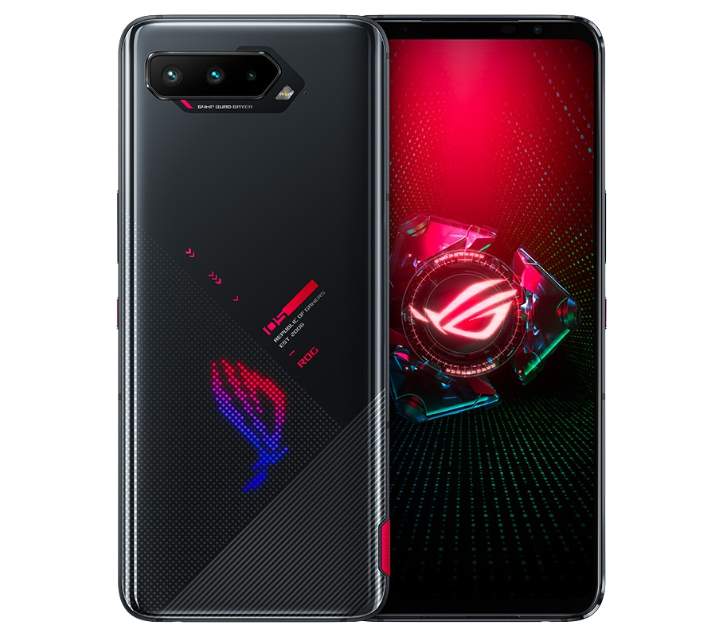

**State: Inactive**  
**Codename: i005d**  
**Maintainer: None**  
**Contributors: [Robotix](https://github.com/Robotix22/), [alfaonyt](https://github.com/alfaonyt/)**  
**Tester: None**

### UEFI Status

| Feature            | Description       | State |
|:-------------------|:------------------|:-----:|
| Display            |                   | ✅    |
| Internal Storage   |                   | ✅    |
| Side Buttons       |                   | ✅    |
| USB Host Mode      |                   | ✅    |
| USB Device Mode    |                   | ❌    |
| USB Power Delivery |                   | ❌    |
| Mass Storage       |Needs Device Mode  | ❌    |
| Windows Boot       |                   | ❌    |
| Linux Boot         |                   | ❌    |

  

<b><strong>Samsung Devices</strong></b>

## Samsung Galaxy S21 FE

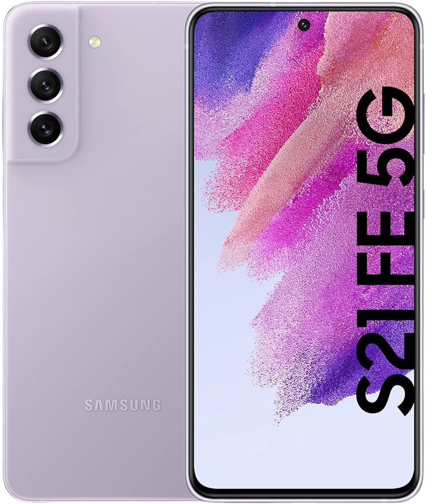

**State: Inactive**  
**Codename: r9qb2**  
**Maintainer: None**  
**Contributors: [Robotix](https://github.com/Robotix22/),[Nikroks](https://github.com/N1kroks/), [Icesito68](https://github.com/Icesito68/)**  
**Tester: None**

### UEFI Status

| Feature            | Description              | State |
|:-------------------|:-------------------------|:-----:|
| Display            |                          | ✅    |
| Internal Storage   |                          | ✅    |
| Side Buttons       |                          | ✅    |
| USB Host Mode      |                          | ❌    |
| USB Device Mode    |                          | ❌    |
| USB Power Delivery |                          | ❌    |
| Mass Storage       | Needs Device Mode        | ❌    |
| Windows Boot       |                          | ✅    |
| Linux Boot         |                          | ❌    |

### OS Status

<table>
<tr><th>Windows</th></tr>
<tr><td>

> NOTE: Only Windows Canary Builds that are Build Nr. 26090 or above work!

| Feature              | Description         | State |
|:---------------------|:--------------------|:-----:|
| Internal Storage     | Needs Special Setup | ✅    |
| Side Buttons         |                     | ❌    |
| Proximity Sensor     |                     | ❌    |
| Light Sensor         |                     | ❌    |
| Accelerometer Sensor |                     | ❌    |
| Compass Sensor       |                     | ❌    |
| Gyroscope Sensor     |                     | ❌    |
| Fingerprint Sensor   |                     | ❌    |
| Hall Sensor          |                     | ❌    |
| Temperature Sensor   |                     | ❌    |
| Battery              |                     | ❌    |
| USB Host Mode        |                     | ❌    |
| USB Device Mode      | Needs Special Setup | ✅    |
| USB Power Delivery   |                     | ❌    |
| Charging             |                     | ❌    |
| WLAN                 |                     | ❌    |
| CPU                  |                     | ✅    |
| Touchscreen          |                     | ❌    |
| Bluetooth            |                     | ❌    |
| GPS                  |                     | ❌    |
| Speakers             |                     | ❌    |
| Microphone           |                     | ❌    |
| GPU                  |                     | ❌    |
| Camera               |                     | ❌    |
| Mobile Data          |                     | ❌    |
| Display              |                     | ✅    |
| Vibration            |                     | ❌    |

</td></tr> </table>

## Samsung Galaxy Z Fold 3 5G

**State: Inactive**  
**Codename: q2q**  
**Maintainer: [Azkali](https://github.com/Azkali/)**  
**Contributors: [Robotix](https://github.com/Robotix22/), [Azkali](https://github.com/Azkali/)**  
**Tester: [Azkali](https://github.com/Azkali/)**

### UEFI Status

| Feature            | Description              | State |
|:-------------------|:-------------------------|:-----:|
| Display            |                          | ✅    |
| Internal Storage   |                          | ✅    |
| Side Buttons       | Pwr Button does not work | ⚠️    |
| USB Host Mode      |                          | ❌    |
| USB Device Mode    |                          | ✅    |
| USB Power Delivery |                          | ❌    |
| Mass Storage       |                          | ❔    |
| Windows Boot       | Windows PE only          | ⚠️    |
| Linux Boot         |                          | ❌    |

### OS Status

<table>
<tr><th>Windows</th></tr>
<tr><td>

| Feature              | Description   | State |
|:---------------------|:--------------|:-----:|
| Internal Storage     |               | ❌    |
| Side Buttons         |               | ❌    |
| Proximity Sensor     |               | ❌    |
| Light Sensor         |               | ❌    |
| Accelerometer Sensor |               | ❌    |
| Compass Sensor       |               | ❌    |
| Gyroscope Sensor     |               | ❌    |
| Barometer Sensor     |               | ❌    |
| Pedometer Sensor     |               | ❌    |
| Geomagnetic Sensor   |               | ❌    |
| Fingerprint Sensor   |               | ❌    |
| Hall Sensor          |               | ❌    |
| Heart Rate Sensor    |               | ❌    |
| NFC Sensor           |               | ❌    |
| Temperature Sensor   |               | ❌    |
| Battery              |               | ❌    |
| USB Host Mode        |               | ❌    |
| USB Device Mode      |               | ❌    |
| USB Power Delivery   |               | ❌    |
| Charging             |               | ❌    |
| WLAN                 |               | ❌    |
| CPU                  | One Core only | ⚠️    |
| Touchscreen          |               | ❌    |
| Bluetooth            |               | ❌    |
| GPS                  |               | ❌    |
| Speakers             |               | ❌    |
| Microphone           |               | ❌    |
| GPU                  |               | ❌    |
| Camera               |               | ❌    |
| Mobile Data          |               | ❌    |
| Display              |               | ✅    |
| Vibration            |               | ❌    |

</td></tr> </table>

  

<b><strong>Xiaomi Devices</strong></b>

## Xiaomi Mi 11

**State: Inactive**  
**Codename: venus**  
**Maintainer: [Daniel224455](https://github.com/Daniel224455/)**  
**Contributors: [Robotix](https://github.com/Robotix22/), [Daniel224455](https://github.com/Daniel224455/)**  
**Tester: [Daniel224455](https://github.com/Daniel224455/)**

### UEFI Status

| Feature            | Description       | State |
|:-------------------|:------------------|:-----:|
| Display            |                   | ✅    |
| Internal Storage   |                   | ✅    |
| Side Buttons       |                   | ✅    |
| USB Host Mode      |                   | ✅    |
| USB Device Mode    |                   | ❌    |
| USB Power Delivery |                   | ❌    |
| Mass Storage       | Needs Device Mode | ❌    |
| Windows Boot       |                   | ✅    |
| Linux Boot         |                   | ❌    |

### OS Status

<table>
<tr><th>Windows</th></tr>
<tr><td>

| Feature               | Description | State |
|:----------------------|:------------|:-----:|
| Internal Storage      |             | ✅    |
| Side Buttons          |             | ✅    |
| Proximity Sensor      |             | ❌    |
| Light Sensor          |             | ❌    |
| Accelerometer Sensor  |             | ❌    |
| Compass Sensor        |             | ❌    |
| Gyroscope Sensor      |             | ❌    |
| Barometer Sensor      |             | ❌    |
| Geomagnetic Sensor    |             | ❌    |
| Fingerprint Sensor    |             | ❌    |
| Hall Sensor           |             | ❌    |
| Gravity Sensor        |             | ❌    |
| NFC Sensor            |             | ❌    |
| Temperature Sensor    |             | ❌    |
| Battery               |             | ❌    |
| USB Host Mode         |             | ✅    |
| USB Device Mode       |             | ❌    |
| USB Power Delivery    |             | ❌    |
| Charging              |             | ❌    |
| WLAN                  |             | ❌    |
| CPU                   |             | ✅    |
| Touchscreen           |             | ❌    |
| Bluetooth             |             | ❌    |
| GPS                   |             | ❌    |
| Speakers              |             | ❌    |
| Microphone            |             | ❌    |
| GPU                   |             | ❌    |
| Camera                |             | ❌    |
| Mobile Data           |             | ❌    |
| Display               |             | ✅    |
| Vibration             |             | ❌    |

</td></tr> </table>

## Xiaomi 11T Pro

**State: Active**  
**Codename: vili**  
**Maintainer: [Robotix](https://github.com/Robotix22/)**  
**Contributors: [Robotix](https://github.com/Robotix22/)**  
**Tester: [Robotix](https://github.com/Robotix22/)**

### UEFI Status

| Feature            | Description | State |
|:-------------------|:------------|:-----:|
| Display            |             | ✅    |
| Internal Storage   |             | ✅    |
| Side Buttons       |             | ✅    |
| USB Host Mode      |             | ❌    |
| USB Device Mode    |             | ✅    |
| USB Power Delivery |             | ❌    |
| Mass Storage       |             | ✅    |
| Windows Boot       |             | ✅    |
| Linux Boot         |             | ❌    |

### OS Status

<table>
<tr><th>Windows</th></tr>
<tr><td>

> NOTE: Only Windows Canary Builds that are Build Nr. 26090 or above work!
> NOTE: Needs Drivers!

| Feature              | Description | State |
|:---------------------|:------------|:-----:|
| Internal Storage     |             | ✅    |
| Side Buttons         |             | ✅    |
| Proximity Sensor     |             | ❌    |
| Light Sensor         |             | ❌    |
| Accelerometer Sensor |             | ❌    |
| Compass Sensor       |             | ❌    |
| Gyroscope Sensor     |             | ❌    |
| Barometer Sensor     |             | ❌    |
| Geomagnetic Sensor   |             | ❌    |
| Fingerprint Sensor   |             | ❌    |
| Hall Sensor          |             | ❌    |
| Gravity Sensor       |             | ❌    |
| NFC Sensor           |             | ❌    |
| Temperature Sensor   |             | ✅    |
| Battery              |             | ❌    |
| USB Host Mode        |             | ❌    |
| USB Device Mode      |             | ✅    |
| USB Power Delivery   |             | ❌    |
| Charging             |             | ❌    |
| WLAN                 |             | ❌    |
| CPU                  |             | ✅    |
| Touchscreen          |             | ❌    |
| Bluetooth            |             | ❌    |
| GPS                  |             | ❌    |
| Speakers             |             | ❌    |
| Microphone           |             | ❌    |
| GPU                  |             | ❌    |
| Camera               |             | ❌    |
| Mobile Data          |             | ❌    |
| Display              |             | ✅    |
| Vibration            |             | ❌    |

</td></tr> </table>

  

---

  

<b><strong>Snapdragon 865/865+/870 Devices</strong></b>

 

<b><strong>OnePlus Devices</strong></b>

## OnePlus 8T

**State: Inactive**  
**Codename: kebab**  
**Maintainer: None**  
**Contributors: [Robotix](https://github.com/Robotix22/), [SwedMlite](https://github.com/SwedMlite/)**  
**Tester: None**

### UEFI Status

| Feature            | Description        | State |
|:-------------------|:-------------------|:-----:|
| Display            |                    | ✅    |
| Internal Storage   |                    | ✅    |
| Side Buttons       |                    | ✅    |
| USB Host Mode      |                    | ✅    |
| USB Device Mode    |                    | ❌    |
| USB Power Delivery |                    | ❌    |
| Mass Storage       | Needs Device Mode  | ❌    |
| Windows Boot       |                    | ✅    |
| Linux Boot         |                    | ❌    |

### OS Status

<table>
<tr><th>Windows</th></tr>
<tr><td>

| Feature              | Description | State |
|:---------------------|:------------|:-----:|
| Internal Storage     |             | ✅    |
| Side Buttons         |             | ❌    |
| Proximity Sensor     |             | ❌    |
| Light Sensor         |             | ❌    |
| Accelerometer Sensor |             | ❌    |
| Compass Sensor       |             | ❌    |
| Gyroscope Sensor     |             | ❌    |
| Fingerprint Sensor   |             | ❌    |
| NFC Sensor           |             | ❌    |
| Hall Sensor          |             | ❌    |
| Temperature Sensor   |             | ❌    |
| Battery              |             | ❌    |
| USB Host Mode        |             | ✅    |
| USB Device Mode      |             | ❌    |
| USB Power Delivery   |             | ❌    |
| Charging             |             | ❌    |
| WLAN                 |             | ❌    |
| CPU                  |             | ✅    |
| Touchscreen          |             | ❌    |
| Bluetooth            |             | ❌    |
| GPS                  |             | ❌    |
| Speakers             |             | ❌    |
| Microphone           |             | ❌    |
| GPU                  |             | ❌    |
| Camera               |             | ❌    |
| Mobile Data          |             | ❌    |
| Display              |             | ✅    |
| Vibration            |             | ❌    |

</td></tr> </table>

  

<b><strong>Lenovo Devices</strong></b>

## Lenovo Legion Tab Y700

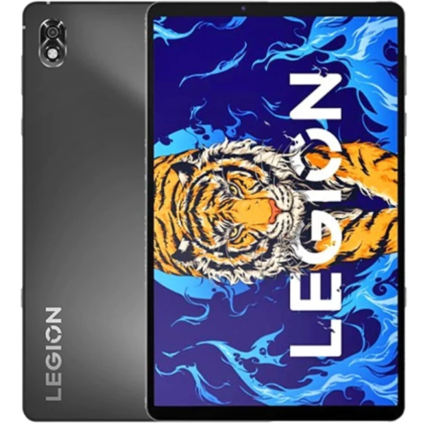

**State: Inactive**  
**Codename: 9707f**  
**Maintainer: None**  
**Contributors: [hyusang](https://github.com/cloudsweets/)**  
**Tester: None**

### UEFI Status

| Feature            | Description       | State |
|:-------------------|:------------------|:-----:|
| Display            |                   | ✅    |
| Internal Storage   |                   | ✅    |
| Side Buttons       |                   | ✅    |
| USB Host Mode      |                   | ✅    |
| USB Device Mode    |                   | ❌    |
| USB Power Delivery |                   | ❌    |
| Mass Storage       | Needs Device Mode | ❌    |
| SD Card            |                   | ❌    |
| Windows Boot       |                   | ✅    |
| Linux Boot         |                   | ❌    |

### OS Status

<table>
<tr><th>Windows</th></tr>
<tr><td>

| Feature               | Description | State |
|:----------------------|:------------|:-----:|
| Internal Storage      |             | ✅    |
| SD Card               |             | ❌    |
| Side Buttons          |             | ❌    |
| Proximity Sensor      |             | ❌    |
| Light Sensor          |             | ❌    |
| Accelerometer Sensor  |             | ❌    |
| Compass Sensor        |             | ❌    |
| Gyroscope Sensor      |             | ❌    |
| Fingerprint Sensor    |             | ❌    |
| Hall Sensor           |             | ❌    |
| Temperature Sensor    |             | ❌    |
| Battery               |             | ❌    |
| USB Host Mode         |             | ✅    |
| USB Device Mode       |             | ❌    |
| USB Power Delivery    |             | ❌    |
| Charging              |             | ❌    |
| WLAN                  |             | ❌    |
| CPU                   |             | ✅    |
| Touchscreen           |             | ❌    |
| Bluetooth             |             | ❌    |
| GPS                   |             | ❌    |
| Speakers              |             | ❌    |
| 3.5mm Audio Jack      |             | ❌    |
| Microphone            |             | ❌    |
| GPU                   |             | ❌    |
| Camera                |             | ❌    |
| Mobile Data           |             | ❌    |
| Display               |             | ✅    |
| Vibration             |             | ❌    |

</td></tr> </table>

  

<b><strong>Realme Devices</strong></b>

## Realme GT NEO 2

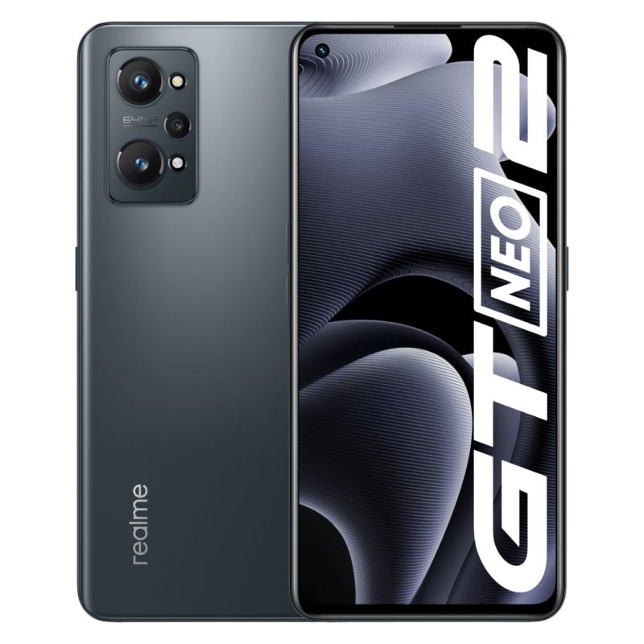

**State: Inactive**  
**Codename: bitra**  
**Maintainer: [kubawis128](https://github.com/kubawis128/)**  
**Contributors: [Robotix](https://github.com/Robotix22/), [kubawis128](https://github.com/kubawis128/)**  
**Testers: [kubawis128](https://github.com/kubawis128/)**

### UEFI Status

| Feature            | Description       | State |
|:-------------------|:------------------|:-----:|
| Display            |                   | ✅    |
| Internal Storage   |                   | ✅    |
| Side Buttons       |                   | ✅    |
| USB Host Mode      |                   | ✅    |
| USB Device Mode    |                   | ❌    |
| USB Power Delivery |                   | ❌    |
| Mass Storage       | Needs Device Mode | ❌    |
| Windows Boot       |                   | ✅    |
| Linux Boot         |                   | ✅    |

### OS Status

<table>
<tr><th>Windows</th><th>Linux</th></tr>
<tr><td>

| Feature              | Description | State |
|:---------------------|:------------|:-----:|
| Internal Storage     |             | ✅    |
| Side Buttons         |             | ❌    |
| Proximity Sensor     |             | ❌    |
| Light Sensor         |             | ❌    |
| Accelerometer Sensor |             | ❌    |
| Compass Sensor       |             | ❌    |
| Gyroscope Sensor     |             | ❌    |
| Fingerprint Sensor   |             | ❌    |
| NFC Sensor           |             | ❌    |
| Temperature Sensor   |             | ❌    |
| Battery              |             | ❌    |
| USB Host Mode        |             | ✅    |
| USB Device Mode      |             | ❌    |
| USB Power Delivery   |             | ❌    |
| Charging             |             | ❌    |
| WLAN                 |             | ❌    |
| CPU                  |             | ✅    |
| Touchscreen          |             | ❌    |
| Bluetooth            |             | ❌    |
| GPS                  |             | ❌    |
| Speakers             |             | ❌    |
| Microphone           |             | ❌    |
| GPU                  |             | ❌    |
| Camera               |             | ❌    |
| Mobile Data          |             | ❌    |
| Display              |             | ✅    |
| Vibration            |             | ❌    |

</td><td>

| Feature              | Description | State |
|:---------------------|:------------|:-----:|
| Internal Storage     |             | ✅    |
| Side Buttons         |             | ❌    |
| Proximity Sensor     |             | ❌    |
| Light Sensor         |             | ❌    |
| Accelerometer Sensor |             | ❌    |
| Compass Sensor       |             | ❌    |
| Gyroscope Sensor     |             | ❌    |
| Fingerprint Sensor   |             | ❌    |
| NFC Sensor           |             | ❌    |
| Temperature Sensor   |             | ❌    |
| Battery              |             | ❌    |
| USB Host Mode        |             | ✅    |
| USB Device Mode      |             | ❌    |
| USB Power Delivery   |             | ❌    |
| Charging             |             | ❌    |
| WLAN                 |             | ❌    |
| CPU                  |             | ✅    |
| Touchscreen          |             | ❌    |
| Bluetooth            |             | ❌    |
| GPS                  |             | ❌    |
| Speakers             |             | ❌    |
| Microphone           |             | ❌    |
| GPU                  |             | ❌    |
| Camera               |             | ❌    |
| Mobile Data          |             | ❌    |
| Display              |             | ✅    |
| Vibration            |             | ❌    |

</td></tr> </table>

  

<b><strong>Xiaomi Devices</strong></b>

## Xiaomi Pad 6

**State: Inactive**  
**Codename: pipa**  
**Maintainer: None**  
**Contributors: [Statzar](https://github.com/Statzar), [N1kroks](https://github.com/N1kroks), [Robotix](https://github.com/Robotix22/), [6adp](https://github.com/6adp)**  
**Tester: None**

### UEFI Status

| Feature            | Description    | State |
|:-------------------|:---------------|:-----:|
| Display            |                | ✅    |
| Internal Storage   |                | ✅    |
| Side Buttons       |                | ✅    |
| USB Host Mode      |                | ✅    |
| USB Device Mode    |                | ✅    |
| USB Power Delivery |                | ✅    |
| Mass Storage       | Unknown Issues | ❌    |
| Windows Boot       |                | ✅    |
| Linux Boot         |                | ✅    |

### OS Status

<table>
<tr><th>Windows</th><th>Linux</th></tr>
<tr><td>

> NOTE: Needs [Windows Drivers](https://github.com/N1kroks/SM8250-Drivers)!

| Feature              | Description                       | State |
|:---------------------|:----------------------------------|:-----:|
| Internal Storage     |                                   | ✅    |
| Side Buttons         |                                   | ✅    |
| Proximity Sensor     |                                   | ❌    |
| Light Sensor         |                                   | ❌    |
| Accelerometer Sensor |                                   | ❌    |
| Compass Sensor       |                                   | ❌    |
| Gyroscope Sensor     |                                   | ❌    |
| Hall Sensor          |                                   | ❌    |
| Temperature Sensor   |                                   | ❌    |
| Battery              |                                   | ✅    |
| USB Host Mode        | Depends What Mode it was in UEFI. | ✅    |
| USB Device Mode      | Depends What Mode it was in UEFI. | ✅    |
| USB Power Delivery   | Depends What Mode it was in UEFI. | ✅    |
| Charging             |                                   | ❌    |
| WLAN                 |                                   | ❌    |
| CPU                  |                                   | ✅    |
| Touchscreen          |                                   | ❌    |
| Bluetooth            |                                   | ❌    |
| GPS                  |                                   | ❌    |
| Speakers             |                                   | ❌    |
| Microphone           |                                   | ❌    |
| GPU                  |                                   | ❌    |
| Camera               |                                   | ❌    |
| Mobile Data          |                                   | ❌    |
| Display              |                                   | ✅    |
| Vibration            |                                   | ❌    |

</td><td>

| Feature              | Description                       | State |
|:---------------------|:----------------------------------|:-----:|
| Internal Storage     |                                   | ✅    |
| Side Buttons         |                                   | ❌    |
| Proximity Sensor     |                                   | ❌    |
| Light Sensor         |                                   | ❌    |
| Accelerometer Sensor |                                   | ❌    |
| Compass Sensor       |                                   | ❌    |
| Gyroscope Sensor     |                                   | ❌    |
| Hall Sensor          |                                   | ❌    |
| Temperature Sensor   |                                   | ❌    |
| Battery              |                                   | ❌    |
| USB Host Mode        | Depends What Mode it was in UEFI. | ✅    |
| USB Device Mode      | Depends What Mode it was in UEFI. | ✅    |
| USB Power Delivery   | Depends What Mode it was in UEFI. | ✅    |
| Charging             |                                   | ❌    |
| WLAN                 |                                   | ❌    |
| CPU                  |                                   | ✅    |
| Touchscreen          |                                   | ❌    |
| Bluetooth            |                                   | ❌    |
| GPS                  |                                   | ❌    |
| Speakers             |                                   | ❌    |
| Microphone           |                                   | ❌    |
| GPU                  |                                   | ❌    |
| Camera               |                                   | ❌    |
| Mobile Data          |                                   | ❌    |
| Display              |                                   | ✅    |
| Vibration            |                                   | ❌    |

</td></tr> </table>

## Xiaomi Poco F3

**State: Halted**  
**Codename: alioth**  
**Maintainers: [N1kroks](https://github.com/N1kroks/)**  
**Contributors: [Robotix](https://github.com/Robotix22/), [SwedMlite](https://github.com/SwedMlite/), [hyusang](https://github.com/cloudsweets/), [AdrianoA3](https://github.com/AdrianoA3/), [N1kroks](https://github.com/N1kroks/)**  
**Testers: [N1kroks](https://github.com/N1kroks/)**

### UEFI Status

| Feature            | Description    | State |
|:-------------------|:---------------|:-----:|
| Display            |                | ✅    |
| Internal Storage   |                | ✅    |
| Side Buttons       |                | ✅    |
| USB Host Mode      |                | ✅    |
| USB Device Mode    |                | ✅    |
| USB Power Delivery |                | ✅    |
| Mass Storage       | Unknown Issues | ❌    |
| Windows Boot       |                | ✅    |
| Linux Boot         |                | ❌    |

### OS Status

<table>
<tr><th>Windows</th></tr>
<tr><td>

> NOTE: Needs [Windows Drivers](https://github.com/N1kroks/SM8250-Drivers)!

| Feature              | Description                       | State |
|:---------------------|:----------------------------------|:-----:|
| Internal Storage     |                                   | ✅    |
| Side Buttons         |                                   | ✅    |
| Proximity Sensor     |                                   | ❌    |
| Light Sensor         |                                   | ❌    |
| Accelerometer Sensor |                                   | ❌    |
| Compass Sensor       |                                   | ❌    |
| Gyroscope Sensor     |                                   | ❌    |
| Fingerprint Sensor   |                                   | ❌    |
| NFC Sensor           |                                   | ❌    |
| Battery              |                                   | ✅    |
| USB Host Mode        |                                   | ✅    |
| USB Device Mode      |                                   | ❌    |
| USB Power Delivery   |                                   | ✅    |
| Charging             |                                   | ❌    |
| WLAN                 |                                   | ❌    |
| CPU                  |                                   | ✅    |
| Touchscreen          |                                   | ❌    |
| Bluetooth            |                                   | ❌    |
| GPS                  |                                   | ❌    |
| Speakers             |                                   | ❌    |
| Microphone           |                                   | ❌    |
| GPU                  |                                   | ❌    |
| Camera               |                                   | ❌    |
| Mobile Data          |                                   | ❌    |
| Display              |                                   | ✅    |
| Vibration            |                                   | ❌    |

</td></tr> </table>

  

---

  

<b><strong>Snapdragon 855/855+/860 Devices</strong></b>

 

<b><strong>LG Devices</strong></b>

## LG G8s

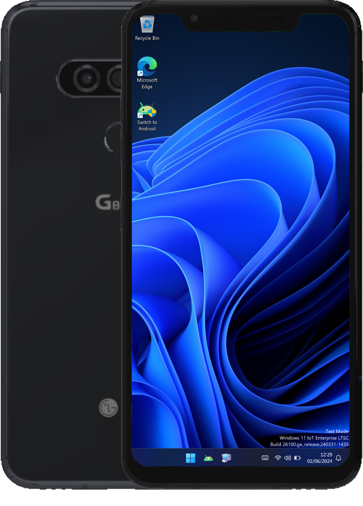

**State: Active**  
**Codename: betalm**  
**Maintainers: [Daniel224455](https://github.com/Daniel224455), [n00b69](https://github.com/n00b69)**  
**Contributors: [Daniel224455](https://github.com/Daniel224455), [n00b69](https://github.com/n00b69), [Icesito68](https://github.com/Icesito68)**  
**Testers: [n00b69](https://github.com/n00b69)**

### UEFI Status

| Feature            | Description | State |
|:-------------------|:------------|:-----:|
| Display            |             | ✅    |
| Internal Storage   |             | ✅    |
| Side Buttons       |             | ✅    |
| USB Host Mode      |             | ❌    |
| USB Device Mode    |             | ✅    |
| USB Power Delivery |             | ❌    |
| Mass Storage       |             | ✅    |
| SD Card            | Broken      | ❌    |
| Windows Boot       |             | ✅    |
| Linux Boot         | Untested    | ❔    |

### OS Status

<table>
<tr><th>Windows</th></tr>
<tr><td>

> NOTE: Needs [Windows Drivers](https://github.com/n00b69/woa-betalm/releases/tag/Drivers)!

| Feature              | Description                                                  | State |
|:---------------------|:-------------------------------------------------------------|:-----:|
| Internal Storage     |                                                              | ✅    |
| SD Card              |                                                              | ❌    |
| Side Buttons         |                                                              | ✅    |
| Proximity Sensor     | Works partially but reversed, disabled for now               | ⚠️    |
| Accelerometer Sensor | Works partially but reversed, disabled for now               | ⚠️    |
| Compass Sensor       | Works partially but reversed, disabled for now               | ⚠️    |
| Gyroscope Sensor     | Works partially but reversed, disabled for now               | ⚠️    |
| Fingerprint Sensor   |                                                              | ❌    |
| NFC Sensor           |                                                              | ❌    |
| Temperature Sensor   |                                                              | ❔    |
| Battery              |                                                              | ✅    |
| USB                  |                                                              | ✅    |
| Charging             | USB charging is slow, wireless charging is somewhat fast     | ✅️    |
| WLAN                 |                                                              | ✅    |
| CPU                  |                                                              | ✅    |
| Touchscreen          |                                                              | ✅    |
| Bluetooth            |                                                              | ✅    |
| GPS                  |                                                              | ✅    |
| Speakers             |                                                              | ❌    |
| 3.5mm Audio Jack     |                                                              | ✅    |
| Microphone           |                                                              | ❌    |
| GPU                  |                                                              | ✅    |
| Flashlight           |                                                              | ❌    |
| Camera               |                                                              | ❌    |
| Mobile Data          |                                                              | ❌    |
| Display              |                                                              | ✅    |
| Vibration            |                                                              | ❌    |

</td></tr> </table>

  

<b><strong>OnePlus Devices</strong></b>

## OnePlus 7T Pro

**State: Inactive**  
**Codename: hotdog**  
**Maintainer: None**  
**Contributors: None**  
**Tester: None**

### UEFI Status

| Feature            | Description     | State |
|:-------------------|:----------------|:-----:|
| Display            |                 | ✅    |
| Internal Storage   |                 | ✅    |
| Side Buttons       |                 | ✅    |
| USB Host Mode      |                 | ❌    |
| USB Device Mode    |                 | ✅    |
| USB Power Delivery |                 | ❌    |
| Mass Storage       |                 | ❔    |
| Windows Boot       | Windows PE only | ⚠️    |
| Linux Boot         |                 | ❌    |

### OS Status

<table>
<tr><th>Windows</th></tr>
<tr><td>

| Feature              | Description | State |
|:---------------------|:------------|:-----:|
| Internal Storage     |             | ❌    |
| Side Buttons         |             | ❌    |
| Proximity Sensor     |             | ❌    |
| Light Sensor         |             | ❌    |
| Accelerometer Sensor |             | ❌    |
| Compass Sensor       |             | ❌    |
| Gyroscope Sensor     |             | ❌    |
| Fingerprint Sensor   |             | ❌    |
| Hall Sensor          |             | ❌    |
| NFC Sensor           |             | ❌    |
| Temperature Sensor   |             | ❌    |
| Battery              |             | ❌    |
| USB Host Mode        |             | ❌    |
| USB Device Mode      |             | ❌    |
| USB Power Delivery   |             | ❌    |
| Charging             |             | ❌    |
| WLAN                 |             | ❌    |
| CPU                  |             | ✅    |
| Touchscreen          |             | ❌    |
| Bluetooth            |             | ❌    |
| GPS                  |             | ❌    |
| Speakers             |             | ❌    |
| Microphone           |             | ❌    |
| GPU                  |             | ❌    |
| Camera               |             | ❌    |
| Mobile Data          |             | ❌    |
| Display              |             | ✅    |
| Vibration            |             | ❌    |

</td></tr> </table>

  

<b><strong>Xiaomi Devices</strong></b>

## Xiaomi Pad 5

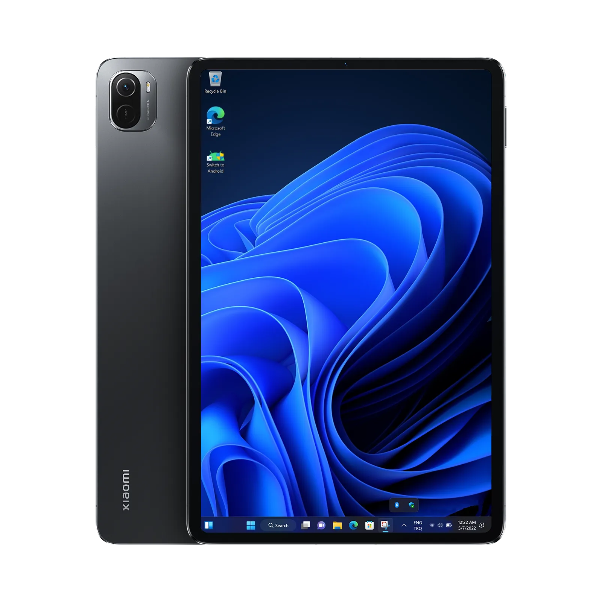

**State: Active**  
**Codename: nabu**  
**Maintainers: [iNUCi](https://github.com/iNUCi)**  
**Contributors: [iNUCi](https://github.com/iNUCi), [Robotix](https://github.com/Robotix22/)**  
**Testers: [iNUCi](https://github.com/iNUCi)**

### UEFI Status

| Feature            | Description | State |
|:-------------------|:------------|:-----:|
| Display            |             | ✅    |
| Internal Storage   |             | ✅    |
| Side Buttons       |             | ✅    |
| USB Host Mode      |             | ❌    |
| USB Device Mode    |             | ✅    |
| USB Power Delivery |             | ❌    |
| Mass Storage       |             | ✅    |
| Windows Boot       |             | ✅    |
| Linux Boot         | Untested    | ❔    |

### OS Status

<table>
<tr><th>Windows</th></tr>
<tr><td>

> NOTE: Needs [Windows Drivers](https://github.com/erdilS/Port-Windows-11-Xiaomi-Pad-5/releases/tag/Drivers)!

| Feature              | Description                                                  | State |
|:---------------------|:-------------------------------------------------------------|:-----:|
| Internal Storage     |                                                              | ✅    |
| Side Buttons         |                                                              | ✅    |
| Proximity Sensor     |                                                              | ❌    |
| Accelerometer Sensor |                                                              | ✅    |
| Compass Sensor       |                                                              | ❌    |
| Gyroscope Sensor     |                                                              | ❌    |
| Fingerprint Sensor   |                                                              | ❌    |
| NFC Sensor           |                                                              | ❌    |
| Temperature Sensor   |                                                              | ❔    |
| Battery              |                                                              | ✅    |
| USB                  |                                                              | ✅    |
| Charging             | Very slow                                                    | ⚠️    |
| WLAN                 |                                                              | ✅    |
| CPU                  |                                                              | ✅    |
| Touchscreen          |                                                              | ✅    |
| Bluetooth            |                                                              | ✅    |
| GPS                  |                                                              | ✅    |
| Speakers             |                                                              | ✅    |
| Microphone           |                                                              | ✅    |
| GPU                  |                                                              | ✅    |
| Flashlight           |                                                              | ⚠    |
| Camera               |                                                              | ❌    |
| Display              |                                                              | ✅    |
| Vibration            |                                                              | ❌    |

</td></tr> </table>

## Xiaomi Mi 9

**State: Active**  
**Codename: cepheus**  
**Maintainers: [Daniel224455](https://github.com/Daniel224455)**  
**Contributors: [Daniel224455](https://github.com/Daniel224455)**  
**Testers: [motylek](https://github.com/jotkauser)**

### UEFI Status

| Feature            | Description | State |
|:-------------------|:------------|:-----:|
| Display            |             | ✅    |
| Internal Storage   |             | ✅    |
| Side Buttons       |             | ✅    |
| USB Host Mode      |             | ✅    |
| USB Device Mode    |             | ❌    |
| USB Power Delivery |             | ❌    |
| SD Card            |             | ❌    |
| Mass Storage       |             | ❌    |
| Windows Boot       |             | ✅    |
| Linux Boot         | Untested    | ❔    |

### OS Status

<table>
<tr><th>Windows</th></tr>
<tr><td>

> NOTE: Needs [Windows Drivers](https://github.com/qaz6750/XiaoMi9-Drivers/releases/latest)!

| Feature              | Description                                                  | State |
|:---------------------|:-------------------------------------------------------------|:-----:|
| Internal Storage     |                                                              | ✅    |
| Side Buttons         |                                                              | ✅    |
| Proximity Sensor     |                                                              | ❌    |
| Accelerometer Sensor |                                                              | ✅    |
| Compass Sensor       |                                                              | ✅    |
| Gyroscope Sensor     |                                                              | ✅    |
| Fingerprint Sensor   |                                                              | ❌    |
| NFC Sensor           |                                                              | ❌    |
| Temperature Sensor   |                                                              | ❔    |
| Battery              |                                                              | ✅    |
| USB                  |                                                              | ✅    |
| Charging             | Very slow                                                    | ⚠️    |
| WLAN                 |                                                              | ✅    |
| CPU                  |                                                              | ✅    |
| Touchscreen          |                                                              | ✅    |
| Bluetooth            |                                                              | ✅    |
| GPS                  |                                                              | ✅    |
| Speakers             |                                                              | ✅    |
| Microphone           |                                                              | ✅    |
| GPU                  |                                                              | ✅    |
| Flashlight           |                                                              | ❌    |
| Camera               |                                                              | ❌    |
| Mobile Data          |                                                              | ✅️    |
| Display              |                                                              | ✅    |
| Vibration            |                                                              | ❌    |

</td></tr> </table>

## Xiaomi Poco X3 Pro

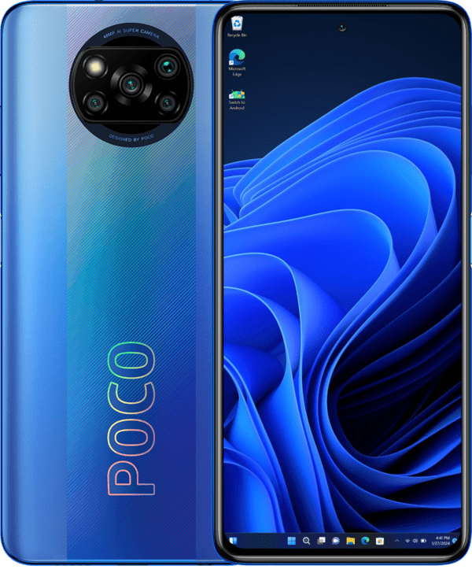

**State: Active**  
**Codename: vayu**  
**Maintainers: [Daniel224455](https://github.com/Daniel224455), [remtrik](https://github.com/remtrik)**  
**Contributors: [Daniel224455](https://github.com/Daniel224455), [remtrik](https://github.com/remtrik), [Nikroks](https://github.com/N1kroks)**  
**Testers: [Daniel224455](https://github.com/Daniel224455)**

### UEFI Status

| Feature            | Description | State |
|:-------------------|:------------|:-----:|
| Display            |             | ✅    |
| Internal Storage   |             | ✅    |
| Side Buttons       |             | ✅    |
| USB Host Mode      |             | ❌    |
| USB Device Mode    |             | ✅    |
| USB Power Delivery |             | ❌    |
| SD Card            |             | ❌    |
| Mass Storage       | Broken      | ❌    |
| Windows Boot       |             | ✅    |
| Linux Boot         | Untested    | ❔    |

### OS Status

<table>
<tr><th>Windows</th></tr>
<tr><td>

> NOTE: Needs [Windows Drivers](https://github.com/woa-vayu/POCOX3Pro-Releases/releases/latest)!

| Feature              | Description                                                  | State |
|:---------------------|:-------------------------------------------------------------|:-----:|
| Internal Storage     |                                                              | ✅    |
| SD Card              | Hot Plug doesn't work                                        | ⚠    |
| Side Buttons         |                                                              | ✅    |
| Proximity Sensor     |                                                              | ❌    |
| Accelerometer Sensor |                                                              | ✅    |
| Compass Sensor       |                                                              | ✅    |
| Gyroscope Sensor     |                                                              | ✅    |
| Fingerprint Sensor   |                                                              | ❌    |
| NFC Sensor           |                                                              | ❌    |
| Temperature Sensor   |                                                              | ❔    |
| Battery              |                                                              | ✅    |
| USB                  |                                                              | ✅    |
| Charging             | Very slow                                                    | ⚠️    |
| WLAN                 |                                                              | ✅    |
| CPU                  |                                                              | ✅    |
| Touchscreen          |                                                              | ✅    |
| Bluetooth            |                                                              | ✅    |
| GPS                  |                                                              | ✅    |
| Speakers             |                                                              | ✅    |
| 3.5mm Audio Jack     |                                                              | ✅    |
| Microphone           |                                                              | ✅    |
| GPU                  |                                                              | ✅    |
| Flashlight           | Accessible only from Windows Camera, acts like a stroboscope | ⚠    |
| Camera               |                                                              | ❌    |
| Mobile Data          |                                                              | ✅️    |
| Display              |                                                              | ✅    |
| Vibration            |                                                              | ❌    |

</td></tr> </table>

  

---

  

<b><strong>Snapdragon 845 Devices</strong></b>

 

<b><strong>LG Devices</strong></b>

## LG Velvet 4G

**State: Inactive**  
**Codename: caymanslm**  
**Maintainer: None**  
**Contributors: [CodeLindro](https://github.com/leandrofriedrich/)**  
**Tester: None**

### UEFI Status

| Feature            | Description | State |
|:-------------------|:------------|:-----:|
| Display            |             | ✅    |
| Internal Storage   |             | ✅    |
| Side Buttons       |             | ✅    |
| USB Host Mode      |             | ❌    |
| USB Device Mode    |             | ✅    |
| USB Power Delivery |             | ❌    |
| Mass Storage       |             | ❔    |
| SD Card            |             | ❌    |
| Windows Boot       |             | ✅    |
| Linux Boot         |             | ❌    |

### OS Status

<table>
<tr><th>Windows</th></tr>
<tr><td>

> NOTE: Needs Windows Drivers!

| Feature              | Description | State |
|:---------------------|:------------|:-----:|
| Internal Storage     |             | ✅    |
| SD Card              |             | ❌    |
| Side Buttons         |             | ✅    |
| Proximity Sensor     |             | ❌    |
| Light Sensor         |             | ❌    |
| Accelerometer Sensor |             | ❌    |
| Compass Sensor       |             | ❌    |
| Fingerprint Sensor   |             | ❌    |
| Hall Sensor          |             | ❌    |
| NFC Sensor           |             | ❌    |
| Temperature Sensor   |             | ❌    |
| Battery              |             | ❌    |
| USB Host Mode        |             | ✅    |
| USB Device Mode      |             | ❌    |
| USB Power Delivery   |             | ❌    |
| Charging             |             | ✅    |
| WLAN                 |             | ❌    |
| CPU                  |             | ✅    |
| Touchscreen          |             | ❌    |
| Bluetooth            |             | ✅    |
| GPS                  |             | ❌    |
| Speakers             |             | ❌    |
| 3.5mm Audio Jack     |             | ❌    |
| Microphone           |             | ❌    |
| GPU                  |             | ❌    |
| Camera               |             | ❌    |
| Mobile Data          |             | ❌    |
| Display              |             | ✅    |
| Vibration            |             | ❌    |

</td></tr> </table> 

  

<b><strong>Xiaomi Devices</strong></b>

## Xiaomi Mi 8

**State: Active**  
**Codename: dipper**  
**Maintainers: [index986](https://github.com/index986/)**  
**Contributors: [index986](https://github.com/index986/)**  
**Testers: Stas**

### UEFI Status

| Feature            | Description       | State |
|:-------------------|:------------------|:-----:|
| Display            |                   | ✅    |
| Internal Storage   |                   | ✅    |
| Side Buttons       |                   | ✅    |
| USB Host Mode      |                   | ✅    |
| USB Device Mode    |                   | ❌    |
| USB Power Delivery |                   | ❌    |
| Mass Storage       | Needs Device Mode | ❌    |
| Windows Boot       |                   | ❌    |
| Linux Boot         |                   | ❌    |

## Xiaomi Mi 8 Pro

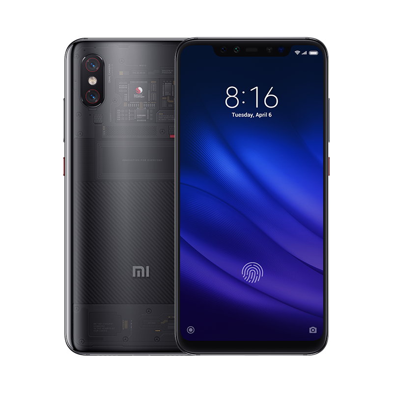

**State: Inactive**  
**Codename: equuleus**  
**Maintainer: None**  
**Contributors: [index986](https://github.com/index986/)**  
**Tester: None**

### UEFI Status

| Feature            | Description       | State |
|:-------------------|:------------------|:-----:|
| Display            |                   | ✅    |
| Internal Storage   |                   | ✅    |
| Side Buttons       |                   | ✅    |
| USB Host Mode      |                   | ✅    |
| USB Device Mode    |                   | ❌    |
| USB Power Delivery |                   | ❌    |
| Mass Storage       | Needs Device Mode | ❌    |
| Windows Boot       |                   | ❌    |
| Linux Boot         |                   | ❌    |

## Xiaomi Mi Mix 2S

**State: Inactive**  
**Codename: polaris**  
**Maintainers: None**  
**Contributors: [Daniel224455](https://github.com/Daniel224455/), [TrustedFloppa](https://github.com/TrustedFloppa/)**  
**Testers: None**

### UEFI Status

| Feature            | Description       | State |
|:-------------------|:------------------|:-----:|
| Display            |                   | ✅    |
| Internal Storage   |                   | ✅    |
| Side Buttons       |                   | ✅    |
| USB Host Mode      |                   | ✅    |
| USB Device Mode    |                   | ❌    |
| USB Power Delivery |                   | ❌    |
| Mass Storage       | Needs Device Mode | ❌    |
| Windows Boot       | Windows PE Only   | ⚠️    |
| Linux Boot         |                   | ❌    |

### OS Status

<table>
<tr><th>Windows</th></tr>
<tr><td>

| Feature              | Description | State |
|:---------------------|:------------|:-----:|
| Internal Storage     |             | ❌    |
| Side Buttons         |             | ❌    |
| Proximity Sensor     |             | ❌    |
| Light Sensor         |             | ❌    |
| Accelerometer Sensor |             | ❌    |
| Compass Sensor       |             | ❌    |
| Gyroscope Sensor     |             | ❌    |
| Fingerprint Sensor   |             | ❌    |
| NFC Sensor           |             | ❌    |
| Temperature Sensor   |             | ❌    |
| Battery              |             | ❌    |
| USB Host Mode        |             | ❌    |
| USB Device Mode      |             | ❌    |
| USB Power Delivery   |             | ❌    |
| Charging             |             | ❌    |
| WLAN                 |             | ❌    |
| CPU                  |             | ✅    |
| Touchscreen          |             | ❌    |
| Bluetooth            |             | ❌    |
| GPS                  |             | ❌    |
| Speakers             |             | ❌    |
| Microphone           |             | ❌    |
| GPU                  |             | ❌    |
| Camera               |             | ❌    |
| Mobile Data          |             | ❌    |
| Display              |             | ✅    |
| Vibration            |             | ❌    |

</td></tr> </table>

  

---

  

<b><strong>Snapdragon 835 Devices</strong></b>

 

<b><strong>Sony Devices</strong></b>

## Sony Xperia XZ1

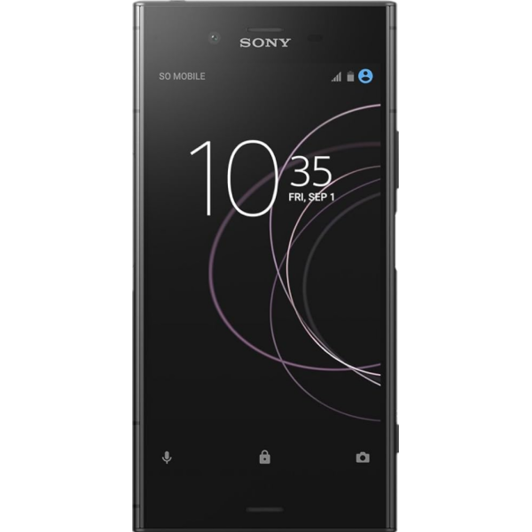

**State: Inactive**  
**Codename: poplar**  
**Maintainer: None**  
**Contributors: [Robotix](https://github.com/Robotix22/)**  
**Tester: None**

### UEFI Status

| Feature            | Description              | State |
|:-------------------|:-------------------------|:-----:|
| Display            |                          | ✅    |
| Internal Storage   | Disabled to prevent Wipe | ✅    |
| Side Buttons       |                          | ✅    |
| USB Host Mode      |                          | ✅    |
| USB Device Mode    |                          | ❌    |
| USB Power Delivery | Dies on Disconnect       | ⚠️    |
| Mass Storage       | Disabled to prevent Wipe | ❌    |
| SD Card            | No Hotplug Support       | ✅    |
| Windows Boot       | Windows PE only          | ⚠️    |
| Linux Boot         |                          | ✅    |

### OS Status

<table>
<tr><th>Windows</th><th>Linux</th></tr>
<tr><td>

> NOTE: Needs Windows Drivers!

| Feature              | Description               | State |
|:---------------------|:--------------------------|:-----:|
| Internal Storage     | Probably Works if Enabled | ❔    |
| SD Card              |                           | ✅    |
| Side Buttons         |                           | ❌    |
| Proximity Sensor     |                           | ❌    |
| Light Sensor         |                           | ❌    |
| Accelerometer Sensor |                           | ❌    |
| Compass Sensor       |                           | ❌    |
| Fingerprint Sensor   |                           | ❌    |
| Hall Sensor          |                           | ❌    |
| NFC Sensor           |                           | ❌    |
| Temperature Sensor   |                           | ❌    |
| Battery              |                           | ❌    |
| USB Host Mode        |                           | ✅    |
| USB Device Mode      |                           | ❌    |
| USB Power Delivery   | Dies on Disconnect        | ⚠️    |
| Charging             |                           | ❌    |
| WLAN                 |                           | ❌    |
| CPU                  |                           | ✅    |
| Touchscreen          |                           | ❌    |
| Bluetooth            |                           | ❌    |
| GPS                  |                           | ❌    |
| Speakers             |                           | ❌    |
| 3.5mm Audio Jack     |                           | ❌    |
| Microphone           |                           | ❌    |
| GPU                  |                           | ❌    |
| Camera               |                           | ❌    |
| Mobile Data          |                           | ❌    |
| Display              |                           | ✅    |
| Vibration            |                           | ❌    |

</td><td>

> NOTE: Only Fedora Workstation and Arch Linux is Tested!

| Feature              | Description               | State |
|:---------------------|:--------------------------|:-----:|
| Internal Storage     | Probably Works if Enabled | ❔    |
| SD Card              |                           | ❌    |
| Side Buttons         |                           | ❌    |
| Proximity Sensor     |                           | ❌    |
| Light Sensor         |                           | ❌    |
| Accelerometer Sensor |                           | ❌    |
| Compass Sensor       |                           | ❌    |
| Fingerprint Sensor   |                           | ❌    |
| Hall Sensor          |                           | ❌    |
| NFC Sensor           |                           | ❌    |
| Temperature Sensor   |                           | ❌    |
| Battery              |                           | ❌    |
| USB Host Mode        |                           | ✅    |
| USB Device Mode      |                           | ❌    |
| USB Power Delivery   | Dies on Disconnect        | ⚠️    |
| Charging             |                           | ❌    |
| WLAN                 |                           | ❌    |
| CPU                  |                           | ✅    |
| Touchscreen          |                           | ❌    |
| Bluetooth            |                           | ❌    |
| GPS                  |                           | ❌    |
| Speakers             |                           | ❌    |
| 3.5mm Audio Jack     |                           | ❌    |
| Microphone           |                           | ❌    |
| GPU                  |                           | ❌    |
| Camera               |                           | ❌    |
| Mobile Data          |                           | ❌    |
| Display              |                           | ✅    |
| Vibration            |                           | ❌    |

</td></tr> </table>

  

---

  

<b><strong>Snapdragon 778G/778G+/782G Devices</strong></b>

 

<b><strong>Nothing Devices</strong></b>

## Nothing Phone (1)

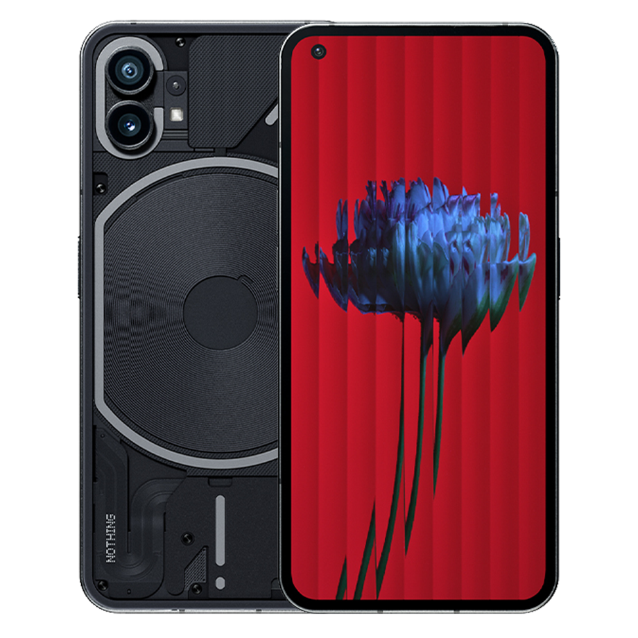

**State: Inactive**  
**Codename: spacewar**  
**Maintainer: None**  
**Contributors: [Robotix](https://github.com/Robotix22/), [index986](https://github.com/index986/)**  
**Tester: None**

### UEFI Status

| Feature            | Description | State |
|:-------------------|:------------|:-----:|
| Display            |             | ✅    |
| Internal Storage   |             | ✅    |
| Side Buttons       |             | ✅    |
| USB Host Mode      |             | ❌    |
| USB Device Mode    |             | ✅    |
| USB Power Delivery |             | ❌    |
| Mass Storage       |             | ✅    |
| Windows Boot       |Broken       | ❌    |
| Linux Boot         |             | ❌    |

  

<b><strong>Samsung Devices</strong></b>

## Samsung Galaxy A52s 5G

**State: Active**  
**Codename: a52sxq**  
**Maintainer: [arminask](https://github.com/arminask/)**  
**Contributors: [Robotix](https://github.com/Robotix22/), [arminask](https://github.com/arminask/), People from Group**  
**Testers: [arminask](https://github.com/arminask/)**

### UEFI Status

| Feature            | Description       | State |
|:-------------------|:------------------|:-----:|
| Display            |                   | ✅    |
| Internal Storage   |                   | ✅    |
| Side Buttons       |                   | ✅    |
| USB Host Mode      |                   | ✅    |
| USB Device Mode    |                   | ❌    |
| USB Power Delivery |                   | ❌    |
| Mass Storage       | Needs Device Mode | ❌    |
| SD Card            |                   | ✅    |
| Windows Boot       |                   | ✅    |
| Linux Boot         |                   | ❌    |

### OS Status

<table>
<tr><th>Windows</th></tr>
<tr><td>

> NOTE: Needs [Windows Drivers](https://github.com/woa-a52s/windows_oem_samsung_a52sxq)!

| Feature              | Description           | State |
|:---------------------|:----------------------|:-----:|
| Internal Storage     |                       | ✅    |
| SD Card              |                       | ✅️    |
| Side Buttons         |                       | ✅    |
| Proximity Sensor     |                       | ❌    |
| Light Sensor         |                       | ❌    |
| Accelerometer Sensor |                       | ❌    |
| Compass Sensor       |                       | ❌    |
| Fingerprint Sensor   |                       | ❌    |
| Hall Sensor          |                       | ❌    |
| NFC Sensor           |                       | ❌    |
| Temperature Sensor   |                       | ✅    |
| Battery              |                       | ✅    |
| USB Host Mode        |                       | ✅    |
| USB Device Mode      |                       | ✅    |
| USB Power Delivery   |                       | ❌    |
| Charging             |                       | ❌    |
| WLAN                 |                       | ✅    |
| CPU                  |                       | ✅    |
| Touchscreen          |                       | ✅    |
| Bluetooth            |                       | ✅    |
| GPS                  |                       | ✅    |
| Speakers             |                       | ❌    |
| Microphone           |                       | ❌    |
| GPU                  |                       | ❌    |
| Camera               |                       | ❌    |
| Mobile Data          |                       | ❌    |
| Display              |                       | ✅    |
| Vibration            |                       | ❌    |

</td></tr> </table>

  

<b><strong>Xiaomi Devices</strong></b>

## Xiaomi Mi 11 Lite NE

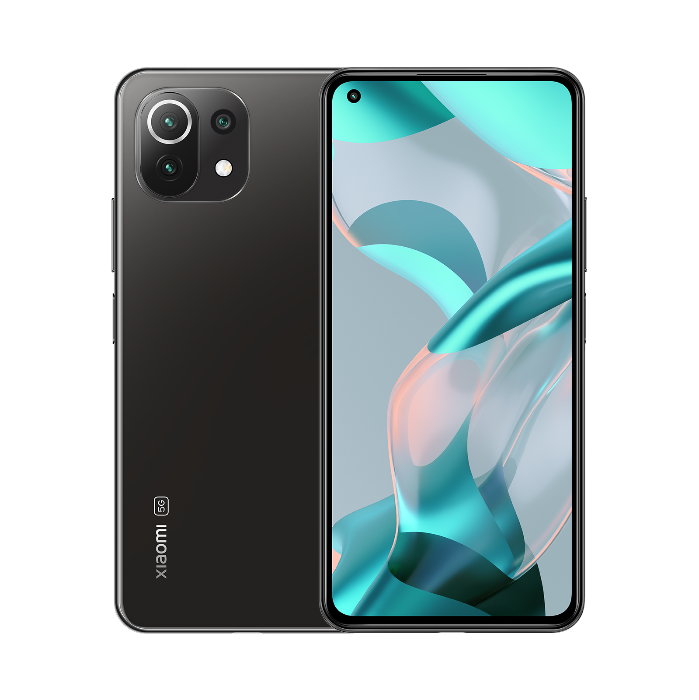

**State: Active**  
**Codename: lisa**  
**Maintainer: [Aistop](https://github.com/AistopGit/)**  
**Contributors: [ETCHDEV](https://github.com/ETCHDEV/), [Nikroks](https://github.com/N1kroks/), [Aistop](https://github.com/AistopGit/)**  
**Tester: [Aistop](https://github.com/AistopGit/)**

### UEFI Status

| Feature            | Description                | State |
|:-------------------|:---------------------------|:-----:|
| Display            |                            | ✅    |
| Internal Storage   |                            | ✅    |
| Side Buttons       |                            | ✅    |
| USB Host Mode      |                            | ❌    |
| USB Device Mode    |                            | ✅    |
| USB Power Delivery |                            | ❌    |
| Mass Storage       | Crashes on large transfers | ⚠️    |
| SD Card            |                            | ❌    |
| Windows Boot       |                            | ✅    |
| Linux Boot         |                            | ❌    |

### OS Status

<table>
<tr><th>Windows</th></tr>
<tr><td>

> NOTE: Needs [Windows Drivers](https://github.com/AistopGit/windows_oem_xiaomi_lisa)!

| Feature              | Description           | State |
|:---------------------|:----------------------|:-----:|
| Internal Storage     |                       | ✅    |
| SD Card              | Hot Plug doesn't work | ⚠️    |
| Side Buttons         |                       | ✅    |
| Proximity Sensor     |                       | ❌    |
| Light Sensor         |                       | ❌    |
| Accelerometer Sensor |                       | ❌    |
| Compass Sensor       |                       | ❌    |
| Fingerprint Sensor   |                       | ❌    |
| Hall Sensor          |                       | ❌    |
| NFC Sensor           |                       | ❌    |
| Temperature Sensor   |                       | ✅    |
| Battery              |                       | ✅    |
| USB Host Mode        |                       | ✅    |
| USB Device Mode      |                       | ✅    |
| USB Power Delivery   |                       | ✅    |
| Charging             |                       | ✅    |
| WLAN                 |                       | ✅    |
| CPU                  |                       | ✅    |
| Touchscreen          |                       | ✅    |
| Bluetooth            |                       | ✅    |
| GPS                  |                       | ✅    |
| Speakers             |                       | ❌    |
| Microphone           |                       | ❌    |
| GPU                  |                       | ❌    |
| Camera               |                       | ❌    |
| Mobile Data          |                       | ✅    |
| Display              |                       | ✅    |
| Vibration            |                       | ❌    |

</td></tr> </table>

  

---

  

<b><strong>Snapdragon 730/730G/732G Devices</strong></b>

 

<b><strong>Lenovo Devices</strong></b>

## Lenovo Tab P11 Pro

**State: Inactive**  
**Codename: j706f**  
**Maintainer: None**  
**Contributors: [hyusang](https://github.com/cloudsweets/)**  
**Tester: None**

### UEFI Status

| Feature            | Description | State |
|:-------------------|:------------|:-----:|
| Display            |             | ✅    |
| Internal Storage   |             | ✅    |
| Side Buttons       |             | ✅    |
| USB Host Mode      |             | ❌    |
| USB Device Mode    |             | ✅    |
| USB Power Delivery |             | ❌    |
| Mass Storage       |             | ❔    |
| SD Card            |             | ❌    |
| Windows Boot       |             | ✅    |
| Linux Boot         |             | ❌    |

### OS Status

<table>
<tr><th>Windows</th></tr>
<tr><td>

| Feature              | Description | State |
|:---------------------|:------------|:-----:|
| Internal Storage     |             | ✅    |
| SD Card              |             | ❌    |
| Side Buttons         |             | ❌    |
| Proximity Sensor     |             | ❌    |
| Light Sensor         |             | ❌    |
| Accelerometer Sensor |             | ❌    |
| Compass Sensor       |             | ❌    |
| Gyroscope Sensor     |             | ❌    |
| Fingerprint Sensor   |             | ❌    |
| Hall Sensor          |             | ❌    |
| Temperature Sensor   |             | ❌    |
| Battery              |             | ❌    |
| USB Host Mode        |             | ❌    |
| USB Device Mode      |             | ❌    |
| USB Power Delivery   |             | ❌    |
| Charging             |             | ❌    |
| WLAN                 |             | ❌    |
| CPU                  |             | ✅    |
| Touchscreen          |             | ❌    |
| Bluetooth            |             | ❌    |
| GPS                  |             | ❌    |
| Speakers             |             | ❌    |
| Microphone           |             | ❌    |
| GPU                  |             | ❌    |
| Camera               |             | ❌    |
| Mobile Data          |             | ❌    |
| Display              |             | ✅    |
| Vibration            |             | ❌    |

</td></tr> </table>

  

<b><strong>Xiaomi Devices</strong></b>

## Xiaomi Poco X3 NFC

**State: Active**  
**Codename: surya**  
**Maintainer: [remtrik](https://github.com/remtrik/)**  
**Contributors: [Nikroks](https://github.com/N1kroks/), [remtrik](https://github.com/remtrik)**  
**Tester: [remtrik](https://github.com/remtrik/)**

### UEFI Status

| Feature            | Description       | State |
|:-------------------|:------------------|:-----:|
| Display            |                   | ✅    |
| Internal Storage   |                   | ✅    |
| Side Buttons       |                   | ✅    |
| USB Host Mode      |                   | ✅    |
| USB Device Mode    |                   | ❌    |
| USB Power Delivery |                   | ❌    |
| Mass Storage       | Needs Device Mode | ❌    |
| SD Card            |                   | ✅    |
| Windows Boot       |                   | ✅    |
| Linux Boot         |                   | ❌    |

### OS Status

<table>
<tr><th>Windows</th></tr>
<tr><td>

> NOTE: Needs Drivers!

| Feature              | Description | State |
|:---------------------|:------------|:-----:|
| Internal Storage     |             | ✅    |
| Side Buttons         |             | ✅    |
| Proximity Sensor     |             | ❌    |
| Light Sensor         |             | ❌    |
| Accelerometer Sensor |             | ❌    |
| Compass Sensor       |             | ❌    |
| Gyroscope Sensor     |             | ❌    |
| Barometer Sensor     |             | ❌    |
| Geomagnetic Sensor   |             | ❌    |
| Fingerprint Sensor   |             | ❌    |
| Hall Sensor          |             | ❌    |
| Gravity Sensor       |             | ❌    |
| NFC Sensor           |             | ❌    |
| Temperature Sensor   |             | ✅    |
| Battery              |             | ✅    |
| USB Host Mode        |             | ✅    |
| USB Device Mode      |             | ❌    |
| USB Power Delivery   |             | ❌    |
| Charging             |             | ❌    |
| WLAN                 |             | ❌    |
| CPU                  |             | ✅    |
| Touchscreen          |             | ❌    |
| Bluetooth            |             | ❌    |
| GPS                  |             | ✅    |
| Speakers             |             | ❌    |
| Microphone           |             | ❌    |
| GPU                  |             | ❌    |
| Camera               |             | ❌    |
| Mobile Data          |             | ❌    |
| Display              |             | ✅    |
| Vibration            |             | ❌    |

</td></tr> </table>

## Xiaomi Redmi Note 10 Pro

**State: Inactive**  
**Codename: sweet**  
**Maintainers: None**  
**Contributors: [remtrik](https://github.com/remtrik/), [hiprivsid](https://github.com/hiprivsid/)**  
**Tester: None**

### UEFI Status

| Feature            | Description       | State |
|:-------------------|:------------------|:-----:|
| Display            |                   | ✅    |
| Internal Storage   |                   | ✅    |
| Side Buttons       |                   | ✅    |
| USB Host Mode      |                   | ✅    |
| USB Device Mode    |                   | ❌    |
| USB Power Delivery |                   | ❌    |
| Mass Storage       | Needs Device Mode | ❌    |
| SD Card            |                   | ❌    |
| Windows Boot       |                   | ❌    |
| Linux Boot         |                   | ❌    |

## Xiaomi Redmi Note 12 Pro 4G

**State: Inactive**  
**Codename: sweet_k6a**  
**Maintainer: None**  
**Contributors: [Robotix](https://github.com/Robotix22/)**  
**Tester: None**

### UEFI Status

| Feature            | Description | State |
|:-------------------|:------------|:-----:|
| Display            |             | ✅    |
| Internal Storage   |             | ✅    |
| Side Buttons       |             | ✅    |
| USB Host Mode      |             | ❌    |
| USB Device Mode    |             | ✅    |
| USB Power Delivery |             | ❌    |
| Mass Storage       |             | ❔    |
| SD Card            |             | ❌    |
| Windows Boot       |             | ❌    |
| Linux Boot         |             | ❌    |

  

---

  

<b><strong>Snapdragon 720G Devices</strong></b>

 

<b><strong>Xiaomi Devices</strong></b>

## Xiaomi Redmi Note 9 Pro / 9 Pro India / 9 Pro Max India / 10 Lite / 9S / Poco M2 Pro

**State: Inactive**  
**Codename: miatoll**  
**Maintainer: [N1kroks](https://github.com/N1kroks/)**  
**Contributors: [N1kroks](https://github.com/N1kroks/)**  
**Tester: [N1kroks](https://github.com/N1kroks/)**

### UEFI Status

| Feature            | Description       | State |
|:-------------------|:------------------|:-----:|
| Display            |                   | ✅    |
| Internal Storage   |                   | ✅    |
| Side Buttons       |                   | ✅    |
| USB Host Mode      |                   | ✅    |
| USB Device Mode    |                   | ❌    |
| USB Power Delivery |                   | ✅    |
| Mass Storage       | Needs Device Mode | ❌    |
| SD Card            |                   | ✅    |
| Windows Boot       |                   | ✅    |
| Linux Boot         |                   | ✅    |

### OS Status

<table>
<tr><th>Windows</th><th>Linux</th></tr>
<tr><td>

> NOTE: Needs [Windows Drivers](https://github.com/N1kroks/7xx-Drivers/releases/latest)!

| Feature              | Description           | State |
|:---------------------|:----------------------|:-----:|
| Internal Storage     |                       | ✅    |
| SD Card              | Hot Plug doesn't work | ⚠️    |
| Side Buttons         |                       | ✅    |
| Proximity Sensor     |                       | ❌    |
| Light Sensor         |                       | ❌    |
| Accelerometer Sensor |                       | ❌    |
| Compass Sensor       |                       | ❌    |
| Gyroscope Sensor     |                       | ❌    |
| Fingerprint Sensor   |                       | ❌    |
| NFC Sensor           |                       | ❌    |
| Battery              |                       | ✅    |
| USB Host Mode        |                       | ✅    |
| USB Device Mode      |                       | ❌    |
| USB Power Delivery   |                       | ✅    |
| Charging             |                       | ❌    |
| WLAN                 |                       | ✅    |
| CPU                  |                       | ✅    |
| Touchscreen          |                       | ✅    |
| Bluetooth            |                       | ✅    |
| GPS                  |                       | ✅    |
| Speakers             |                       | ❌    |
| 3.5mm Audio Jack     |                       | ❌    |
| Microphone           |                       | ❌    |
| GPU                  |                       | ✅    |
| Camera               |                       | ❌    |
| Mobile Data          |                       | ✅    |
| Display              |                       | ✅    |
| Vibration            |                       | ❌    |

</td><td>

> NOTE: Needs [Linux Fork](https://github.com/N1kroks/linux-7125)!

| Feature              | Description | State |
|:---------------------|:------------|:-----:|
| Internal Storage     |             | ✅    |
| SD Card              |             | ✅    |
| Side Buttons         |             | ✅    |
| Proximity Sensor     |             | ✅    |
| Light Sensor         |             | ✅    |
| Accelerometer Sensor |             | ✅    |
| Compass Sensor       |             | ✅    |
| Gyroscope Sensor     |             | ❌    |
| Fingerprint Sensor   |             | ❌    |
| NFC Sensor           |             | ❌    |
| Battery              |             | ✅    |
| USB Host Mode        |             | ✅    |
| USB Device Mode      |             | ✅    |
| USB Power Delivery   |             | ✅    |
| Charging             |             | ❌    |
| WLAN                 |             | ✅    |
| CPU                  |             | ✅    |
| Touchscreen          |             | ✅    |
| Bluetooth            |             | ✅    |
| GPS                  |             | ❌    |
| Speakers             |             | ✅    |
| 3.5mm Audio Jack     |             | ✅    |
| Microphone           |             | ✅    |
| GPU                  |             | ✅    |
| Camera               |             | ❌    |
| Mobile Data          |             | ✅    |
| Display              |             | ✅    |
| Vibration            |             | ❌    |

</td></tr> </table>

  

---

  

<b><strong>Snapdragon 680/685 Devices</strong></b>

 

<b><strong>Xiaomi Devices</strong></b>

## Xiaomi Redmi 10C

**State: Inactive**  
**Codename: fog**  
**Maintainer: [Statzar](https://github.com/Statzar)/**  
**Contributors: [Statzar](https://github.com/Statzar/)**  
**Tester: [Statzar](https://github.com/Statzar/)**

### UEFI Status

| Feature            | Description       | State |
|:-------------------|:------------------|:-----:|
| Display            |                   | ✅    |
| Internal Storage   |                   | ✅    |
| Side Buttons       |                   | ✅    |
| USB Host Mode      |                   | ✅    |
| USB Device Mode    |                   | ❌    |
| USB Power Delivery |                   | ❌    |
| Mass Storage       | Needs Device Mode | ❌    |
| SD Card            |                   | ✅    |
| Windows Boot       |                   | ✅    |
| Linux Boot         |                   | ✅    |

### OS Status

<table>
<tr><th>Windows</th><th>Linux</th></tr>
<tr><td>

| Feature              | Description         | State |
|:---------------------|:--------------------|:-----:|
| Internal Storage     |                     | ✅    |
| SD Card              |Hot Plug doesn't work| ⚠️    |
| Side Buttons         |                     | ❌    |
| Proximity Sensor     |                     | ❌    |
| Light Sensor         |                     | ❌    |
| Accelerometer Sensor |                     | ❌    |
| Compass Sensor       |                     | ❌    |
| Fingerprint Sensor   |                     | ❌    |
| NFC Sensor           |                     | ❌    |
| Temperature Sensor   |                     | ❌    |
| Battery              |                     | ❌    |
| USB Host Mode        |                     | ✅    |
| USB Device Mode      |                     | ❌    |
| USB Power Delivery   |                     | ❌    |
| Charging             |                     | ❌    |
| WLAN                 |                     | ❌    |
| CPU                  |                     | ✅    |
| Touchscreen          |                     | ❌    |
| Bluetooth            |                     | ❌    |
| GPS                  |                     | ❌    |
| Speakers             |                     | ❌    |
| 3.5mm Audio Jack     |                     | ❌    |
| Microphone           |                     | ❌    |
| GPU                  |                     | ❌    |
| Camera               |                     | ❌    |
| Mobile Data          |                     | ❌    |
| Display              |                     | ✅    |
| Vibration            |                     | ❌    |

</td><td>

| Feature              | Description | State |
|:---------------------|:------------|:-----:|
| Internal Storage     |             | ✅    |
| SD Card              |             | ❌    |
| Side Buttons         |             | ❌    |
| Proximity Sensor     |             | ❌    |
| Light Sensor         |             | ❌    |
| Accelerometer Sensor |             | ❌    |
| Compass Sensor       |             | ❌    |
| Fingerprint Sensor   |             | ❌    |
| NFC Sensor           |             | ❌    |
| Temperature Sensor   |             | ❌    |
| Battery              |             | ❌    |
| USB Host Mode        |             | ✅    |
| USB Device Mode      |             | ❌    |
| USB Power Delivery   |             | ❌    |
| Charging             |             | ❌    |
| WLAN                 |             | ❌    |
| CPU                  |             | ✅    |
| Touchscreen          |             | ❌    |
| Bluetooth            |             | ❌    |
| GPS                  |             | ❌    |
| Speakers             |             | ❌    |
| 3.5mm Audio Jack     |             | ❌    |
| Microphone           |             | ❌    |
| GPU                  |             | ❌    |
| Camera               |             | ❌    |
| Mobile Data          |             | ❌    |
| Display              |             | ✅    |
| Vibration            |             | ❌    |

</td></tr> </table>

## Xiaomi Redmi Note 11

**State: Inactive**  
**Codename: spes**  
**Maintainer: [Statzar](https://github.com/Statzar/)**  
**Contributors: [Statzar](https://github.com/Statzar/)**  
**Tester: [Statzar](https://github.com/Statzar/)**

### UEFI Status

| Feature            | Description       | State |
|:-------------------|:------------------|:-----:|
| Display            |                   | ✅    |
| Internal Storage   |                   | ✅    |
| Side Buttons       |                   | ✅    |
| USB Host Mode      |                   | ✅    |
| USB Device Mode    |                   | ❌    |
| USB Power Delivery |                   | ❌    |
| Mass Storage       | Needs Device Mode | ❌    |
| SD Card            |                   | ✅    |
| Windows Boot       |                   | ✅    |
| Linux Boot         |                   | ✅    |

### OS Status

<table>
<tr><th>Windows</th><th>Linux</th></tr>
<tr><td>

| Feature              | Description | State |
|:---------------------|:------------|:-----:|
| Internal Storage     |             | ✅    |
| SD Card              |             | ❌    |
| Side Buttons         |             | ❌    |
| Proximity Sensor     |             | ❌    |
| Light Sensor         |             | ❌    |
| Accelerometer Sensor |             | ❌    |
| Compass Sensor       |             | ❌    |
| Gyroscope Sensor     |             | ❌    |
| Fingerprint Sensor   |             | ❌    |
| NFC Sensor           |             | ❌    |
| Temperature Sensor   |             | ❌    |
| Battery              |             | ❌    |
| USB Host Mode        |             | ✅    |
| USB Device Mode      |             | ❌    |
| USB Power Delivery   |             | ❌    |
| Charging             |             | ❌    |
| WLAN                 |             | ❌    |
| CPU                  |             | ✅    |
| Touchscreen          |             | ❌    |
| Bluetooth            |             | ❌    |
| GPS                  |             | ❌    |
| Speakers             |             | ❌    |
| 3.5mm Audio Jack     |             | ❌    |
| Microphone           |             | ❌    |
| GPU                  |             | ❌    |
| Camera               |             | ❌    |
| Mobile Data          |             | ❌    |
| Display              |             | ✅    |
| Vibration            |             | ❌    |

</td><td>

| Feature              | Description | State |
|:---------------------|:------------|:-----:|
| Internal Storage     |             | ✅    |
| SD Card              |             | ❌    |
| Side Buttons         |             | ❌    |
| Proximity Sensor     |             | ❌    |
| Light Sensor         |             | ❌    |
| Accelerometer Sensor |             | ❌    |
| Compass Sensor       |             | ❌    |
| Gyroscope Sensor     |             | ❌    |
| Fingerprint Sensor   |             | ❌    |
| NFC Sensor           |             | ❌    |
| Temperature Sensor   |             | ❌    |
| Battery              |             | ❌    |
| USB Host Mode        |             | ✅    |
| USB Device Mode      |             | ❌    |
| USB Power Delivery   |             | ❌    |
| Charging             |             | ❌    |
| WLAN                 |             | ❌    |
| CPU                  |             | ✅    |
| Touchscreen          |             | ❌    |
| Bluetooth            |             | ❌    |
| GPS                  |             | ❌    |
| Speakers             |             | ❌    |
| 3.5mm Audio Jack     |             | ❌    |
| Microphone           |             | ❌    |
| GPU                  |             | ❌    |
| Camera               |             | ❌    |
| Mobile Data          |             | ❌    |
| Display              |             | ✅    |
| Vibration            |             | ❌    |

</td></tr> </table>

## Xiaomi Redmi Note 12

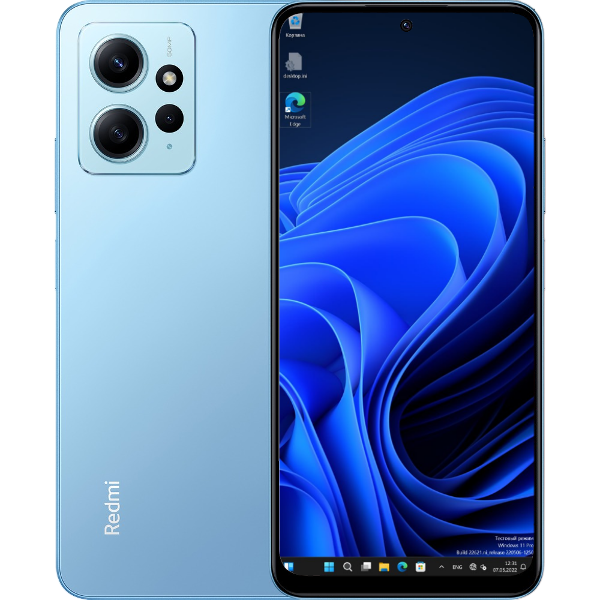

**State: Inactive**  
**Codename: tapas**  
**Maintainer: None**  
**Contributors: [Statzar](https://github.com/Statzar/), [6adp](https://github.com/6adp/)**  
**Tester: None**

### UEFI Status

| Feature            | Description       | State |
|:-------------------|:------------------|:-----:|
| Display            |                   | ✅    |
| Internal Storage   |                   | ✅    |
| Side Buttons       |                   | ✅    |
| USB Host Mode      |                   | ✅    |
| USB Device Mode    |                   | ❌    |
| USB Power Delivery |                   | ❌    |
| Mass Storage       | Needs Device Mode | ❌    |
| SD Card            |                   | ✅    |
| Windows Boot       |                   | ✅    |
| Linux Boot         |                   | ✅    |

### OS Status

<table>
<tr><th>Windows</th><th>Linux</th></tr>
<tr><td>

| Feature              | Description | State |
|:---------------------|:------------|:-----:|
| Internal Storage     |             | ✅    |
| SD Card              |             | ❌    |
| Side Buttons         |             | ❌    |
| Proximity Sensor     |             | ❌    |
| Light Sensor         |             | ❌    |
| Accelerometer Sensor |             | ❌    |
| Compass Sensor       |             | ❌    |
| Fingerprint Sensor   |             | ❌    |
| NFC Sensor           |             | ❌    |
| Temperature Sensor   |             | ❌    |
| Battery              |             | ❌    |
| USB Host Mode        |             | ✅    |
| USB Device Mode      |             | ❌    |
| USB Power Delivery   |             | ❌    |
| Charging             |             | ❌    |
| WLAN                 |             | ❌    |
| CPU                  |             | ✅    |
| Touchscreen          |             | ❌    |
| Bluetooth            |             | ❌    |
| GPS                  |             | ❌    |
| Speakers             |             | ❌    |
| 3.5mm Audio Jack     |             | ❌    |
| Microphone           |             | ❌    |
| GPU                  |             | ❌    |
| Camera               |             | ❌    |
| Mobile Data          |             | ❌    |
| Display              |             | ✅    |
| Vibration            |             | ❌    |

</td><td>

| Feature              | Description | State |
|:---------------------|:------------|:-----:|
| Internal Storage     |             | ✅    |
| SD Card              |             | ❌    |
| Side Buttons         |             | ❌    |
| Proximity Sensor     |             | ❌    |
| Light Sensor         |             | ❌    |
| Accelerometer Sensor |             | ❌    |
| Compass Sensor       |             | ❌    |
| Fingerprint Sensor   |             | ❌    |
| NFC Sensor           |             | ❌    |
| Temperature Sensor   |             | ❌    |
| Battery              |             | ❌    |
| USB Host Mode        |             | ✅    |
| USB Device Mode      |             | ❌    |
| USB Power Delivery   |             | ❌    |
| Charging             |             | ❌    |
| WLAN                 |             | ❌    |
| CPU                  |             | ✅    |
| Touchscreen          |             | ❌    |
| Bluetooth            |             | ❌    |
| GPS                  |             | ❌    |
| Speakers             |             | ❌    |
| 3.5mm Audio Jack     |             | ❌    |
| Microphone           |             | ❌    |
| GPU                  |             | ❌    |
| Camera               |             | ❌    |
| Mobile Data          |             | ❌    |
| Display              |             | ✅    |
| Vibration            |             | ❌    |

</td></tr> </table>

  

---

  

<b><strong>Snapdragon 665 Devices</strong></b>

 

<b><strong>Xiaomi Devices</strong></b>

## Xiaomi Mi A3

**State: Inactive**  
**Codename: laurel_sprout**  
**Maintainer: None**  
**Contributors: [Kernel357](https://github.com/Kernel357/)**  
**Tester: None**

### UEFI Status

| Feature            | Description | State |
|:-------------------|:------------|:-----:|
| Display            |             | ✅    |
| Internal Storage   |             | ✅    |
| Side Buttons       |             | ✅    |
| USB Host Mode      |             | ❌    |
| USB Device Mode    |             | ✅    |
| USB Power Delivery |             | ❌    |
| Mass Storage       |             | ❔    |
| SD Card            |             | ❌    |
| Windows Boot       |             | ❌    |
| Linux Boot         |             | ❌    |

## Xiaomi Redmi Note 8T

**State: Inactive**  
**Codename: willow**  
**Maintainer: None**  
**Contributors: [SwedMlite](https://github.com/SwedMlite), [Robotix](https://github.com/Robotix22/)**  
**Testers: [Dima](https://github.com/dimabimaev/)**

### UEFI Status

| Feature            | Description               | State |
|:-------------------|:--------------------------|:-----:|
| Display            |                           | ✅    |
| Internal Storage   |                           | ✅    |
| Side Buttons       |                           | ✅    |
| USB Host Mode      |                           | ✅    |
| USB Device Mode    |                           | ❌    |
| USB Power Delivery |                           | ✅    |
| Mass Storage       | Unstable with Device Mode | ⚠️    |
| SD Card            |                           | ❌    |
| Windows Boot       |                           | ✅    |
| Linux Boot         |                           | ❔    |

### OS Status

<table>
<tr><th>Windows</th></tr>
<tr><td>

| Feature              | Description  | State |
|:---------------------|:-------------|:-----:|
| Internal Storage     |              | ✅    |
| SD Card              |              | ❌    |
| Side Buttons         |              | ❌    |
| Proximity Sensor     |              | ❌    |
| Light Sensor         |              | ❌    |
| Accelerometer Sensor |              | ❌    |
| Gyroscope Sensor     |              | ❌    |
| Fingerprint Sensor   |              | ❌    |
| Temperature Sensor   |              | ❌    |
| Battery              |              | ❌    |
| USB Host Mode        |              | ✅    |
| USB Device Mode      |              | ❌    |
| USB Power Delivery   |              | ✅    |
| Charging             |              | ❌    |
| WLAN                 |              | ❌    |
| CPU                  | 4 Cores only | ⚠️    |
| Touchscreen          |              | ❌    |
| Bluetooth            |              | ❌    |
| GPS                  |              | ❌    |
| Speakers             |              | ❌    |
| 3.5mm Audio Jack     |              | ❌    |
| Microphone           |              | ❌    |
| GPU                  |              | ❌    |
| Camera               |              | ❌    |
| Mobile Data          |              | ❌    |
| Display              |              | ✅    |
| Vibration            |              | ❌    |

</td></tr> </table>

  

---

  

<b><strong>Snapdragon 662 Devices</strong></b>

 

<b><strong>Motorola Devices</strong></b>

## Motorola Moto G30

**State: Inactive**  
**Codename: caprip**  
**Maintainer: None**  
**Contributors: [Vicente Cortes](https://github.com/vicenteicc2008/)**  
**Tester: None**

### UEFI Status

| Feature            | Description                     | State |
|:-------------------|:--------------------------------|:-----:|
| Display            |                                 | ✅    |
| Internal Storage   |                                 | ✅    |
| Side Buttons       | Pwr Button is Mapped as SUSPEND | ⚠️    |
| USB Host Mode      |                                 | ❌    |
| USB Device Mode    |                                 | ✅    |
| USB Power Delivery |                                 | ❌    |
| Mass Storage       |                                 | ❔    |
| SD Card            |                                 | ❌    |
| Windows Boot       |                                 | ✅    |
| Linux Boot         |                                 | ❌    |

### OS Status

<table>
<tr><th>Windows</th></tr>
<tr><td>

| Feature              | Description  | State |
|:---------------------|:-------------|:-----:|
| Internal Storage     |              | ✅    |
| SD Card              |              | ❌    |
| Side Buttons         |              | ❌    |
| Proximity Sensor     |              | ❌    |
| Light Sensor         |              | ❌    |
| Accelerometer Sensor |              | ❌    |
| Gyroscope Sensor     |              | ❌    |
| Fingerprint Sensor   |              | ❌    |
| NFC Sensor           |              | ❌    |
| Temperature Sensor   |              | ❌    |
| Battery              |              | ❌    |
| USB Host Mode        |              | ❌    |
| USB Device Mode      |              | ❌    |
| USB Power Delivery   |              | ❌    |
| Charging             |              | ❌    |
| WLAN                 |              | ❌    |
| CPU                  | 4 Cores only | ⚠️    |
| Touchscreen          |              | ❌    |
| Bluetooth            |              | ❌    |
| GPS                  |              | ❌    |
| Speakers             |              | ❌    |
| 3.5mm Audio Jack     |              | ❌    |
| Microphone           |              | ❌    |
| GPU                  |              | ❌    |
| Camera               |              | ❌    |
| Mobile Data          |              | ❌    |
| Display              |              | ✅    |
| Vibration            |              | ❌    |

</td></tr> </table>

## Motorola Moto G9 Power

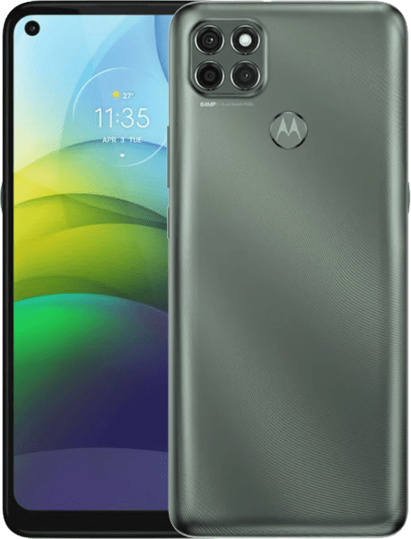

**State: Inactive**  
**Codename: cebu**  
**Maintainers: None**  
**Contributors: [remtrik](https://github.com/remtrik/), [hiprivsid](https://github.com/hiprivsid/)**  
**Tester: None**

### UEFI Status

| Feature            | Description       | State |
|:-------------------|:------------------|:-----:|
| Display            |                   | ✅    |
| Internal Storage   |                   | ✅    |
| Side Buttons       |                   | ✅    |
| USB Host Mode      |                   | ✅    |
| USB Device Mode    |                   | ❌    |
| USB Power Delivery |                   | ❌    |
| Mass Storage       | Needs Device Mode | ❌    |
| SD Card            |                   | ❌    |
| Windows Boot       |                   | ❌    |
| Linux Boot         |                   | ❌    |

  

<b><strong>Xiaomi Devices</strong></b>

## Xiaomi Redmi 9T

**State: Inactive**  
**Codename: lime**  
**Maintainer: None**  
**Contributors: [Robotix](https://github.com/Robotix22/)**  
**Tester: None**

### UEFI Status

| Feature            | Description       | State |
|:-------------------|:------------------|:-----:|
| Display            |                   | ✅    |
| Internal Storage   |                   | ✅    |
| Side Buttons       |                   | ✅    |
| USB Host Mode      |                   | ✅    |
| USB Device Mode    |                   | ❌    |
| USB Power Delivery |                   | ✅    |
| Mass Storage       | Needs Device Mode | ❌    |
| SD Card            |                   | ❌    |
| Windows Boot       | Windows PE only   | ⚠️    |
| Linux Boot         |                   | ❌    |

### OS Status

<table>
<tr><th>Windows</th></tr>
<tr><td>

| Feature              | Description  | State |
|:---------------------|:-------------|:-----:|
| Internal Storage     |              | ❌    |
| SD Card              |              | ❌    |
| Side Buttons         |              | ❌    |
| Proximity Sensor     |              | ❌    |
| Light Sensor         |              | ❌    |
| Accelerometer Sensor |              | ❌    |
| Compass Sensor       |              | ❌    |
| Gyroscope Sensor     |              | ❌    |
| Fingerprint Sensor   |              | ❌    |
| NFC Sensor           |              | ❌    |
| Temperature Sensor   |              | ❌    |
| Battery              |              | ❌    |
| USB Host Mode        |              | ✅    |
| USB Device Mode      |              | ❌    |
| USB Power Delivery   |              | ✅    |
| Charging             |              | ❌    |
| WLAN                 |              | ❌    |
| CPU                  | 4 Cores only | ⚠️    |
| Touchscreen          |              | ❌    |
| Bluetooth            |              | ❌    |
| GPS                  |              | ❌    |
| Speakers             |              | ❌    |
| 3.5mm Audio Jack     |              | ❌    |
| Microphone           |              | ❌    |
| GPU                  |              | ❌    |
| Camera               |              | ❌    |
| Mobile Data          |              | ❌    |
| Display              |              | ✅    |
| Vibration            |              | ❌    |

</td></tr> </table>

## Xiaomi Poco M3

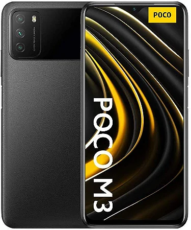

**State: Active**  
**Codename: citrus**  
**Maintainer: [deuspato](https://github.com/deuspato)**  
**Contributors: [Robotix](https://github.com/Robotix22), [9.8.7.6](https://github.com/Daniel224455), [NUC](https://github.com/iNUCi), [Aistop](https://github.com/AistopGit), [All_One1](https://github.com/Ost268), [Heyylucazzz](https://github.com/heyylucazzz)**  
**Tester: [deuspato](https://github.com/deuspato)**

### UEFI Status

| Feature            | Description       | State |
|:-------------------|:------------------|:-----:|
| Display            |                   | ✅    |
| Internal Storage   |                   | ✅    |
| Side Buttons       |                   | ✅    |
| USB Host Mode      |                   | ❌    |
| USB Device Mode    |                   | ✅    |
| USB Power Delivery |                   | ❌    |
| Mass Storage       |                   | ✅    |
| SD Card            |                   | ✅    |
| Windows Boot       |                   | ❌    |
| Linux Boot         |                   | ✅    |

### OS Status

<table>
<tr><th>Linux</th></tr>
<tr><td>

| Feature              | Description  | State |
|:---------------------|:-------------|:-----:|
| Internal Storage     |              | ✅    |
| SD Card              |              | ✅    |
| Side Buttons         |              | ❌    |
| Proximity Sensor     |              | ❌    |
| Light Sensor         |              | ❌    |
| Accelerometer Sensor |              | ❌    |
| Compass Sensor       |              | ❌    |
| Gyroscope Sensor     |              | ❌    |
| Fingerprint Sensor   |              | ❌    |
| NFC Sensor           |              | ❌    |
| Temperature Sensor   |              | ❌    |
| Battery              |              | ❌    |
| USB Host Mode        |              | ❌    |
| USB Device Mode      |              | ✅    |
| USB Power Delivery   |              | ❌    |
| Charging             |              | ❌    |
| WLAN                 |              | ❌    |
| CPU                  | 8? i think   | ⚠️    |
| Touchscreen          |              | ❌    |
| Bluetooth            |              | ❌    |
| GPS                  |              | ❌    |
| Speakers             |              | ❌    |
| 3.5mm Audio Jack     |              | ❌    |
| Microphone           |              | ❌    |
| GPU                  |              | ❌    |
| Camera               |              | ❌    |
| Mobile Data          |              | ❌    |
| Display              |              | ✅    |
| Vibration            |              | ❌    |

</td></tr> </table>

  

---

  

<b><strong>Snapdragon 660/636/630 Devices</strong></b>

 

<b><strong>Xiaomi Devices</strong></b>

## Xiaomi Mi Max 3

**State: Inactive**  
**Codename: nitrogen**  
**Maintainer: [Aistop](https://github.com/AistopGit/)**  
**Contributors: [Robotix](https://github.com/Robotix22/), [Aistop](https://github.com/AistopGit/)**  
**Tester: [Aistop](https://github.com/AistopGit/)**

### UEFI Status

| Feature            | Description | State |
|:-------------------|:------------|:-----:|
| Display            |             | ✅    |
| Internal Storage   |             | ✅    |
| Side Buttons       |             | ✅    |
| USB Host Mode      |             | ❌    |
| USB Device Mode    |             | ✅    |
| USB Power Delivery |             | ✅    |
| Mass Storage       |             | ✅    |
| SD Card            |             | ✅    |
| Windows Boot       |             | ✅    |
| Linux Boot         |             | ✅    |

### OS Status

<table>
<tr><th>Windows</th><th>Linux</th></tr>
<tr><td>

| Feature              | Description                       | State |
|:---------------------|:----------------------------------|:-----:|
| Internal Storage     |                                   | ❌    |
| SD Card              |                                   | ❌    |
| Side Buttons         |                                   | ❌    |
| Proximity Sensor     |                                   | ❌    |
| Light Sensor         |                                   | ❌    |
| Accelerometer Sensor |                                   | ❌    |
| Compass Sensor       |                                   | ❌    |
| Gyroscope Sensor     |                                   | ❌    |
| Fingerprint Sensor   |                                   | ❌    |
| Hall Sensor          |                                   | ❌    |
| Temperature Sensor   |                                   | ❌    |
| Battery              |                                   | ❌    |
| USB Host Mode        | Depends What Mode it was in UEFI. | ✅    |
| USB Device Mode      | Depends What Mode it was in UEFI. | ✅    |
| USB Power Delivery   | Depends What Mode it was in UEFI. | ✅    |
| Charging             |                                   | ❌    |
| WLAN                 |                                   | ❌    |
| CPU                  |                                   | ✅    |
| Touchscreen          |                                   | ❌    |
| Bluetooth            |                                   | ❌    |
| GPS                  |                                   | ❌    |
| Speakers             |                                   | ❌    |
| 3.5mm Audio Jack     |                                   | ❌    |
| Microphone           |                                   | ❌    |
| GPU                  |                                   | ❌    |
| Camera               |                                   | ❌    |
| Mobile Data          |                                   | ❌    |
| Display              |                                   | ✅    |
| Vibration            |                                   | ❌    |

</td><td>

| Feature              | Description                       | State |
|:---------------------|:----------------------------------|:-----:|
| Internal Storage     |                                   | ❌    |
| SD Card              |                                   | ❌    |
| Side Buttons         |                                   | ❌    |
| Proximity Sensor     |                                   | ❌    |
| Light Sensor         |                                   | ❌    |
| Accelerometer Sensor |                                   | ❌    |
| Compass Sensor       |                                   | ❌    |
| Gyroscope Sensor     |                                   | ❌    |
| Fingerprint Sensor   |                                   | ❌    |
| Hall Sensor          |                                   | ❌    |
| Temperature Sensor   |                                   | ❌    |
| Battery              |                                   | ❌    |
| USB Host Mode        | Depends What Mode it was in UEFI. | ✅    |
| USB Device Mode      | Depends What Mode it was in UEFI. | ✅    |
| USB Power Delivery   | Depends What Mode it was in UEFI. | ✅    |
| Charging             |                                   | ❌    |
| WLAN                 |                                   | ❌    |
| CPU                  |                                   | ✅    |
| Touchscreen          |                                   | ❌    |
| Bluetooth            |                                   | ❌    |
| GPS                  |                                   | ❌    |
| Speakers             |                                   | ❌    |
| 3.5mm Audio Jack     |                                   | ❌    |
| Microphone           |                                   | ❌    |
| GPU                  |                                   | ❌    |
| Camera               |                                   | ❌    |
| Mobile Data          |                                   | ❌    |
| Display              |                                   | ✅    |
| Vibration            |                                   | ❌    |

</td></tr> </table>

## Xiaomi Redmi Note 7

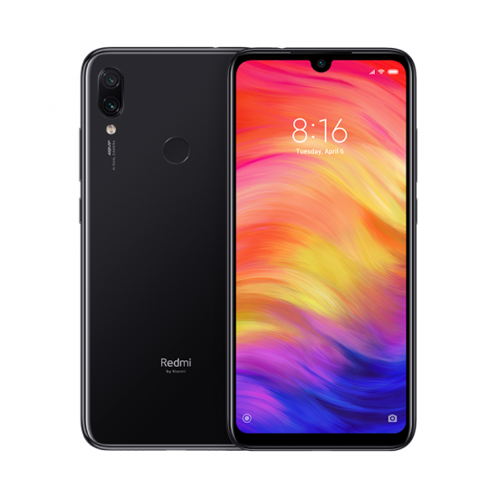

**State: Inactive**  
**Codename: lavender**  
**Maintainer: [index986](https://github.com/index986/)**  
**Contributors: [index986](https://github.com/index986)**  
**Tester: [index986](https://github.com/index986/)**

### UEFI Status

| Feature            | Description                    | State |
|:-------------------|:-------------------------------|:-----:|
| Display            |                                | ✅    |
| Internal Storage   |                                | ✅    |
| Side Buttons       |                                | ✅    |
| USB Host Mode      |                                | ❌    |
| USB Device Mode    |                                | ✅    |
| USB Power Delivery | Unstable if fastboot boot used | ⚠️    |
| Mass Storage       |                                | ✅    |
| SD Card            |                                | ✅    |
| Windows Boot       | Windows PE only                | ⚠️    |
| Linux Boot         |                                | ❔    |

  

  

  

---

<b><strong>Tegra Devices</strong></b>

 

<b><strong>Tegra X1 Devices</strong></b>

 

<b><strong>Nintendo Devices</strong></b>

## Nintendo Switch

**State: Inactive**  
**Codename: HAC-001**  
**Maintainer: [Robotix](https://github.com/Robotix22/)**  
**Contributors: [Robotix](https://github.com/Robotix22/)**  
**Tester: [Robotix](https://github.com/Robotix22/)**

### UEFI Status

| Feature            | Description       | State |
|:-------------------|:------------------|:-----:|
| Display            | Wrong Orientation | ⚠️    |
| Internal Storage   |                   | ❌    |
| Joy Cons           |                   | ❌    |
| Side Buttons       | No Power Button   | ⚠️    |
| USB Host Mode      |                   | ❌    |
| USB Device Mode    |                   | ❌    |
| USB Power Delivery |                   | ❌    |
| SD Card            |                   | ❌    |
| Windows Boot       |                   | ❌    |
| Linux Boot         |                   | ❌    |

  

---

  

<b><strong>Tegra 3 Devices</strong></b>

 

<b><strong>Lenovo Devices</strong></b>

## Lenovo IdeaPad Yoga 11

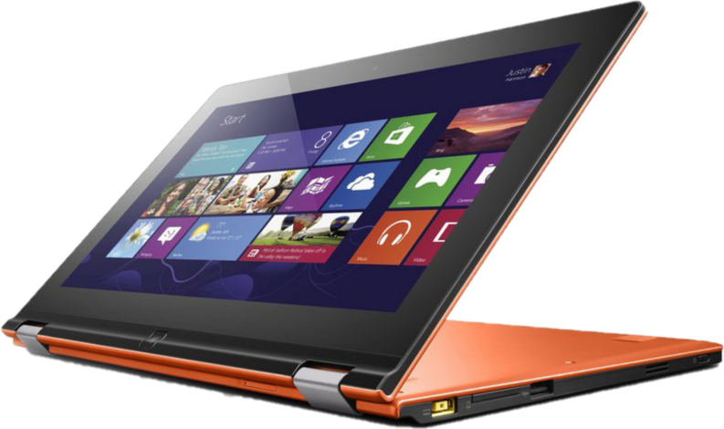

**State: Inactive**  
**Codename: Venus**  
**Maintainer: None**  
**Contributors: [Robotix](https://github.com/Robotix22/)**  
**Tester: None**

### UEFI Status

| Feature            | Description               | State |
|:-------------------|:--------------------------|:-----:|
| Display            |                           | ✅    |
| Internal Storage   |                           | ❌    |
| Keyboard           | Some features are missing | ⚠️    |
| Side Buttons       |                           | ❔    |
| USB Host Mode      |                           | ❌    |
| USB Device Mode    |                           | ❌    |
| USB Power Delivery |                           | ❌    |
| SD Card            |                           | ❌    |
| Windows Boot       |                           | ❌    |
| Linux Boot         |                           | ❌    |

  

<b><strong>Microsoft Devices</strong></b>

## Microsoft Surface RT

**State: Inactive**  
**Codename: oemk**  
**Maintainer: None**  
**Contributors: [Robotix](https://github.com/Robotix22/)**  
**Tester: None**

### UEFI Status

| Feature            | Description | State |
|:-------------------|:------------|:-----:|
| Display            |             | ✅    |
| Internal Storage   |             | ❌    |
| Touchcover         |             | ❌    |
| Side Buttons       |             | ❌    |
| USB Host Mode      |             | ❌    |
| USB Device Mode    |             | ❌    |
| USB Power Delivery |             | ❌    |
| SD Card            |             | ❌    |
| Windows Boot       |             | ❌    |
| Linux Boot         |             | ❌    |

  

  

  

