| Symbol | Meaning      |
|:------:|:------------:|
| ✅     | Working     |
| ⚠️     | Problematic |
| ❌     | Not Working |
| ❔     | Unknown     |

## Supported Devices

<b><strong>Exynos Devices</strong></b>

 

<b><strong>Exynos 2400 Devices</strong></b>

## Samsung Galaxy S24

<table>
<tr><td>

> [!CAUTION]
> `BIT-9` Version is Required on this Phone!

</td></tr>
</table>

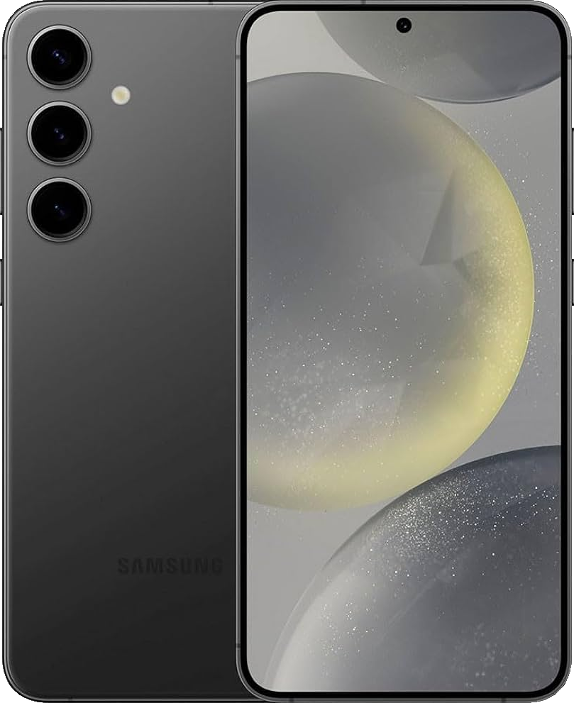

**State: Inactive**  
**Codename: e1s**  
**Contributors: [Robotix](https://github.com/Robotix22/), [halal-beef](https://github.com/halal-beef/)**

### UEFI Status

| Feature            | Description    | State |
|:-------------------|:---------------|:-----:|
| Display            |                | ✅    |
| Internal Storage   |                | ❌    |
| Side Buttons       | Only Volume Up | ⚠️    |
| USB Host Mode      |                | ❌    |
| USB Device Mode    |                | ❌    |
| USB Power Delivery |                | ❌    |
| SD Card            |                | ❌    |
| Windows Boot       |                | ❌    |
| Linux Boot         |                | ❌    |

<b><strong>Exynos 9830 Devices</strong></b>

## Samsung Galaxy Note 20 5G

<table>
<tr><td>

> [!CAUTION]
> `BIT-17` Version is Required on this Phone!

</td></tr>
</table>

**State: Inactive**  
**Codename: c1s**  
**Contributors: [halal-beef](https://github.com/halal-beef/), [BotchedRPR](https://github.com/BotchedRPR/)**

### UEFI Status

| Feature            | Description | State |
|:-------------------|:------------|:-----:|
| Display            |             | ✅    |
| Internal Storage   |             | ❌    |
| Side Buttons       |             | ✅    |
| USB Host Mode      |             | ❌    |
| USB Device Mode    |             | ❌    |
| USB Power Delivery |             | ❌    |
| SD Card            |             | ❌    |
| Windows Boot       |             | ❌    |
| Linux Boot         |             | ❌    |

## Samsung Galaxy S20 5G

<table>
<tr><td>

> [!CAUTION]
> `BIT-23` Version is Required on this Phone!

</td></tr>
</table>

**State: Inactive**  
**Codename: x1s**  
**Contributors: [halal-beef](https://github.com/halal-beef/)**

### UEFI Status

| Feature            | Description | State |
|:-------------------|:------------|:-----:|
| Display            |             | ✅    |
| Internal Storage   |             | ❌    |
| Side Buttons       |             | ✅    |
| USB Host Mode      |             | ❌    |
| USB Device Mode    |             | ❌    |
| USB Power Delivery |             | ❌    |
| SD Card            |             | ❌    |
| Windows Boot       |             | ❌    |
| Linux Boot         |             | ❌    |

## Samsung Galaxy S20 FE

<table>
<tr><td>

> [!CAUTION]
> `BIT-23` Version is Required on this Phone!

</td></tr>
</table>

**State: Inactive**  
**Codename: r8s**  
**Contributors: [halal-beef](https://github.com/halal-beef/), [Sota4Ever](https://github.com/Sota4Ever/)**

### UEFI Status

| Feature            | Description | State |
|:-------------------|:------------|:-----:|
| Display            |             | ✅    |
| Internal Storage   |             | ❌    |
| Side Buttons       |             | ✅    |
| USB Host Mode      |             | ❌    |
| USB Device Mode    |             | ❌    |
| USB Power Delivery |             | ❌    |
| SD Card            |             | ❌    |
| Windows Boot       |             | ❌    |
| Linux Boot         |             | ❌    |

<b><strong>Exynos 9820 Devices</strong></b>

## Samsung Galaxy S10

<table>
<tr><td>

> [!CAUTION]
> `BIT-16` Version is Required on this Phone!

</td></tr>
</table>

**State: Inactive**  
**Codename: beyond1lte**  
**Contributors: [Robotix](https://github.com/Robotix22/)**

### UEFI Status

| Feature            | Description | State |
|:-------------------|:------------|:-----:|
| Display            |             | ✅    |
| Internal Storage   |             | ❌    |
| Side Buttons       |             | ✅    |
| USB Host Mode      |             | ❌    |
| USB Device Mode    |             | ❌    |
| USB Power Delivery |             | ❌    |
| SD Card            |             | ❌    |
| Windows Boot       |             | ❌    |
| Linux Boot         |             | ❌    |

<b><strong>Exynos 9810 Devices</strong></b>

## Samsung Galaxy S9

<table>
<tr><td>

> [!CAUTION]
> `BIT-17` Version is Required on this Phone!

</td></tr>
</table>

**State: Inactive**  
**Codename: starlte**  
**Contributors: [Robotix](https://github.com/Robotix22/)**

### UEFI Status

| Feature            | Description | State |
|:-------------------|:------------|:-----:|
| Display            |             | ✅    |
| Internal Storage   |             | ❌    |
| Side Buttons       |             | ✅    |
| USB Host Mode      |             | ❌    |
| USB Device Mode    |             | ❌    |
| USB Power Delivery |             | ❌    |
| SD Card            |             | ❌    |
| Windows Boot       |             | ❌    |
| Linux Boot         |             | ❌    |

<b><strong>Exynos 7885 Devices</strong></b>

<table>
<tr><td>

> [!IMPORTANT]
> Only 23H2 Windows Builds and Lower are able to Boot.

</td></tr>
</table>

## Samsung Galaxy A10

<table>
<tr><td>

> [!CAUTION]
> `BIT-9` Version is Required on this Phone!

</td></tr>
</table>

**State: Inactive**  
**Codename: a10**  
**Contributors: [snaccy](https://github.com/sonic011gamer/)**

### UEFI Status

| Feature            | Description | State |
|:-------------------|:------------|:-----:|
| Display            |             | ✅    |
| Internal Storage   |             | ❌    |
| Side Buttons       |             | ✅    |
| USB Host Mode      |             | ❌    |
| USB Device Mode    |             | ❌    |
| USB Power Delivery |             | ❌    |
| SD Card            |             | ❌    |
| Windows Boot       |             | ❌    |
| Linux Boot         |             | ❌    |

## Samsung Galaxy A7 (2018)

<table>
<tr><td>

> [!CAUTION]
> `BIT-5` Version is Required on this Phone!

</td></tr>
</table>

**State: Inactive**  
**Codename: a7**  
**Contributors: [Icesito](https://github.com/Icesito68/)**

### UEFI Status

| Feature            | Description | State |
|:-------------------|:------------|:-----:|
| Display            |             | ✅    |
| Internal Storage   |             | ❌    |
| Side Buttons       |             | ✅    |
| USB Host Mode      |             | ❌    |
| USB Device Mode    |             | ❌    |
| USB Power Delivery |             | ❌    |
| SD Card            |             | ❌    |
| Windows Boot       |             | ❌    |
| Linux Boot         |             | ❌    |

<b><strong>Exynos 7870 Devices</strong></b>

<table>
<tr><td>

> [!IMPORTANT]
> Only 23H2 Windows Builds and Lower are able to Boot.

</td></tr>
</table>

## Samsung Galaxy Tab A 10.1 (2016)

<table>
<tr><td>

> [!CAUTION]
> `BIT-7` Version is Required on this Phone!

</td></tr>
</table>

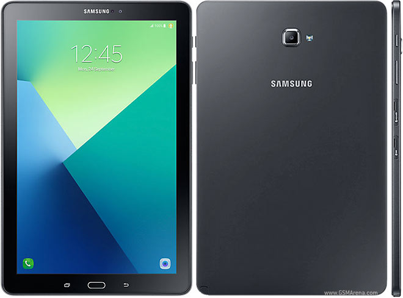

**State: Inactive**  
**Codename: gtaxllte**  
**Contributors: [Glitchythedev](https://github.com/Glitchythedev/), [AistopGit](https://github.com/AistopGit)**

### UEFI Status

| Feature            | Description           | State |
|:-------------------|:----------------------|:-----:|
| Display            |                       | ✅    |
| Internal Storage   | Untested Writes       | ✅    |
| Side Buttons       |                       | ✅    |
| USB Host Mode      |                       | ❌    |
| USB Device Mode    |                       | ❌    |
| USB Power Delivery |                       | ❌    |
| SD Card            |                       | ❌    |
| Windows Boot       |                       | ❌    |
| Linux Boot         |                       | ❌    |

---

<b><strong>MediaTek Devices</strong></b>

 

<b><strong>MediaTek P65/G80 Devices</strong></b>

 

<b><strong>Xiaomi Devices</strong></b>

## Xiaomi Redmi 9

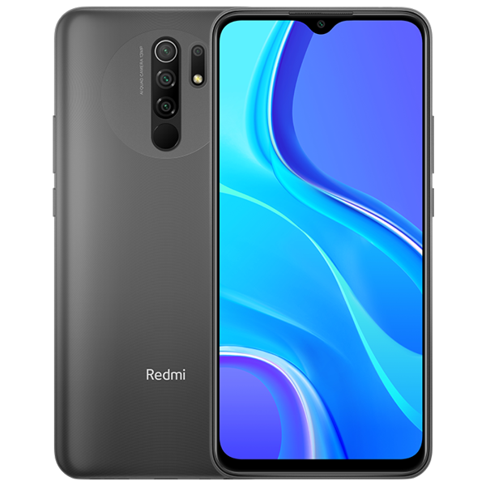

**State: Inactive**  
**Codename: lancelot**  
**Contributors: [Nikroks](https://github.com/N1kroks/)**

### UEFI Status

| Feature            | Description    | State |
|:-------------------|:---------------|:-----:|
| Display            |                | ✅    |
| Internal Storage   |                | ✅    |
| Side Buttons       |                | ✅    |
| USB Host Mode      |                | ❌    |
| USB Device Mode    |                | ❌    |
| USB Power Delivery |                | ❌    |
| SD Card            |                | ❌    |
| Windows Boot       |                | ❌    |
| Linux Boot         |                | ❌    |

---

<b><strong>Snapdragon Devices</strong></b>

 

<b><strong>Snapdragon 8 Elite Devices</strong></b>

 

<b><strong>OnePlus Devices</strong></b>

## OnePlus 13

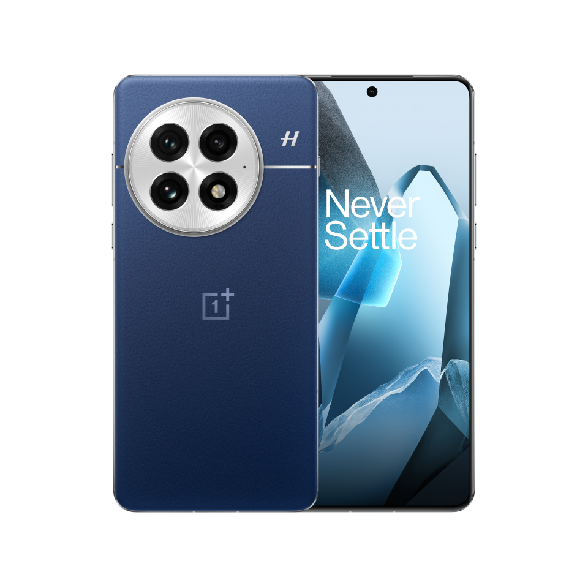

**State: Active**  
**Codename: dodge**  
**Contributors: [Robotix](https://github.com/Robotix22/), [N1kroks](https://github.com/N1kroks/), [index986](https://github.com/index986/)**

### UEFI Status

| Feature            | Description | State |
|:-------------------|:-------------|:-----:|
| Display            |              | ✅    |
| Internal Storage   |              | ✅    |
| Side Buttons       |              | ✅    |
| USB Host Mode      |              | ❌    |
| USB Device Mode    |              | ✅    |
| USB Power Delivery |              | ❌    |
| Mass Storage       |              | ✅    |
| Windows Boot       | Untested     | ❔    |
| Linux Boot         |              | ✅    |

<table>
<tr><th>Linux</th></tr>
<tr><td>

> [!IMPORTANT]
> Linux Requires: [Mainline Kernel](https://github.com/index986/sm8750-mainline).

> [!NOTE]
> The PostmarketOS Site for this Device can be Found [here](https://wiki.postmarketos.org/wiki/OnePlus_13_(oneplus-dodge)).

| Feature              | Description   | State |
|:---------------------|:--------------|:-----:|
| Internal Storage     |               | ✅    |
| Side Buttons         |               | ✅    |
| Proximity Sensor     |               | ❌    |
| Light Sensor         |               | ❌    |
| Accelerometer Sensor |               | ❌    |
| Compass Sensor       |               | ❌    | 
| Gyroscope Sensor     |               | ❌    |
| Fingerprint Sensor   |               | ❌    |
| NFC Sensor           |               | ❌    |
| Temperature Sensor   |               | ❌    |
| Battery              |               | ❌    |
| USB Host Mode        |               | ❌    |
| USB Device Mode      |               | ✅    |
| USB Power Delivery   |               | ❌    |
| Charging             | No indication | ⚠️    |
| WLAN                 |               | ❌    |
| CPU                  |               | ✅    |
| Touchscreen          |               | ✅    |
| Bluetooth            |               | ❌    |
| GPS                  |               | ❌    |
| Speakers             |               | ❌    |
| Microphone           |               | ❌    |
| GPU                  |               | ❌    |
| Camera               |               | ❌    |
| Flashlight           |               | ✅    |
| Mobile Data          |               | ❌    |
| Display              |               | ✅    | 
| Vibration            |               | ❌    |

</td></tr>
</table>

## OnePlus 13s

**State: Active**  
**Codename: pagani**  
**Contributors: [renhiyama](https://github.com/renhiyama), [Robotix](https://github.com/Robotix22/), [N1kroks](https://github.com/N1kroks/)**

### UEFI Status

| Feature            | Description | State |
|:-------------------|:-------------|:-----:|
| Display            |              | ✅    |
| Internal Storage   |              | ✅    |
| Side Buttons       |              | ✅    |
| USB Host Mode      | Untested     | ❔    |
| USB Device Mode    |              | ✅    |
| USB Power Delivery |              | ❌    |
| Mass Storage       |              | ✅    |
| Windows Boot       | WIP          | 🏗    |
| Linux Boot         | WIP          | 🏗    |

<table>
<tr><th>Linux</th></tr>
<tr><td>

> [!IMPORTANT]
> Linux Requires: [Mainline Kernel](https://github.com/renhiyama/pagani-kernel) (WIP).

</td></tr>
</table>

---

<b><strong>Snapdragon 8s Gen 3 Devices</strong></b>

 

<table>
<tr><td>

> [!IMPORTANT]
> Only Windows Builds 26090 or higher Work.

</td></tr>
</table>

<b><strong>Realme Devices</strong></b>

## Realme GT Neo6 / GT 6

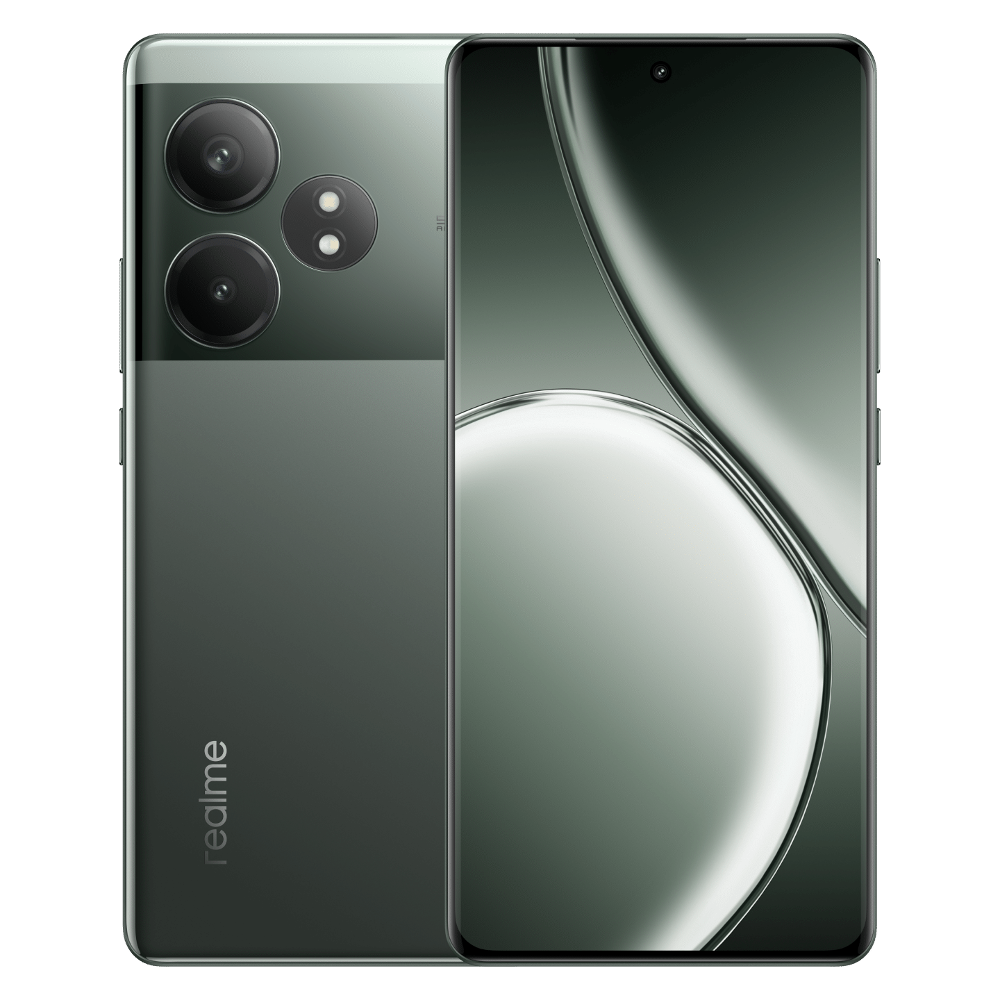

**State: Active**  
**Codename: bale**  
**Contributors: [Robotix](https://github.com/Robotix22/), [Shandorman](https://github.com/jiganomegsdfdf/), [InternalHellhound](https://github.com/InternalHellhound), [index986](https://github.com/index986/), [Daniel224455](https://github.com/Daniel224455/), [Aistop](https://github.com/AistopGit/)**

### UEFI Status

| Feature            | Description              | State |
|:-------------------|:-------------------------|:-----:|
| Display            |                          | ✅    |
| Internal Storage   |                          | ✅    |
| Side Buttons       |                          | ✅    |
| USB Host Mode      |                          | ❌    |
| USB Device Mode    |                          | ✅    |
| USB Power Delivery |                          | ❌    |
| Mass Storage       |                          | ✅    |
| Windows Boot       | Tested with WinPE only.  | ⚠️    |
| Linux Boot         | Untested.                | ❔    |

### OS Status

<table>
<tr><th>Windows</th></tr>
<tr><td>

| Feature              | Description   | State |
|:---------------------|:--------------|:-----:|
| Internal Storage     |               | ❌    |
| Side Buttons         |               | ❌    |
| Proximity Sensor     |               | ❌    |
| Light Sensor         |               | ❌    |
| Accelerometer Sensor |               | ❌    |
| Compass Sensor       |               | ❌    | 
| Gyroscope Sensor     |               | ❌    |
| Fingerprint Sensor   |               | ❌    |
| NFC Sensor           |               | ❌    |
| Temperature Sensor   |               | ❌    |
| Battery              |               | ❌    |
| USB Host Mode        |               | ❌    |
| USB Device Mode      |               | ❌    |
| USB Power Delivery   |               | ❌    |
| Charging             |               | ❌    |
| WLAN                 |               | ❌    |
| CPU                  |               | ✅    |
| Touchscreen          |               | ❌    |
| Bluetooth            |               | ❌    |
| GPS                  |               | ❌    |
| Speakers             |               | ❌    |
| Microphone           |               | ❌    |
| GPU                  |               | ❌    |
| Camera               |               | ❌    |
| Mobile Data          |               | ❌    |
| Display              |               | ✅    | 
| Vibration            |               | ❌    |

</td>
<!--
<td>

| Feature              | Description   | State |
|:---------------------|:--------------|:-----:|
| Internal Storage     |               | ❔    |
| Side Buttons         |               | ❔    |
| Proximity Sensor     |               | ❔    |
| Light Sensor         |               | ❔    |
| Accelerometer Sensor |               | ❔    |
| Compass Sensor       |               | ❔    | 
| Gyroscope Sensor     |               | ❔    |
| Fingerprint Sensor   |               | ❔    |
| NFC Sensor           |               | ❔    |
| Temperature Sensor   |               | ❔    |
| Battery              |               | ❔    |
| USB Host Mode        |               | ❔    |
| USB Device Mode      |               | ❔    |
| USB Power Delivery   |               | ❔    |
| Charging             |               | ❔    |
| WLAN                 |               | ❔    |
| CPU                  |               | ❔    |
| Touchscreen          |               | ❔    |
| Bluetooth            |               | ❔    |
| GPS                  |               | ❔    |
| Speakers             |               | ❔    |
| Microphone           |               | ❔    |
| GPU                  |               | ❔    |
| Camera               |               | ❔    |
| Mobile Data          |               | ❔    |
| Display              |               | ❔    | 
| Vibration            |               | ❔    |

</td>
-->
</tr>
</table>

<b><strong>Xiaomi Devices</strong></b>

## Xiaomi Pad 7 Pro

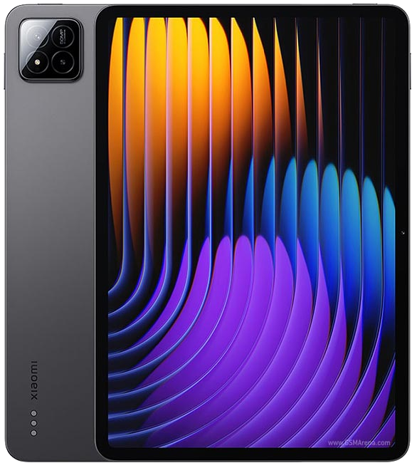

**State: Active**  
**Codename: muyu**  
**Contributors: [Sinetek (mail)](mailto:philmb3487@proton.me), [Sinetek (gitlab)](https://gitlab.com/philmb3487/)**

### UEFI Status

| Feature            | Description  | State |
|:-------------------|:-------------|:-----:|
| Display            |              | ✅    |
| Internal Storage   |              | ✅    |
| Side Buttons       |              | ✅    |
| USB Host Mode      |              | ❌    |
| USB Device Mode    |              | ✅    |
| USB Power Delivery |              | ❌    |
| Mass Storage       |              | ✅    |
| Windows Boot       |              | ❌    |
| Linux Boot         | Mainline WIP | ⚠️     |

More information on this device available at [Muyu Wiki (Xiaomi Pad 7 Pro on SM8635) - Mainlining](http://muyuwiki.ca).

## POCO F6

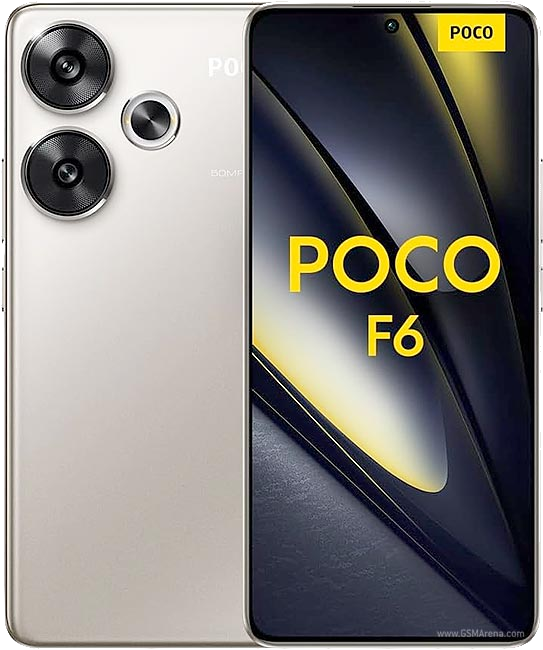

**State: Inactive**  
**Codename: peridot**  
**Contributors: [Robotix](https://github.com/Robotix22/), [PugzAreCute](https://github.com/PugzAreCute), [InternalHellhound](https://github.com/InternalHellhound), [iNUCi](https://github.com/iNUCi), [Daniel224455](https://github.com/Daniel224455/), [Aistop](https://github.com/AistopGit/)**

### UEFI Status

| Feature            | Description  | State |
|:-------------------|:-------------|:-----:|
| Display            |              | ✅    |
| Internal Storage   |              | ✅    |
| Side Buttons       |              | ✅    |
| USB Host Mode      |              | ❌    |
| USB Device Mode    |              | ✅    |
| USB Power Delivery |              | ❌    |
| Mass Storage       |              | ✅    |
| Windows Boot       |              | ✅    |
| Linux Boot         | Mainline WIP | ⚠️    |

### OS Status

<table>
<tr><th>Windows</th><!-- <th>Linux</th> -->
</tr>
<tr><td>

> [!IMPORTANT]
> Only Windows PE boots.

| Feature              | Description   | State |
|:---------------------|:--------------|:-----:|
| Internal Storage     |               | ❌    |
| Side Buttons         |               | ❌    |
| Proximity Sensor     |               | ❌    |
| Light Sensor         |               | ❌    |
| Accelerometer Sensor |               | ❌    |
| Compass Sensor       |               | ❌    | 
| Gyroscope Sensor     |               | ❌    |
| Fingerprint Sensor   |               | ❌    |
| NFC Sensor           |               | ❌    |
| Temperature Sensor   |               | ❌    |
| Battery              |               | ❌    |
| USB Host Mode        |               | ❌    |
| USB Device Mode      |               | ❌    |
| USB Power Delivery   |               | ❌    |
| Charging             |               | ❌    |
| WLAN                 |               | ❌    |
| CPU                  |               | ✅    |
| Touchscreen          |               | ❌    |
| Bluetooth            |               | ❌    |
| GPS                  |               | ❌    |
| Speakers             |               | ❌    |
| Microphone           |               | ❌    |
| GPU                  |               | ❌    |
| Camera               |               | ❌    |
| Mobile Data          |               | ❌    |
| Display              |               | ✅    | 
| Vibration            |               | ❌    |

</td>
<!--
<td>

| Feature              | Description   | State |
|:---------------------|:--------------|:-----:|
| Internal Storage     |               | ❔    |
| Side Buttons         |               | ❔    |
| Proximity Sensor     |               | ❔    |
| Light Sensor         |               | ❔    |
| Accelerometer Sensor |               | ❔    |
| Compass Sensor       |               | ❔    | 
| Gyroscope Sensor     |               | ❔    |
| Fingerprint Sensor   |               | ❔    |
| NFC Sensor           |               | ❔    |
| Temperature Sensor   |               | ❔    |
| Battery              |               | ❔    |
| USB Host Mode        |               | ❔    |
| USB Device Mode      |               | ❔    |
| USB Power Delivery   |               | ❔    |
| Charging             |               | ❔    |
| WLAN                 |               | ❔    |
| CPU                  |               | ❔    |
| Touchscreen          |               | ❔    |
| Bluetooth            |               | ❔    |
| GPS                  |               | ❔    |
| Speakers             |               | ❔    |
| Microphone           |               | ❔    |
| GPU                  |               | ❔    |
| Camera               |               | ❔    |
| Mobile Data          |               | ❔    |
| Display              |               | ❔    | 
| Vibration            |               | ❔    |

</td>
-->
</tr>
</table>

---

<b><strong>Snapdragon 8 Gen 2 Devices</strong></b>

 

<table>
<tr><td>

> [!IMPORTANT]
> Only Windows Builds 26090 or higher Work.

</td></tr>
</table>

<b><strong>OnePlus Devices</strong></b>

## OnePlus 12R / Ace 3

**State: Inactive**  
**Codename: aston**  
**Contributors: [Robotix](https://github.com/Robotix22/), [Shandorman](https://github.com/jiganomegsdfdf/)**

### UEFI Status

| Feature            | Description | State |
|:-------------------|:------------|:-----:|
| Display            |             | ✅    |
| Internal Storage   |             | ✅    |
| Side Buttons       |             | ✅    |
| USB Host Mode      |             | ❌    |
| USB Device Mode    |             | ✅    |
| USB Power Delivery |             | ❌    |
| Mass Storage       |             | ✅    |
| Windows Boot       |             | ✅    |
| Linux Boot         |             | ✅    |

### OS Status

<table>
<tr><th>Windows</th><th>Linux</th></tr>
<tr><td>

| Feature              | Description   | State |
|:---------------------|:--------------|:-----:|
| Internal Storage     |               | ✅    |
| Side Buttons         |               | ❌    |
| Proximity Sensor     |               | ❌    |
| Light Sensor         |               | ❌    |
| Accelerometer Sensor |               | ❌    |
| Gyroscope Sensor     |               | ❌    |
| Magnetometer Sensor  |               | ❌    |
| Fingerprint Sensor   |               | ❌    |
| NFC Sensor           |               | ❌    |
| Temperature Sensor   | Only Battery  | ⚠️    |
| Battery              |               | ✅    |
| USB Host Mode        |               | ❌    |
| USB Device Mode      |               | ❔    |
| USB Power Delivery   |               | ❌    |
| Charging             | No Indication | ⚠️    |
| WLAN                 |               | ❌    |
| CPU                  |               | ✅    |
| Touchscreen          |               | ❌    |
| Bluetooth            |               | ❌    |
| GPS                  |               | ❌    |
| Speakers             |               | ❌    |
| Microphone           |               | ❌    |
| GPU                  |               | ❌    |
| Camera               |               | ❌    |
| Mobile Data          |               | ❌    |
| Display              |               | ✅    | 
| Vibration            |               | ❌    |

</td>
<td>

> [!IMPORTANT]
> Linux Requires: [Mainline Kernel](https://github.com/jiganomegsdfdf/aston-mainline).

> [!TIP]
> Recommended Guide: [Ubuntu](https://github.com/jiganomegsdfdf/ubuntu-oneplus-aston).

| Feature              | Description             | State |
|:---------------------|:------------------------|:-----:|
| Internal Storage     |                         | ✅    |
| Side Buttons         |                         | ✅    |
| Proximity Sensor     |                         | ❌    |
| Light Sensor         |                         | ✅    |
| Accelerometer Sensor |                         | ❌    |
| Gyroscope Sensor     |                         | ❌    |
| Magnetometer Sensor  | Userspace Issues        | ⚠️    |
| Fingerprint Sensor   |                         | ❌    |
| NFC Sensor           | Untested                | ❔    |
| Temperature Sensor   |                         | ✅    |
| Battery              |                         | ✅    |
| USB Host Mode        |                         | ❌    |
| USB Device Mode      |                         | ✅    |
| USB Power Delivery   |                         | ❌    |
| Charging             | 100W = 1.1W             | ⚠️    |
| WLAN                 |                         | ✅    |
| CPU                  |                         | ✅    |
| Touchscreen          |                         | ✅    |
| Bluetooth            |                         | ✅    |
| GPS                  |                         | ❌    |
| Speakers             |                         | ✅    |
| Microphone           |                         | ✅    |
| GPU                  |                         | ✅    |
| Camera               | Only Front, Macroand UW | ✅    |
| Mobile Data          |                         | ❌    |
| Display              |                         | ✅    | 
| Vibration            |                         | ❌    |

</td></tr>
</table>

<b><strong>Xiaomi Devices</strong></b>

## Xiaomi 13 Pro

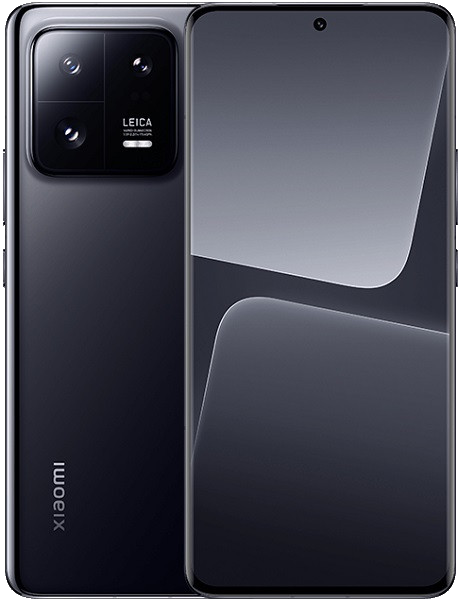

**State: Active**  
**Codename: nuwa**  
**Contributors: [Robotix](https://github.com/Robotix22/), [Alfa](https://github.com/alfaonyt/)**

### UEFI Status

| Feature            | Description | State |
|:-------------------|:------------|:-----:|
| Display            |             | ✅    |
| Internal Storage   |             | ✅    |
| Side Buttons       |             | ✅    |
| USB Host Mode      |             | ❌    |
| USB Device Mode    |             | ✅    |
| USB Power Delivery |             | ❌    |
| Mass Storage       |             | ✅    |
| Windows Boot       |             | ❌    |
| Linux Boot         |             | ✅    |

### OS Status

<table>
<tr><th>Linux</th></tr>
<tr><td>

> [!IMPORTANT]
> Linux Requires: [Mainline Kernel](https://github.com/alfaonyt/nuwa-mainline).

| Feature              | Description             | State |
|:---------------------|:------------------------|:-----:|
| Internal Storage     | No UFS Deep Sleep       | ✅    |
| Side Buttons         |                         | ✅    |
| Proximity Sensor     |                         | ❌    |
| Light Sensor         |                         | ❌    |
| Accelerometer Sensor |                         | ❌    |
| Gyroscope Sensor     |                         | ❌    |
| Magnetometer Sensor  |                         | ❌    |
| Fingerprint Sensor   |                         | ❌    |
| NFC Sensor           |                         | ❌    |
| Temperature Sensor   |                         | ❌    |
| Battery              |                         | ✅    |
| USB Host Mode        | Untested. Should work   | ❔    |
| USB Device Mode      |                         | ✅    |
| USB Power Delivery   | Untested                | ❔    |
| Charging             |                         | ✅    |
| WLAN                 |                         | ✅    |
| CPU                  |                         | ✅    |
| Touchscreen          | WIP                     | ❌    |
| Bluetooth            |                         | ✅    |
| GPS                  |                         | ❌    |
| Speakers             |                         | ✅    |
| Microphone           |                         | ❌    |
| GPU                  |                         | ✅    |
| Camera               |                         | ❌    |
| Mobile Data          |                         | ✅    |
| Display              |                         | ✅    | 
| Vibration            |                         | ❌    |

</td></tr>
</table>

<b><strong>ZTE Devices</strong></b>

## ZTE Nubia RedMagic 8 Pro

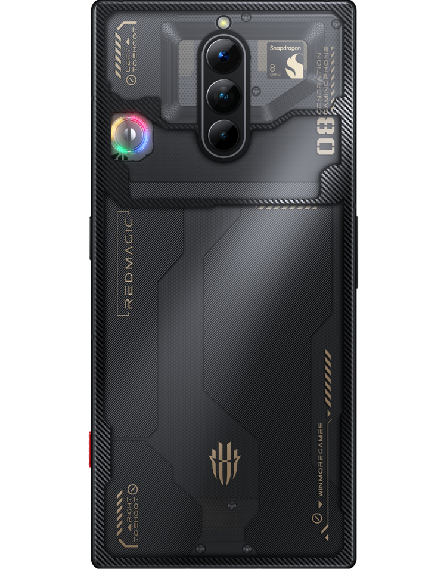

**State: Active**  
**Codename: nx729j**  
**Contributors: [Robotix](https://github.com/Robotix22/), [Nikka](https://github.com/NikkaGames/)**

### UEFI Status

| Feature            | Description | State |
|:-------------------|:------------|:-----:|
| Display            |             | ✅    |
| Internal Storage   |             | ✅    |
| Side Buttons       |             | ✅    |
| USB Host Mode      |             | ❌    |
| USB Device Mode    |             | ✅    |
| USB Power Delivery |             | ❌    |
| Mass Storage       |             | ✅    |
| Windows Boot       |             | ✅    |
| Linux Boot         |             | ❌    |

### OS Status

<table>
<tr><th>Windows</th></tr>
<tr><td>

| Feature              | Description   | State |
|:---------------------|:--------------|:-----:|
| Internal Storage     |               | ✅    |
| Side Buttons         |               | ❌    |
| Proximity Sensor     |               | ❌    |
| Light Sensor         |               | ❌    |
| Accelerometer Sensor |               | ❌    |
| Gyroscope Sensor     |               | ❌    |
| Magnetometer Sensor  |               | ❌    |
| Fingerprint Sensor   |               | ❌    |
| NFC Sensor           |               | ❌    |
| Temperature Sensor   |               | ❌    |
| Battery              |               | ❌    |
| USB Host Mode        |               | ✅    |
| USB Device Mode      |               | ❔    |
| USB Power Delivery   |               | ❌    |
| Charging             |               | ❌    |
| WLAN                 |               | ❌    |
| CPU                  |               | ✅    |
| Touchscreen          |               | ❌    |
| Bluetooth            |               | ❌    |
| GPS                  |               | ❌    |
| Speakers             |               | ❌    |
| Microphone           |               | ❌    |
| GPU                  |               | ❌    |
| Camera               |               | ❌    |
| Mobile Data          |               | ❌    |
| Display              |               | ✅    | 
| Vibration            |               | ❌    |

</td>
</tr>
</table>

---

<b><strong>Snapdragon 8+ Gen 1 / 7+ Gen 2 Devices</strong></b>

 

<table>
<tr><td>

> [!IMPORTANT]
> Only Windows Builds 26090 or higher Work.

</td></tr>
</table>

<b><strong>Nothing Devices</strong></b>

## Nothing Phone (2)

**State: Inactive**  
**Codename: pong**  
**Contributors: [Robotix](https://github.com/Robotix22/), [N1kroks](https://github.com/N1kroks/), [index986](https://github.com/index986/)**

### UEFI Status

| Feature            | Description       | State |
|:-------------------|:------------------|:-----:|
| Display            |                   | ✅    |
| Internal Storage   |                   | ✅    |
| Side Buttons       |                   | ✅    |
| USB Host Mode      |                   | ❌    |
| USB Device Mode    |                   | ✅    |
| USB Power Delivery |                   | ❌    |
| Mass Storage       |                   | ✅    |
| Windows Boot       |                   | ✅    |
| Linux Boot         |                   | ✅    |

### OS Status

<table>
<tr><th>Windows</th></tr>
<tr><td>

| Feature              | Description   | State |
|:---------------------|:--------------|:-----:|
| Internal Storage     |               | ✅    |
| Side Buttons         |               | ❌    |
| Proximity Sensor     |               | ❌    |
| Light Sensor         |               | ❌    |
| Accelerometer Sensor |               | ❌    |
| Compass Sensor       |               | ❌    | 
| Gyroscope Sensor     |               | ❌    |
| Fingerprint Sensor   |               | ❌    |
| NFC Sensor           |               | ❌    |
| Temperature Sensor   |               | ❌    |
| Battery              |               | ❌    |
| USB Host Mode        |               | ✅    |
| USB Device Mode      |               | ❌    |
| USB Power Delivery   |               | ❌    |
| Charging             |               | ❌    |
| WLAN                 |               | ❌    |
| CPU                  |               | ✅    |
| Touchscreen          |               | ❌    |
| Bluetooth            |               | ❌    |
| GPS                  |               | ❌    |
| Speakers             |               | ❌    |
| Microphone           |               | ❌    |
| GPU                  |               | ❌    |
| Camera               |               | ❌    |
| Mobile Data          |               | ❌    |
| Display              |               | ✅    | 
| Vibration            |               | ❌    |

<td>

> [!IMPORTANT]
> Linux Requires: [Mainline Kernel](https://github.com/sm8450-mainline/linux/tree/tyalie).

| Feature              | Description   | State |
|:---------------------|:--------------|:-----:|
| Internal Storage     |               | ✅    |
| Side Buttons         |               | ✅    |
| Proximity Sensor     |               | ❌    |
| Light Sensor         |               | ❌    |
| Accelerometer Sensor |               | ❌    |
| Compass Sensor       |               | ❌    | 
| Gyroscope Sensor     |               | ❌    |
| Fingerprint Sensor   |               | ❌    |
| NFC Sensor           |               | ✅    |
| Temperature Sensor   |               | ✅    |
| Battery              |               | ✅    |
| USB Host Mode        |               | ✅    |
| USB Device Mode      |               | ✅    |
| USB Power Delivery   |               | ✅    |
| Charging             |               | ✅    |
| WLAN                 |               | ❌    |
| CPU                  |               | ✅    |
| Touchscreen          |               | ✅    |
| Flashlight           |               | ✅    |
| Bluetooth            |               | ❌    |
| GPS                  |               | ❌    |
| Speakers             |               | ❌    |
| Microphone           |               | ❌    |
| GPU                  |               | ✅    |
| Camera               |               | ❌    |
| Mobile Data          |               | ❌    |
| Display              |               | ✅    | 
| Vibration            |               | ❌    |

</td></tr>
</table>

<b><strong>Realme Devices</strong></b>

## Realme GT Neo5 150W/240W/GT3

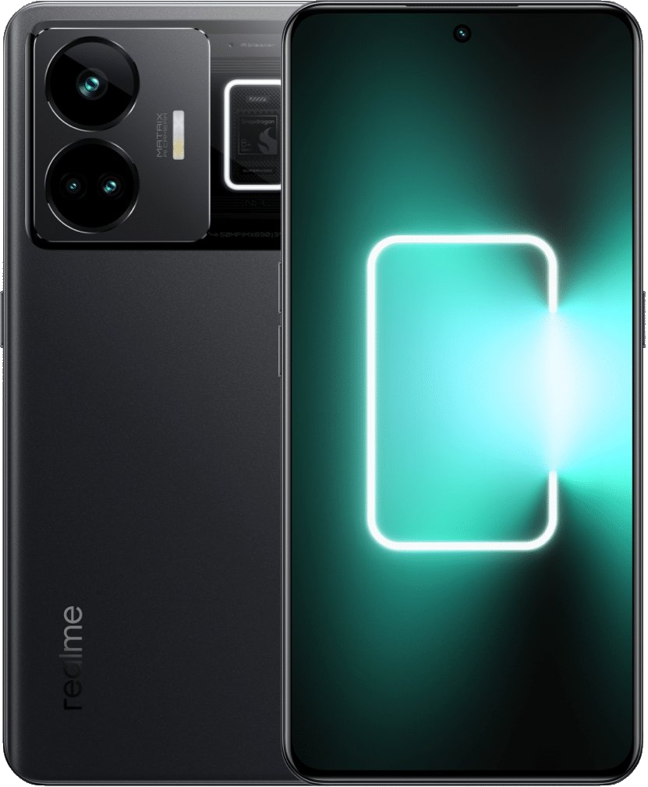

**State: Active**  
**Codename: senna_bc**  
**Contributors: [artempeshkov](https://github.com/artempeshkov/), [Rostislav Lastochkin](https://github.com/remtrik), [Robotix](https://github.com/Robotix22/)**

### UEFI Status

| Feature            | Description | State |
|:-------------------|:-------------|:-----:|
| Display            |              | ✅    |
| Internal Storage   |              | ✅    |
| Side Buttons       |              | ✅    |
| USB Host Mode      |              | ❌    |
| USB Device Mode    |              | ✅    |
| USB Power Delivery |              | ❌    |
| Mass Storage       |              | ✅    |
| Windows Boot       |              | ❌    |
| Linux Boot         |              | ❌    |

<b><strong>Samsung Devices</strong></b>

## Samsung Galaxy Z Flip 4

<table>
<tr><td>

> [!CAUTION]
> `BIT-10` Version is Required on this Phone!

</td></tr>
</table>

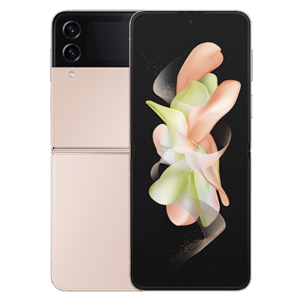

**State: Inactive**  
**Codename: b4q**  
**Contributors: [Robotix](https://github.com/Robotix22/)**

### UEFI Status

| Feature            | Description                                          | State |
|:-------------------|:-----------------------------------------------------|:-----:|
| Main Display       |                                                      | ✅    |
| Cover Display      |                                                      | ❌    |
| Internal Storage   |                                                      | ✅    |
| Side Buttons       |                                                      | ✅    |
| USB Host Mode      |                                                      | ❌    |
| USB Device Mode    | Requires a Reconnect if it was Connected during Boot | ✅    |
| USB Power Delivery |                                                      | ❌    |
| Mass Storage       |                                                      | ✅    |
| Windows Boot       |                                                      | ✅    |
| Linux Boot         |                                                      | ❌    |

### OS Status

<table>
<tr><th>Windows</th></tr>
<tr><td>

| Feature              | Description                                                                                                       | State |
|:---------------------|:------------------------------------------------------------------------------------------------------------------|:-----:|
| Internal Storage     | Needs [Special Setup](https://github.com/Project-Silicium/Guides/blob/main/Vendors/Samsung/Modding-UFS/README.md) | ✅    |
| Side Buttons         |                                                                                                                   | ❌    |
| Proximity Sensor     |                                                                                                                   | ❌    |
| Light Sensor         |                                                                                                                   | ❌    |
| Accelerometer Sensor |                                                                                                                   | ❌    |
| Compass Sensor       |                                                                                                                   | ❌    |
| Gyroscope Sensor     |                                                                                                                   | ❌    |
| Fingerprint Sensor   |                                                                                                                   | ❌    |
| Barometer Sensor     |                                                                                                                   | ❌    |
| Geomagnetic Sensor   |                                                                                                                   | ❌    |
| Hall Sensor          |                                                                                                                   | ❌    |
| Temperature Sensor   |                                                                                                                   | ❌    |
| Battery              |                                                                                                                   | ❌    |
| USB Host Mode        |                                                                                                                   | ❌    |
| USB Device Mode      |                                                                                                                   | ❌    |
| USB Power Delivery   |                                                                                                                   | ❌    |
| Charging             |                                                                                                                   | ❌    |
| WLAN                 |                                                                                                                   | ❌    |
| CPU                  |                                                                                                                   | ✅    |
| Touchscreen          |                                                                                                                   | ❌    |
| Bluetooth            |                                                                                                                   | ❌    |
| GPS                  |                                                                                                                   | ❌    |
| Speakers             |                                                                                                                   | ❌    |
| Microphone           |                                                                                                                   | ❌    |
| GPU                  |                                                                                                                   | ❌    |
| Camera               |                                                                                                                   | ❌    |
| Mobile Data          |                                                                                                                   | ❌    |
| Display              |                                                                                                                   | ✅    |
| Vibration            |                                                                                                                   | ❌    |

</td></tr>
</table>

<b><strong>Xiaomi Devices</strong></b>

## Xiaomi Poco F5

**State: Active**  
**Codename: marble**  
**Contributors: [Yuzuru10](https://github.com/Yuzuru10/), [Robotix](https://github.com/Robotix22/)**

### UEFI Status

| Feature            | Description       | State |
|:-------------------|:------------------|:-----:|
| Display            |                   | ✅    |
| Internal Storage   |                   | ✅    |
| Side Buttons       |                   | ✅    |
| USB Host Mode      |                   | ❌    |
| USB Device Mode    |                   | ✅    |
| USB Power Delivery |                   | ❌    |
| Mass Storage       |                   | ✅    |
| Windows Boot       |                   | ❔    |
| Linux Boot         |                   | WIP    |

---

<b><strong>Snapdragon 8 Gen 1 Devices</strong></b>

 

<table>
<tr><td>

> [!IMPORTANT]
> Only Windows Builds 26090 or higher Work.

</td></tr>
</table>

<b><strong>Samsung Devices</strong></b>

## Samsung Galaxy S22 5G

<table>
<tr><td>

> [!CAUTION]
> `BIT-12` Version is Required on this Phone!

</td></tr>
</table>

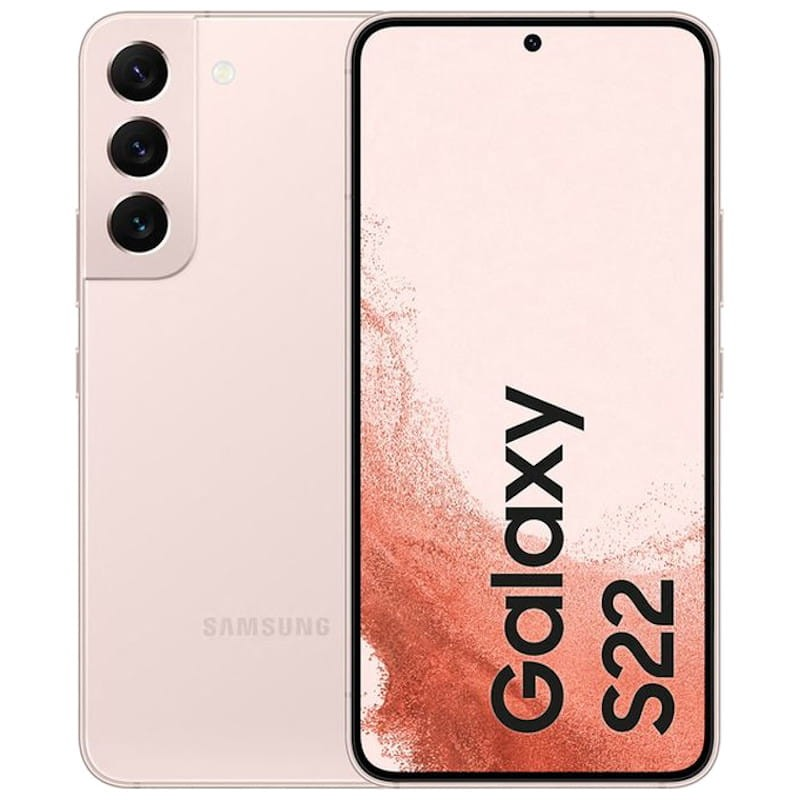

**State: Active**  
**Codename: r0q**  
**Contributors: [Violet](https://github.com/ghatt-o/), [Robotix](https://github.com/Robotix22/)**

### UEFI Status

| Feature            | Description                                          | State |
|:-------------------|:-----------------------------------------------------|:-----:|
| Display            |                                                      | ✅    |
| Internal Storage   |                                                      | ✅    |
| Side Buttons       | No power button                                      | ⚠️    |
| USB Host Mode      |                                                      | ❌    |
| USB Device Mode    | Requires a Reconnect if it was Connected during Boot | ✅    |
| USB Power Delivery |                                                      | ❌    |
| Mass Storage       | Needs patch to initialize without power button       | ✅    |
| Windows Boot       | Windows PE only                                      | ⚠️    |
| Linux Boot         |                                                      | ✅    |

### OS Status

<table>
<tr><th>Linux</th></tr>
<tr><td>

> [!IMPORTANT]
> Linux Requires: [Mainline Kernel](https://git.kernel.org/pub/scm/linux/kernel/git/torvalds/linux.git/).
> Touchscreen and the display are still being upstreamed, check mailing lists

> [!NOTE]
> The PostmarketOS Site for this Device can be Found [here](https://wiki.postmarketos.org/wiki/Samsung_Galaxy_S22_5G_(samsung-r0q)).

| Feature              | Description   | State |
|:---------------------|:--------------|:-----:|
| Internal Storage     |               | ✅    |
| Side Buttons         |               | ✅    |
| Proximity Sensor     |               | ❌    |
| Light Sensor         |               | ❌    |
| Accelerometer Sensor |               | ❌    |
| Compass Sensor       |               | ❌    | 
| Gyroscope Sensor     |               | ❌    |
| Fingerprint Sensor   |               | ❌    |
| NFC Sensor           |               | ❌    |
| Temperature Sensor   |               | ❌    |
| Battery              |               | ✅    |
| USB Host Mode        |               | ❔    |
| USB Device Mode      |               | ✅    |
| USB Power Delivery   |               | ❔    |
| Charging             | Slow Charging | ✅    |
| WLAN                 |               | ✅    |
| CPU                  |               | ✅    |
| Touchscreen          |               | ✅    |
| Bluetooth            |               | ✅    |
| GPS                  |               | ❌    |
| Speakers             |               | ✅    |
| Microphone           |               | ❌    |
| GPU                  |               | ✅    |
| Camera               |               | ❌    |
| Flashlight           |               | ❌    |
| Mobile Data          |               | ❌    |
| Display              |               | ✅    | 
| Vibration            |               | ❌    |

</td></tr>
</table>

<table>
<tr><th>Windows</th></tr>
<tr><td>

> [!IMPORTANT]
> Only Windows PE can Boot.

> [!IMPORTANT]
> Needs [Windows Drivers](https://github.com/Robotix22/windows_silicon_qcom_waipio/).

| Feature              | Description   | State |
|:---------------------|:--------------|:-----:|
| Internal Storage     |               | ❌    |
| Side Buttons         |               | ✅    |
| Proximity Sensor     |               | ❌    |
| Light Sensor         |               | ❌    |
| Accelerometer Sensor |               | ❌    |
| Compass Sensor       |               | ❌    | 
| Gyroscope Sensor     |               | ❌    |
| Fingerprint Sensor   |               | ❌    |
| NFC Sensor           |               | ❌    |
| Temperature Sensor   |               | ❌    |
| Battery              |               | ❌    |
| USB Host Mode        |               | ❌    |
| USB Device Mode      |               | ❌    |
| USB Power Delivery   |               | ❌    |
| Charging             |               | ❌    |
| WLAN                 |               | ❌    |
| CPU                  | Only one core | ⚠️    |
| Touchscreen          |               | ❌    |
| Bluetooth            |               | ❌    |
| GPS                  |               | ❌    |
| Speakers             |               | ❌    |
| Microphone           |               | ❌    |
| GPU                  |               | ❌    |
| Camera               |               | ❌    |
| Mobile Data          |               | ❌    |
| Display              |               | ✅    | 
| Vibration            |               | ❌    |

</td></tr>
</table>

## Samsung Galaxy Tab S8+ 5G

<table>
<tr><td>

> [!CAUTION]
> `BIT-9` Version is Required on this Phone!

</td></tr>
</table>

**State: Active**  
**Codename: gts8p**  
**Contributors: [Robotix](https://github.com/Robotix22/)**

### UEFI Status

| Feature            | Description                                          | State |
|:-------------------|:-----------------------------------------------------|:-----:|
| Display            |                                                      | ✅    |
| Internal Storage   |                                                      | ✅    |
| Side Buttons       |                                                      | ✅    |
| USB Host Mode      |                                                      | ❌    |
| USB Device Mode    | Requires a Reconnect if it was Connected during Boot | ✅    |
| USB Power Delivery |                                                      | ❌    |
| Mass Storage       |                                                      | ✅    |
| SD Card            | Power On Code is Missing                             | ❌    |
| Windows Boot       |                                                      | ✅    |
| Linux Boot         |                                                      | ❌    |

### OS Status

<table>
<tr><th>Windows</th></tr>
<tr><td>

> [!IMPORTANT]
> Needs [Windows Drivers](https://github.com/Robotix22/windows_silicon_qcom_waipio/).

| Feature              | Description                                                                                                       | State |
|:---------------------|:------------------------------------------------------------------------------------------------------------------|:-----:|
| Internal Storage     | Needs [Special Setup](https://github.com/Project-Silicium/Guides/blob/main/Vendors/Samsung/Modding-UFS/README.md) | ✅    |
| SD Card              |                                                                                                                   | ❌    |
| Side Buttons         |                                                                                                                   | ✅    |
| Proximity Sensor     |                                                                                                                   | ❌    |
| Light Sensor         |                                                                                                                   | ❌    |
| Accelerometer Sensor |                                                                                                                   | ❌    |
| Compass Sensor       |                                                                                                                   | ❌    |
| Gyroscope Sensor     |                                                                                                                   | ❌    |
| Fingerprint Sensor   |                                                                                                                   | ❌    |
| Hall Sensor          |                                                                                                                   | ❌    |
| Temperature Sensor   |                                                                                                                   | ❌    |
| Battery              |                                                                                                                   | ❌    |
| USB Host Mode        |                                                                                                                   | ❌    |
| USB Device Mode      |                                                                                                                   | ❌    |
| USB Power Delivery   |                                                                                                                   | ❌    |
| Charging             |                                                                                                                   | ❌    |
| WLAN                 |                                                                                                                   | ❌    |
| CPU                  |                                                                                                                   | ✅    |
| Touchscreen          |                                                                                                                   | ❌    |
| Bluetooth            |                                                                                                                   | ❌    |
| GPS                  |                                                                                                                   | ❌    |
| Speakers             |                                                                                                                   | ❌    |
| Microphone           |                                                                                                                   | ❌    |
| GPU                  |                                                                                                                   | ❌    |
| Camera               |                                                                                                                   | ❌    |
| Mobile Data          |                                                                                                                   | ❌    |
| Display              |                                                                                                                   | ✅    |
| Vibration            |                                                                                                                   | ❌    |
| S Pen                |                                                                                                                   | ❌    |

</td></tr>
</table>

## Samsung Galaxy Tab S8 5G

<table>
<tr><td>

> [!CAUTION]
> `BIT-9` Version is Required on this Phone!

</td></tr>
</table>

**State: Inactive**  
**Codename: gts8**  
**Contributors: [Robotix](https://github.com/Robotix22/)**

### UEFI Status

| Feature            | Description               | State |
|:-------------------|:--------------------------|:-----:|
| Display            | Wrong Display Oriantation | ⚠️    |
| Internal Storage   |                           | ✅    |
| Side Buttons       | Pwr Button does not work  | ⚠️    |
| USB Host Mode      |                           | ❌    |
| USB Device Mode    |                           | ✅    |
| USB Power Delivery |                           | ❌    |
| Mass Storage       |                           | ❔    |
| SD Card            |                           | ❌    |
| Windows Boot       |                           | ✅    |
| Linux Boot         |                           | ❌    |

### OS Status

<table>
<tr><th>Windows</th></tr>
<tr><td>

| Feature              | Description                                                                                                       | State |
|:---------------------|:------------------------------------------------------------------------------------------------------------------|:-----:|
| Internal Storage     | Needs [Special Setup](https://github.com/Project-Silicium/Guides/blob/main/Vendors/Samsung/Modding-UFS/README.md) | ✅    |
| SD Card              |                                                                                                                   | ❌    |
| Side Buttons         |                                                                                                                   | ❌    |
| Proximity Sensor     |                                                                                                                   | ❌    |
| Light Sensor         |                                                                                                                   | ❌    |
| Accelerometer Sensor |                                                                                                                   | ❌    |
| Compass Sensor       |                                                                                                                   | ❌    |
| Gyroscope Sensor     |                                                                                                                   | ❌    |
| Fingerprint Sensor   |                                                                                                                   | ❌    |
| Hall Sensor          |                                                                                                                   | ❌    |
| Temperature Sensor   |                                                                                                                   | ❌    |
| Battery              |                                                                                                                   | ❌    |
| USB Host Mode        |                                                                                                                   | ❌    |
| USB Device Mode      |                                                                                                                   | ❌    |
| USB Power Delivery   |                                                                                                                   | ❌    |
| Charging             |                                                                                                                   | ❌    |
| WLAN                 |                                                                                                                   | ❌    |
| CPU                  | One Core Only                                                                                                     | ⚠️    |
| Touchscreen          |                                                                                                                   | ❌    |
| Bluetooth            |                                                                                                                   | ❌    |
| GPS                  |                                                                                                                   | ❌    |
| Speakers             |                                                                                                                   | ❌    |
| Microphone           |                                                                                                                   | ❌    |
| GPU                  |                                                                                                                   | ❌    |
| Camera               |                                                                                                                   | ❌    |
| Mobile Data          |                                                                                                                   | ❌    |
| Display              | Wrong Orientation                                                                                                 | ⚠️    |
| Vibration            |                                                                                                                   | ❌    |
| S Pen                |                                                                                                                   | ❌    |

</td></tr>
</table>

<b><strong>Xiaomi Devices</strong></b>

## Xiaomi 12 Pro

**State: Inactive**  
**Codename: zeus**  
**Contributors: [Robotix](https://github.com/Robotix22/), [2petro](https://github.com/2Petro/)**

### UEFI Status

| Feature            | Description | State |
|:-------------------|:------------|:-----:|
| Display            |             | ✅    |
| Internal Storage   |             | ✅    |
| Side Buttons       |             | ✅    |
| USB Host Mode      |             | ❌    |
| USB Device Mode    |             | ✅    |
| USB Power Delivery |             | ❌    |
| Mass Storage       |             | ❔    |
| Windows Boot       |             | ❌    |
| Linux Boot         |             | ❌    |

## Xiaomi Poco F4 GT

**State: Inactive**  
**Codename: ingres**  
**Contributors: [Robotix](https://github.com/Robotix22/), [Nikka](https://github.com/NikkaGames/)**

### UEFI Status

| Feature            | Description | State |
|:-------------------|:------------|:-----:|
| Display            |             | ✅    |
| Internal Storage   |             | ✅    |
| Side Buttons       |             | ✅    |
| USB Host Mode      |             | ❌    |
| USB Device Mode    |             | ✅    |
| USB Power Delivery |             | ❌    |
| Mass Storage       |             | ✅    |
| Windows Boot       |             | ✅    |
| Linux Boot         |             | ❌    |

<table>
<tr><th>Windows</th></tr>
<tr><td>

| Feature              | Description   | State |
|:---------------------|:--------------|:-----:|
| Internal Storage     |               | ✅    |
| Side Buttons         |               | ❌    |
| Proximity Sensor     |               | ❌    |
| Light Sensor         |               | ❌    |
| Accelerometer Sensor |               | ❌    |
| Compass Sensor       |               | ❌    | 
| Gyroscope Sensor     |               | ❌    |
| Fingerprint Sensor   |               | ❌    |
| NFC Sensor           |               | ❌    |
| Temperature Sensor   |               | ❌    |
| Battery              |               | ❌    |
| USB Host Mode        |               | ✅    |
| USB Device Mode      |               | ❌    |
| USB Power Delivery   |               | ❌    |
| Charging             |               | ❌    |
| WLAN                 |               | ❌    |
| CPU                  |               | ✅    |
| Touchscreen          |               | ❌    |
| Bluetooth            |               | ❌    |
| GPS                  |               | ❌    |
| Speakers             |               | ❌    |
| Microphone           |               | ❌    |
| GPU                  |               | ❌    |
| Camera               |               | ❌    |
| Mobile Data          |               | ❌    |
| Display              |               | ✅    | 
| Vibration            |               | ❌    |

</td></tr>
</table>

---

<b><strong>Snapdragon 888/888+ Devices</strong></b>

 

<table>
<tr><td>

> [!IMPORTANT]
> Only Windows Builds 26090 or higher Work.

</td></tr>
</table>

<b><strong>Asus Devices</strong></b>

## Asus ROG Phone 5

**State: Active**  
**Codename: i005d**  
**Contributors: [Robotix](https://github.com/Robotix22/), [Alfa](https://github.com/alfaonyt/)**

### UEFI Status

| Feature            | Description                         | State |
|:-------------------|:------------------------------------|:-----:|
| Display            |                                     | ✅    |
| Internal Storage   |                                     | ✅    |
| Side Buttons       |                                     | ✅    |
| USB Host Mode      |                                     | ❌    |
| USB Device Mode    |                                     | ✅    |
| USB Power Delivery |                                     | ❌    |
| Mass Storage       | Unstable, Breaks on Large Transfers | ⚠️    |
| Windows Boot       |                                     | ❌    |
| Linux Boot         | WIP                                 | ❌    |

<b><strong>OnePlus Devices</strong></b>

## Oneplus 9

**State: Inactive**  
**Codename: lemonade**  
**Contributors: [Robotix](https://github.com/Robotix22/)**

### UEFI Status

| Feature            | Description                         | State |
|:-------------------|:------------------------------------|:-----:|
| Display            |                                     | ✅    |
| Internal Storage   |                                     | ✅    |
| Side Buttons       |                                     | ✅    |
| USB Host Mode      |                                     | ✅    |
| USB Device Mode    |                                     | ✅    |
| USB Power Delivery |                                     | ❌    |
| Mass Storage       | Unstable, Breaks on Large Transfers | ⚠️    |
| Windows Boot       |                                     | ✅    |
| Linux Boot         |                                     | ❌    |

### OS Status

<table>
<tr><th>Windows</th></tr>
<tr><td>

| Feature              | Description | State |
|:---------------------|:------------|:-----:|
| Internal Storage     |             | ✅    |
| Side Buttons         |             | ✅    |
| Proximity Sensor     |             | ❌    |
| Light Sensor         |             | ❌    |
| Accelerometer Sensor |             | ❌    |
| Compass Sensor       |             | ❌    |
| Gyroscope Sensor     |             | ❌    |
| Barometer Sensor     |             | ❌    |
| Geomagnetic Sensor   |             | ❌    |
| Fingerprint Sensor   |             | ❌    |
| Hall Sensor          |             | ❌    |
| Gravity Sensor       |             | ❌    |
| NFC Sensor           |             | ❌    |
| Temperature Sensor   |             | ✅    |
| Battery              |             | ✅    |
| USB Host Mode        |             | ✅    |
| USB Device Mode      |             | ✅    |
| USB Power Delivery   |             | ❌    |
| Charging             |             | ✅    |
| WLAN                 |             | ❌    |
| CPU                  |             | ✅    |
| Touchscreen          |             | ❌    |
| Bluetooth            |             | ❌    |
| GPS                  |             | ✅    |
| Speakers             |             | ❌    |
| Microphone           |             | ❌    |
| GPU                  |             | ❌    |
| Camera               |             | ❌    |
| Mobile Data          |             | ❌    |
| Display              |             | ✅    |
| Vibration            |             | ❌    |

</td></tr>
</table>

<b><strong>Samsung Devices</strong></b>

## Samsung Galaxy S21 FE

<table>
<tr><td>

> [!CAUTION]
> `BIT-18` Version is Required on this Phone!

</td></tr>
</table>

**State: Inactive**  
**Codename: r9qb2**  
**Contributors: [Robotix](https://github.com/Robotix22/), [Nikroks](https://github.com/N1kroks/), [Icesito68](https://github.com/Icesito68/)**

### UEFI Status

| Feature            | Description              | State |
|:-------------------|:-------------------------|:-----:|
| Display            |                          | ✅    |
| Internal Storage   |                          | ✅    |
| Side Buttons       |                          | ✅    |
| USB Host Mode      |                          | ❌    |
| USB Device Mode    |                          | ❌    |
| USB Power Delivery |                          | ❌    |
| Mass Storage       | Needs Device Mode        | ❌    |
| Windows Boot       |                          | ✅    |
| Linux Boot         |                          | ❌    |

### OS Status

<table>
<tr><th>Windows</th></tr>
<tr><td>

| Feature              | Description         | State |
|:---------------------|:--------------------|:-----:|
| Internal Storage     | Needs Special Setup | ✅    |
| Side Buttons         |                     | ❌    |
| Proximity Sensor     |                     | ❌    |
| Light Sensor         |                     | ❌    |
| Accelerometer Sensor |                     | ❌    |
| Compass Sensor       |                     | ❌    |
| Gyroscope Sensor     |                     | ❌    |
| Fingerprint Sensor   |                     | ❌    |
| Hall Sensor          |                     | ❌    |
| Temperature Sensor   |                     | ❌    |
| Battery              |                     | ❌    |
| USB Host Mode        |                     | ❌    |
| USB Device Mode      | Needs Special Setup | ✅    |
| USB Power Delivery   |                     | ❌    |
| Charging             |                     | ❌    |
| WLAN                 |                     | ❌    |
| CPU                  |                     | ✅    |
| Touchscreen          |                     | ❌    |
| Bluetooth            |                     | ❌    |
| GPS                  |                     | ❌    |
| Speakers             |                     | ❌    |
| Microphone           |                     | ❌    |
| GPU                  |                     | ❌    |
| Camera               |                     | ❌    |
| Mobile Data          |                     | ❌    |
| Display              |                     | ✅    |
| Vibration            |                     | ❌    |

</td></tr> </table>

## Samsung Galaxy Z Fold 3 5G

<table>
<tr><td>

> [!CAUTION]
> `BIT-14` Version is Required on this Phone!

</td></tr>
</table>

**State: Inactive**  
**Codename: q2q**  
**Contributors: [Robotix](https://github.com/Robotix22/), [Azkali](https://github.com/Azkali/)**

### UEFI Status

| Feature            | Description              | State |
|:-------------------|:-------------------------|:-----:|
| Display            |                          | ✅    |
| Internal Storage   |                          | ✅    |
| Side Buttons       | Pwr Button does not work | ⚠️    |
| USB Host Mode      |                          | ❌    |
| USB Device Mode    |                          | ✅    |
| USB Power Delivery |                          | ❌    |
| Mass Storage       |                          | ❔    |
| Windows Boot       |                          | ✅    |
| Linux Boot         |                          | ❌    |

### OS Status

<table>
<tr><th>Windows</th></tr>
<tr><td>

| Feature              | Description   | State |
|:---------------------|:--------------|:-----:|
| Internal Storage     |               | ❌    |
| Side Buttons         |               | ❌    |
| Proximity Sensor     |               | ❌    |
| Light Sensor         |               | ❌    |
| Accelerometer Sensor |               | ❌    |
| Compass Sensor       |               | ❌    |
| Gyroscope Sensor     |               | ❌    |
| Barometer Sensor     |               | ❌    |
| Pedometer Sensor     |               | ❌    |
| Geomagnetic Sensor   |               | ❌    |
| Fingerprint Sensor   |               | ❌    |
| Hall Sensor          |               | ❌    |
| Heart Rate Sensor    |               | ❌    |
| NFC Sensor           |               | ❌    |
| Temperature Sensor   |               | ❌    |
| Battery              |               | ❌    |
| USB Host Mode        |               | ❌    |
| USB Device Mode      |               | ❌    |
| USB Power Delivery   |               | ❌    |
| Charging             |               | ❌    |
| WLAN                 |               | ❌    |
| CPU                  | One Core only | ⚠️    |
| Touchscreen          |               | ❌    |
| Bluetooth            |               | ❌    |
| GPS                  |               | ❌    |
| Speakers             |               | ❌    |
| Microphone           |               | ❌    |
| GPU                  |               | ❌    |
| Camera               |               | ❌    |
| Mobile Data          |               | ❌    |
| Display              |               | ✅    |
| Vibration            |               | ❌    |

</td></tr>
</table>

<b><strong>Xiaomi Devices</strong></b>

## Xiaomi Mi 11

**State: Inactive**  
**Codename: venus**  
**Contributors: [Robotix](https://github.com/Robotix22/), [Daniel224455](https://github.com/Daniel224455/)**

### UEFI Status

| Feature            | Description       | State |
|:-------------------|:------------------|:-----:|
| Display            |                   | ✅    |
| Internal Storage   |                   | ✅    |
| Side Buttons       |                   | ✅    |
| USB Host Mode      |                   | ✅    |
| USB Device Mode    |                   | ❌    |
| USB Power Delivery |                   | ❌    |
| Mass Storage       | Needs Device Mode | ❌    |
| Windows Boot       |                   | ✅    |
| Linux Boot         |                   | ❌    |

### OS Status

<table>
<tr><th>Windows</th></tr>
<tr><td>

| Feature               | Description | State |
|:----------------------|:------------|:-----:|
| Internal Storage      |             | ✅    |
| Side Buttons          |             | ✅    |
| Proximity Sensor      |             | ❌    |
| Light Sensor          |             | ❌    |
| Accelerometer Sensor  |             | ❌    |
| Compass Sensor        |             | ❌    |
| Gyroscope Sensor      |             | ❌    |
| Barometer Sensor      |             | ❌    |
| Geomagnetic Sensor    |             | ❌    |
| Fingerprint Sensor    |             | ❌    |
| Hall Sensor           |             | ❌    |
| Gravity Sensor        |             | ❌    |
| NFC Sensor            |             | ❌    |
| Temperature Sensor    |             | ❌    |
| Battery               |             | ❌    |
| USB Host Mode         |             | ✅    |
| USB Device Mode       |             | ❌    |
| USB Power Delivery    |             | ❌    |
| Charging              |             | ❌    |
| WLAN                  |             | ❌    |
| CPU                   |             | ✅    |
| Touchscreen           |             | ❌    |
| Bluetooth             |             | ❌    |
| GPS                   |             | ❌    |
| Speakers              |             | ❌    |
| Microphone            |             | ❌    |
| GPU                   |             | ❌    |
| Camera                |             | ❌    |
| Mobile Data           |             | ❌    |
| Display               |             | ✅    |
| Vibration             |             | ❌    |

</td></tr>
</table>

## Xiaomi 11T Pro

**State: Active**  
**Codename: vili**  
**Contributors: [Robotix](https://github.com/Robotix22/)**

### UEFI Status

| Feature            | Description                         | State |
|:-------------------|:------------------------------------|:-----:|
| Display            |                                     | ✅    |
| Internal Storage   |                                     | ✅    |
| Side Buttons       |                                     | ✅    |
| USB Host Mode      |                                     | ❌    |
| USB Device Mode    |                                     | ✅    |
| USB Power Delivery |                                     | ❌    |
| Mass Storage       | Unstable, Breaks on Large Transfers | ⚠️    |
| Windows Boot       |                                     | ✅    |
| Linux Boot         |                                     | ❌    |

### OS Status

<table>
<tr><th>Windows</th></tr>
<tr><td>

| Feature              | Description | State |
|:---------------------|:------------|:-----:|
| Internal Storage     |             | ✅    |
| Side Buttons         |             | ✅    |
| Proximity Sensor     |             | ❌    |
| Light Sensor         |             | ❌    |
| Accelerometer Sensor |             | ❌    |
| Compass Sensor       |             | ❌    |
| Gyroscope Sensor     |             | ❌    |
| Barometer Sensor     |             | ❌    |
| Geomagnetic Sensor   |             | ❌    |
| Fingerprint Sensor   |             | ❌    |
| Hall Sensor          |             | ❌    |
| Gravity Sensor       |             | ❌    |
| NFC Sensor           |             | ❌    |
| Temperature Sensor   |             | ✅    |
| Battery              |             | ❌    |
| USB Host Mode        |             | ❌    |
| USB Device Mode      |             | ✅    |
| USB Power Delivery   |             | ❌    |
| Charging             |             | ❌    |
| WLAN                 |             | ❌    |
| CPU                  |             | ✅    |
| Touchscreen          |             | ❌    |
| Bluetooth            |             | ❌    |
| GPS                  |             | ❌    |
| Speakers             |             | ❌    |
| Microphone           |             | ❌    |
| GPU                  |             | ❌    |
| Camera               |             | ❌    |
| Mobile Data          |             | ❌    |
| Display              |             | ✅    |
| Vibration            |             | ❌    |

</td></tr>
</table>

---

<b><strong>Snapdragon 865/865+/870 Devices</strong></b>

 

<b><strong>OnePlus Devices</strong></b>

## OnePlus 8T

**State: Inactive**  
**Codename: kebab**  
**Contributors: [Robotix](https://github.com/Robotix22/), [SwedMlite](https://github.com/SwedMlite/)**

### UEFI Status

| Feature            | Description        | State |
|:-------------------|:-------------------|:-----:|
| Display            |                    | ✅    |
| Internal Storage   |                    | ✅    |
| Side Buttons       |                    | ✅    |
| USB Host Mode      |                    | ✅    |
| USB Device Mode    |                    | ❌    |
| USB Power Delivery |                    | ❌    |
| Mass Storage       | Needs Device Mode  | ❌    |
| Windows Boot       |                    | ✅    |
| Linux Boot         |                    | ❌    |

### OS Status

<table>
<tr><th>Windows</th></tr>
<tr><td>

| Feature              | Description | State |
|:---------------------|:------------|:-----:|
| Internal Storage     |             | ✅    |
| Side Buttons         |             | ❌    |
| Proximity Sensor     |             | ❌    |
| Light Sensor         |             | ❌    |
| Accelerometer Sensor |             | ❌    |
| Compass Sensor       |             | ❌    |
| Gyroscope Sensor     |             | ❌    |
| Fingerprint Sensor   |             | ❌    |
| NFC Sensor           |             | ❌    |
| Hall Sensor          |             | ❌    |
| Temperature Sensor   |             | ❌    |
| Battery              |             | ❌    |
| USB Host Mode        |             | ✅    |
| USB Device Mode      |             | ❌    |
| USB Power Delivery   |             | ❌    |
| Charging             |             | ❌    |
| WLAN                 |             | ❌    |
| CPU                  |             | ✅    |
| Touchscreen          |             | ❌    |
| Bluetooth            |             | ❌    |
| GPS                  |             | ❌    |
| Speakers             |             | ❌    |
| Microphone           |             | ❌    |
| GPU                  |             | ❌    |
| Camera               |             | ❌    |
| Mobile Data          |             | ❌    |
| Display              |             | ✅    |
| Vibration            |             | ❌    |

</td></tr>
</table>

<b><strong>Lenovo Devices</strong></b>

## Lenovo Legion Tab Y700

**State: Inactive**  
**Codename: 9707f**  
**Contributors: [hyusang](https://github.com/cloudsweets/)**

### UEFI Status

| Feature            | Description       | State |
|:-------------------|:------------------|:-----:|
| Display            |                   | ✅    |
| Internal Storage   |                   | ✅    |
| Side Buttons       |                   | ✅    |
| USB Host Mode      |                   | ✅    |
| USB Device Mode    |                   | ❌    |
| USB Power Delivery |                   | ❌    |
| Mass Storage       | Needs Device Mode | ❌    |
| SD Card            |                   | ❌    |
| Windows Boot       |                   | ✅    |
| Linux Boot         |                   | ❌    |

### OS Status

<table>
<tr><th>Windows</th></tr>
<tr><td>

| Feature               | Description | State |
|:----------------------|:------------|:-----:|
| Internal Storage      |             | ✅    |
| SD Card               |             | ❌    |
| Side Buttons          |             | ❌    |
| Proximity Sensor      |             | ❌    |
| Light Sensor          |             | ❌    |
| Accelerometer Sensor  |             | ❌    |
| Compass Sensor        |             | ❌    |
| Gyroscope Sensor      |             | ❌    |
| Fingerprint Sensor    |             | ❌    |
| Hall Sensor           |             | ❌    |
| Temperature Sensor    |             | ❌    |
| Battery               |             | ❌    |
| USB Host Mode         |             | ✅    |
| USB Device Mode       |             | ❌    |
| USB Power Delivery    |             | ❌    |
| Charging              |             | ❌    |
| WLAN                  |             | ❌    |
| CPU                   |             | ✅    |
| Touchscreen           |             | ❌    |
| Bluetooth             |             | ❌    |
| GPS                   |             | ❌    |
| Speakers              |             | ❌    |
| 3.5mm Audio Jack      |             | ❌    |
| Microphone            |             | ❌    |
| GPU                   |             | ❌    |
| Camera                |             | ❌    |
| Mobile Data           |             | ❌    |
| Display               |             | ✅    |
| Vibration             |             | ❌    |

</td></tr>
</table>

<b><strong>Realme Devices</strong></b>

## Realme GT NEO 2

**State: Inactive**  
**Codename: bitra**  
**Contributors: [Robotix](https://github.com/Robotix22/), [kubawis128](https://github.com/kubawis128/)**

### UEFI Status

| Feature            | Description       | State |
|:-------------------|:------------------|:-----:|
| Display            |                   | ✅    |
| Internal Storage   |                   | ✅    |
| Side Buttons       |                   | ✅    |
| USB Host Mode      |                   | ✅    |
| USB Device Mode    |                   | ❌    |
| USB Power Delivery |                   | ❌    |
| Mass Storage       | Needs Device Mode | ❌    |
| Windows Boot       |                   | ✅    |
| Linux Boot         |                   | ✅    |

### OS Status

<table>
<tr><th>Windows</th><th>Linux</th></tr>
<tr><td>

| Feature              | Description | State |
|:---------------------|:------------|:-----:|
| Internal Storage     |             | ✅    |
| Side Buttons         |             | ❌    |
| Proximity Sensor     |             | ❌    |
| Light Sensor         |             | ❌    |
| Accelerometer Sensor |             | ❌    |
| Compass Sensor       |             | ❌    |
| Gyroscope Sensor     |             | ❌    |
| Fingerprint Sensor   |             | ❌    |
| NFC Sensor           |             | ❌    |
| Temperature Sensor   |             | ❌    |
| Battery              |             | ❌    |
| USB Host Mode        |             | ✅    |
| USB Device Mode      |             | ❌    |
| USB Power Delivery   |             | ❌    |
| Charging             |             | ❌    |
| WLAN                 |             | ❌    |
| CPU                  |             | ✅    |
| Touchscreen          |             | ❌    |
| Bluetooth            |             | ❌    |
| GPS                  |             | ❌    |
| Speakers             |             | ❌    |
| Microphone           |             | ❌    |
| GPU                  |             | ❌    |
| Camera               |             | ❌    |
| Mobile Data          |             | ❌    |
| Display              |             | ✅    |
| Vibration            |             | ❌    |

</td><td>

| Feature              | Description | State |
|:---------------------|:------------|:-----:|
| Internal Storage     |             | ✅    |
| Side Buttons         |             | ❌    |
| Proximity Sensor     |             | ❌    |
| Light Sensor         |             | ❌    |
| Accelerometer Sensor |             | ❌    |
| Compass Sensor       |             | ❌    |
| Gyroscope Sensor     |             | ❌    |
| Fingerprint Sensor   |             | ❌    |
| NFC Sensor           |             | ❌    |
| Temperature Sensor   |             | ❌    |
| Battery              |             | ❌    |
| USB Host Mode        |             | ✅    |
| USB Device Mode      |             | ❌    |
| USB Power Delivery   |             | ❌    |
| Charging             |             | ❌    |
| WLAN                 |             | ❌    |
| CPU                  |             | ✅    |
| Touchscreen          |             | ❌    |
| Bluetooth            |             | ❌    |
| GPS                  |             | ❌    |
| Speakers             |             | ❌    |
| Microphone           |             | ❌    |
| GPU                  |             | ❌    |
| Camera               |             | ❌    |
| Mobile Data          |             | ❌    |
| Display              |             | ✅    |
| Vibration            |             | ❌    |

</td></tr>
</table>

<b><strong>Samsung Devices</strong></b>

## Samsung Galaxy S20 FE

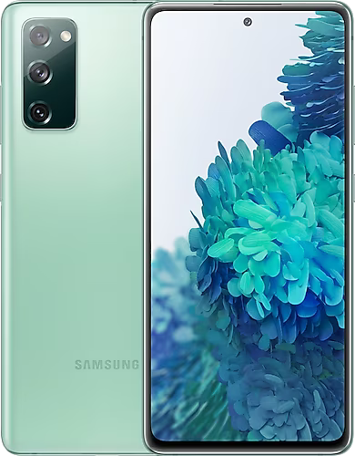

**State: Inactive**  
**Codename: r8q**  
**Contributors: [olegos2](https://github.com/olegos2), [Robotix](https://github.com/Robotix22/)**

### UEFI Status

| Feature            | Description       | State |
|:-------------------|:------------------|:-----:|
| Display            |                   | ✅    |
| Internal Storage   |                   | ✅    |
| Side Buttons       |                   | ✅    |
| USB Host Mode      |                   | ❌    |
| USB Device Mode    |                   | ✅    |
| USB Power Delivery |                   | ❌    |
| Mass Storage       |                   | ✅    |
| SD Card            |                   | ❌    |
| Windows Boot       |                   | ❌    |
| Linux Boot         |                   | ❌    |

<b><strong>Xiaomi Devices</strong></b>

## Xiaomi Pad 6

**State: Inactive**  
**Codename: pipa**  
**Contributors: [Statzar](https://github.com/Statzar), [N1kroks](https://github.com/N1kroks), [Robotix](https://github.com/Robotix22/), [6adp](https://github.com/6adp)**

### UEFI Status

| Feature            | Description    | State |
|:-------------------|:---------------|:-----:|
| Display            |                | ✅    |
| Internal Storage   |                | ✅    |
| Side Buttons       |                | ✅    |
| USB Host Mode      |                | ✅    |
| USB Device Mode    |                | ✅    |
| USB Power Delivery |                | ✅    |
| Mass Storage       | Unknown Issues | ❌    |
| Windows Boot       |                | ✅    |
| Linux Boot         |                | ✅    |

### OS Status

<table>
<tr><th>Windows</th><th>Linux</th></tr>
<tr><td>

| Feature              | Description                       | State |
|:---------------------|:----------------------------------|:-----:|
| Internal Storage     |                                   | ✅    |
| Side Buttons         |                                   | ✅    |
| Light Sensor         |                                   | ❌    |
| Accelerometer Sensor |                                   | ❌    |
| Compass Sensor       |                                   | ❌    |
| Gyroscope Sensor     |                                   | ❌    |
| Hall Sensor          |                                   | ❌    |
| Temperature Sensor   |                                   | ❌    |
| Battery              |                                   | ✅    |
| USB Host Mode        |                                   | ❌    |
| USB Device Mode      |                                   | ✅    |
| USB Power Delivery   |                                   | ❌    |
| Charging             |                                   | ❌    |
| WLAN                 |                                   | ❌    |
| CPU                  |                                   | ✅    |
| Touchscreen          |                                   | ❌    |
| Bluetooth            |                                   | ❌    |
| Speakers             |                                   | ❌    |
| Microphone           |                                   | ❌    |
| GPU                  |                                   | ❌    |
| Camera               |                                   | ❌    |
| Display              |                                   | ✅    |

</td><td>

| Feature              | Description                       | State |
|:---------------------|:----------------------------------|:-----:|
| Internal Storage     |                                   | ✅    |
| Side Buttons         |                                   | ❌    |
| Light Sensor         |                                   | ❌    |
| Accelerometer Sensor |                                   | ❌    |
| Compass Sensor       |                                   | ❌    |
| Gyroscope Sensor     |                                   | ❌    |
| Hall Sensor          |                                   | ❌    |
| Temperature Sensor   |                                   | ❌    |
| Battery              |                                   | ❌    |
| USB Host Mode        |                                   | ❌    |
| USB Device Mode      |                                   | ✅    |
| USB Power Delivery   |                                   | ❌    |
| Charging             |                                   | ❌    |
| WLAN                 |                                   | ❌    |
| CPU                  |                                   | ✅    |
| Touchscreen          |                                   | ❌    |
| Bluetooth            |                                   | ❌    |
| Speakers             |                                   | ❌    |
| Microphone           |                                   | ❌    |
| GPU                  |                                   | ❌    |
| Camera               |                                   | ❌    |
| Display              |                                   | ✅    |

</td></tr>
</table>

## Xiaomi Poco F3 / Redmi K40 / Mi 11X

**State: Active**  
**Codename: alioth**  
**Contributors: [Robotix](https://github.com/Robotix22/), [SwedMlite](https://github.com/SwedMlite/), [hyusang](https://github.com/cloudsweets/), [AdrianoA3](https://github.com/AdrianoA3/), [N1kroks](https://github.com/N1kroks/)**

### UEFI Status

| Feature            | Description    | State |
|:-------------------|:---------------|:-----:|
| Display            |                | ✅    |
| Internal Storage   |                | ✅    |
| Side Buttons       |                | ✅    |
| USB Host Mode      |                | ❌    |
| USB Device Mode    |                | ✅    |
| USB Power Delivery |                | ❌    |
| Mass Storage       |                | ✅    |
| Windows Boot       |                | ✅    |
| Linux Boot         |                | ✅    |

### OS Status

<table>
<tr><th>Windows</th><th>Linux</th></tr>
<tr><td>

| Feature              | Description                       | State |
|:---------------------|:----------------------------------|:-----:|
| Internal Storage     |                                   | ✅    |
| Side Buttons         |                                   | ✅    |
| Proximity Sensor     |                                   | ❌    |
| Light Sensor         |                                   | ❌    |
| Accelerometer Sensor |                                   | ❌    |
| Compass Sensor       |                                   | ❌    |
| Gyroscope Sensor     |                                   | ❌    |
| Fingerprint Sensor   |                                   | ❌    |
| NFC Sensor           |                                   | ❌    |
| Battery              |                                   | ❌    |
| USB Host Mode        |                                   | ❌    |
| USB Device Mode      |                                   | ✅    |
| USB Power Delivery   |                                   | ❌    |
| Charging             |                                   | ❌    |
| WLAN                 |                                   | ❌    |
| CPU                  |                                   | ✅    |
| Touchscreen          |                                   | ❌    |
| Bluetooth            |                                   | ❌    |
| GPS                  |                                   | ❌    |
| Speakers             |                                   | ❌    |
| Microphone           |                                   | ❌    |
| GPU                  |                                   | ❌    |
| Camera               |                                   | ❌    |
| Mobile Data          |                                   | ❌    |
| Display              |                                   | ✅    |
| Vibration            |                                   | ❌    |

</td><td>

> [!IMPORTANT]
> Linux Requires: [Mainline Kernel](https://github.com/mainlining/linux/tree/nikroks/alioth)

| Feature              | Description                       | State |
|:---------------------|:----------------------------------|:-----:|
| Internal Storage     |                                   | ✅    |
| Side Buttons         |                                   | ✅    |
| Proximity Sensor     |                                   | ❌    |
| Light Sensor         |                                   | ✅    |
| Accelerometer Sensor |                                   | ✅    |
| Compass Sensor       |                                   | ✅    |
| Gyroscope Sensor     |                                   | ❌    |
| Fingerprint Sensor   |                                   | ❌    |
| NFC Sensor           |                                   | ✅    |
| Battery              |                                   | ✅    |
| USB Host Mode        |                                   | ✅    |
| USB Device Mode      |                                   | ✅    |
| USB Power Delivery   |                                   | ✅    |
| Charging             |                                   | ⚠️    |
| WLAN                 |                                   | ✅    |
| CPU                  |                                   | ✅    |
| Touchscreen          |                                   | ✅    |
| Bluetooth            |                                   | ✅    |
| GPS                  |                                   | ❌    |
| Speakers             |                                   | ✅    |
| Microphone           |                                   | ❌    |
| GPU                  |                                   | ✅    |
| Camera               |                                   | ⚠️    |
| Mobile Data          |                                   | ❌    |
| Display              |                                   | ✅    |
| Vibration            |                                   | ❌    |

</td></tr>
</table>

---

<b><strong>Snapdragon 855/855+/860 Devices</strong></b>

 

<b><strong>LG Devices</strong></b>

## LG G8s

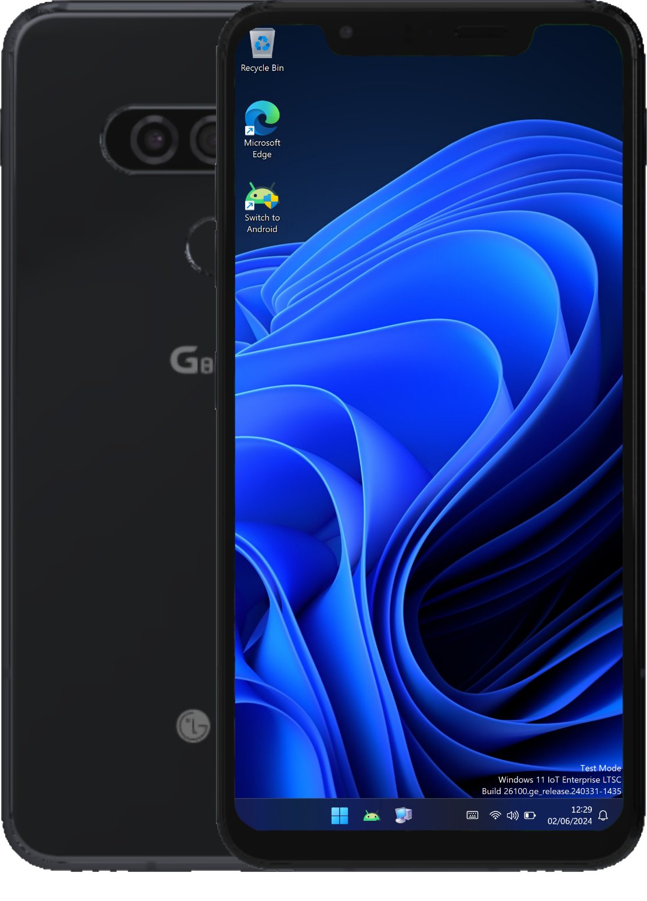

**State: Inactive**  
**Codename: betalm**  
**Contributors: [Daniel224455](https://github.com/Daniel224455), [n00b69](https://github.com/n00b69), [Icesito68](https://github.com/Icesito68)**

### UEFI Status

| Feature            | Description | State |
|:-------------------|:------------|:-----:|
| Display            |             | ✅    |
| Internal Storage   |             | ✅    |
| Side Buttons       |             | ✅    |
| USB Host Mode      |             | ❌    |
| USB Device Mode    |             | ✅    |
| USB Power Delivery |             | ❌    |
| Mass Storage       |             | ✅    |
| SD Card            | Broken      | ❌    |
| Windows Boot       |             | ✅    |
| Linux Boot         | Untested    | ❔    |

### OS Status

<table>
<tr><th>Windows</th></tr>
<tr><td>

> [!IMPORTANT]
> Needs [Windows Drivers](https://github.com/n00b69/woa-betalm/releases/tag/Drivers).

| Feature              | Description                                                  | State |
|:---------------------|:-------------------------------------------------------------|:-----:|
| Internal Storage     |                                                              | ✅    |
| SD Card              |                                                              | ❌    |
| Side Buttons         |                                                              | ✅    |
| Proximity Sensor     | Partially works, Disabled for now.                           | ⚠️    |
| Accelerometer Sensor | Partially works, Disabled for now.                           | ⚠️    |
| Compass Sensor       | Partially works, Disabled for now.                           | ⚠️    |
| Gyroscope Sensor     | Partially works, Disabled for now.                           | ⚠️    |
| Fingerprint Sensor   |                                                              | ❌    |
| NFC Sensor           |                                                              | ❌    |
| Temperature Sensor   |                                                              | ❔    |
| Battery              |                                                              | ✅    |
| USB                  |                                                              | ✅    |
| Charging             | USB Charging is slow, Wireless Charging is somewhat Fast.    | ✅️    |
| WLAN                 |                                                              | ✅    |
| CPU                  |                                                              | ✅    |
| Touchscreen          |                                                              | ✅    |
| Bluetooth            |                                                              | ✅    |
| GPS                  |                                                              | ✅    |
| Speakers             |                                                              | ❌    |
| 3.5mm Audio Jack     |                                                              | ✅    |
| Microphone           |                                                              | ❌    |
| GPU                  |                                                              | ✅    |
| Flashlight           |                                                              | ❌    |
| Camera               |                                                              | ❌    |
| Mobile Data          |                                                              | ❌    |
| Display              |                                                              | ✅    |
| Vibration            |                                                              | ❌    |

</td></tr>
</table>

<b><strong>OnePlus Devices</strong></b>

## OnePlus 7T Pro

**State: Inactive**  
**Codename: hotdog**  
**Contributors: [mat-777](https://github.com/mat-777/)**  

### UEFI Status

| Feature            | Description     | State |
|:-------------------|:----------------|:-----:|
| Display            |                 | ✅    |
| Internal Storage   |                 | ✅    |
| Side Buttons       |                 | ✅    |
| USB Host Mode      |                 | ❌    |
| USB Device Mode    |                 | ✅    |
| USB Power Delivery |                 | ❌    |
| Mass Storage       |                 | ❔    |
| Windows Boot       | Windows PE only | ⚠️    |
| Linux Boot         |                 | ❌    |

### OS Status

<table>
<tr><th>Windows</th></tr>
<tr><td>

| Feature              | Description | State |
|:---------------------|:------------|:-----:|
| Internal Storage     |             | ❌    |
| Side Buttons         |             | ❌    |
| Proximity Sensor     |             | ❌    |
| Light Sensor         |             | ❌    |
| Accelerometer Sensor |             | ❌    |
| Compass Sensor       |             | ❌    |
| Gyroscope Sensor     |             | ❌    |
| Fingerprint Sensor   |             | ❌    |
| Hall Sensor          |             | ❌    |
| NFC Sensor           |             | ❌    |
| Temperature Sensor   |             | ❌    |
| Battery              |             | ❌    |
| USB Host Mode        |             | ❌    |
| USB Device Mode      |             | ❌    |
| USB Power Delivery   |             | ❌    |
| Charging             |             | ❌    |
| WLAN                 |             | ❌    |
| CPU                  |             | ✅    |
| Touchscreen          |             | ❌    |
| Bluetooth            |             | ❌    |
| GPS                  |             | ❌    |
| Speakers             |             | ❌    |
| Microphone           |             | ❌    |
| GPU                  |             | ❌    |
| Camera               |             | ❌    |
| Mobile Data          |             | ❌    |
| Display              |             | ✅    |
| Vibration            |             | ❌    |

</td></tr>
</table>

<b><strong>Xiaomi Devices</strong></b>

## Xiaomi Pad 5

**State: Active**  
**Codename: nabu**  
**Contributors: [iNUCi](https://github.com/iNUCi), [Robotix](https://github.com/Robotix22/)**

### UEFI Status

| Feature            | Description | State |
|:-------------------|:------------|:-----:|
| Display            |             | ✅    |
| Internal Storage   |             | ✅    |
| Side Buttons       |             | ✅    |
| USB Host Mode      |             | ❌    |
| USB Device Mode    |             | ✅    |
| USB Power Delivery |             | ❌    |
| Mass Storage       |             | ✅    |
| Windows Boot       |             | ✅    |
| Linux Boot         |             | ✅    |

### OS Status

<table>
<tr><th>Windows</th><th>Linux</th></tr>
<tr><td>

> [!IMPORTANT]
> Needs [Windows Drivers](https://github.com/erdilS/Port-Windows-11-Xiaomi-Pad-5/releases/tag/Drivers).

| Feature              | Description                                                  | State |
|:---------------------|:-------------------------------------------------------------|:-----:|
| Internal Storage     |                                                              | ✅    |
| Side Buttons         |                                                              | ✅    |
| Proximity Sensor     |                                                              | ❌    |
| Accelerometer Sensor |                                                              | ✅    |
| Compass Sensor       |                                                              | ❌    |
| Gyroscope Sensor     |                                                              | ❌    |
| Fingerprint Sensor   |                                                              | ❌    |
| NFC Sensor           |                                                              | ❌    |
| Temperature Sensor   |                                                              | ❔    |
| Battery              |                                                              | ✅    |
| USB                  |                                                              | ✅    |
| Charging             | Very Slow                                                    | ⚠️    |
| WLAN                 |                                                              | ✅    |
| CPU                  |                                                              | ✅    |
| Touchscreen          |                                                              | ✅    |
| Bluetooth            |                                                              | ✅    |
| GPS                  |                                                              | ✅    |
| Speakers             |                                                              | ✅    |
| Microphone           |                                                              | ✅    |
| GPU                  |                                                              | ✅    |
| Flashlight           |                                                              | ⚠️    |
| Camera               |                                                              | ❌    |
| Display              |                                                              | ✅    |
| Vibration            |                                                              | ❌    |

</td><td>

> [!IMPORTANT]
> Linux Requires: [Mainline Kernel](https://gitlab.com/sm8150-mainline/linux).

| Feature              | Description                                                  | State |
|:---------------------|:-------------------------------------------------------------|:-----:|
| Internal Storage     |                                                              | ✅    |
| Side Buttons         |                                                              | ✅    |
| Proximity Sensor     |                                                              | ❌    |
| Accelerometer Sensor |                                                              | ❌    |
| Compass Sensor       |                                                              | ❌    |
| Gyroscope Sensor     |                                                              | ❌    |
| Fingerprint Sensor   |                                                              | ❌    |
| NFC Sensor           |                                                              | ❌    |
| Temperature Sensor   |                                                              | ✅    |
| Battery              |                                                              | ✅    |
| USB                  |                                                              | ✅    |
| Charging             |                                                              | ✅    |
| WLAN                 |                                                              | ✅    |
| CPU                  |                                                              | ✅    |
| Touchscreen          |                                                              | ✅    |
| Bluetooth            |                                                              | ✅    |
| GPS                  |                                                              | ❌    |
| Speakers             | Top right Speaker doesn't work                               | ⚠️    |
| Microphone           |                                                              | ✅    |
| GPU                  |                                                              | ✅    |
| Flashlight           |                                                              | ❌    |
| Camera               |                                                              | ❌    |
| Display              |                                                              | ✅    |
| Vibration            |                                                              | ❌    |

</td></tr>
</table>

## Xiaomi Mi 9

**State: Inactive**  
**Codename: cepheus**  
**Contributors: [Daniel224455](https://github.com/Daniel224455)**

### UEFI Status

| Feature            | Description | State |
|:-------------------|:------------|:-----:|
| Display            |             | ✅    |
| Internal Storage   |             | ✅    |
| Side Buttons       |             | ✅    |
| USB Host Mode      |             | ✅    |
| USB Device Mode    |             | ❌    |
| USB Power Delivery |             | ❌    |
| SD Card            |             | ❌    |
| Mass Storage       |             | ❌    |
| Windows Boot       |             | ✅    |
| Linux Boot         | Untested    | ❔    |

### OS Status

<table>
<tr><th>Windows</th></tr>
<tr><td>

> [!IMPORTANT]
> Needs [Windows Drivers](https://github.com/qaz6750/XiaoMi9-Drivers/releases/latest).

| Feature              | Description                                                  | State |
|:---------------------|:-------------------------------------------------------------|:-----:|
| Internal Storage     |                                                              | ✅    |
| Side Buttons         |                                                              | ✅    |
| Proximity Sensor     |                                                              | ❌    |
| Accelerometer Sensor |                                                              | ✅    |
| Compass Sensor       |                                                              | ✅    |
| Gyroscope Sensor     |                                                              | ✅    |
| Fingerprint Sensor   |                                                              | ❌    |
| NFC Sensor           |                                                              | ❌    |
| Temperature Sensor   |                                                              | ❔    |
| Battery              |                                                              | ✅    |
| USB                  |                                                              | ✅    |
| Charging             | Very Slow                                                    | ⚠️    |
| WLAN                 |                                                              | ✅    |
| CPU                  |                                                              | ✅    |
| Touchscreen          |                                                              | ✅    |
| Bluetooth            |                                                              | ✅    |
| GPS                  |                                                              | ✅    |
| Speakers             |                                                              | ✅    |
| Microphone           |                                                              | ✅    |
| GPU                  |                                                              | ✅    |
| Flashlight           |                                                              | ❌    |
| Camera               |                                                              | ❌    |
| Mobile Data          |                                                              | ✅️    |
| Display              |                                                              | ✅    |
| Vibration            |                                                              | ❌    |

</td></tr>
</table>

## Xiaomi Poco X3 Pro

**State: Inactive**  
**Codename: vayu**  
**Contributors: [Daniel224455](https://github.com/Daniel224455), [remtrik](https://github.com/remtrik), [Nikroks](https://github.com/N1kroks)**

### UEFI Status

| Feature            | Description | State |
|:-------------------|:------------|:-----:|
| Display            |             | ✅    |
| Internal Storage   |             | ✅    |
| Side Buttons       |             | ✅    |
| USB Host Mode      |             | ❌    |
| USB Device Mode    |             | ✅    |
| USB Power Delivery |             | ❌    |
| SD Card            |             | ❌    |
| Mass Storage       | Broken      | ❌    |
| Windows Boot       |             | ✅    |
| Linux Boot         |             | ✅    |

### OS Status

<table>
<tr><th>Windows</th></tr>
<tr><td>

> [!IMPORTANT]
> Needs [Windows Drivers](https://github.com/woa-vayu/POCOX3Pro-Releases/releases/latest).

| Feature              | Description                                                  | State |
|:---------------------|:-------------------------------------------------------------|:-----:|
| Internal Storage     |                                                              | ✅    |
| SD Card              |                                                              | ✅    |
| Side Buttons         |                                                              | ✅    |
| Proximity Sensor     |                                                              | ❌    |
| Accelerometer Sensor |                                                              | ✅    |
| Compass Sensor       |                                                              | ✅    |
| Gyroscope Sensor     |                                                              | ✅    |
| Fingerprint Sensor   |                                                              | ❌    |
| NFC Sensor           |                                                              | ❌    |
| Temperature Sensor   |                                                              | ❔    |
| Battery              |                                                              | ✅    |
| USB                  |                                                              | ✅    |
| Charging             | Very Slow                                                    | ⚠️    |
| WLAN                 |                                                              | ✅    |
| CPU                  |                                                              | ✅    |
| Touchscreen          |                                                              | ✅    |
| Bluetooth            |                                                              | ✅    |
| GPS                  |                                                              | ✅    |
| Speakers             |                                                              | ✅    |
| 3.5mm Audio Jack     |                                                              | ✅    |
| Microphone           |                                                              | ✅    |
| GPU                  |                                                              | ✅    |
| Flashlight           | Accessible only from Windows Camera, acts like a Stroboscope | ⚠️    |
| Camera               |                                                              | ❌    |
| Mobile Data          |                                                              | ✅️    |
| Display              |                                                              | ✅    |
| Vibration            |                                                              | ❌    |

</td></tr>
</table>

---

<b><strong>Snapdragon 845 Devices</strong></b>

 

<b><strong>LG Devices</strong></b>

## LG Velvet 4G

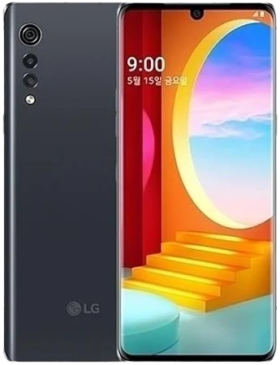

**State: Inactive**  
**Codename: caymanslm**  
**Contributors: [CodeLindro](https://github.com/leandrofriedrich/)**

### UEFI Status

| Feature            | Description | State |
|:-------------------|:------------|:-----:|
| Display            |             | ✅    |
| Internal Storage   |             | ✅    |
| Side Buttons       |             | ✅    |
| USB Host Mode      |             | ❌    |
| USB Device Mode    |             | ✅    |
| USB Power Delivery |             | ❌    |
| Mass Storage       |             | ❔    |
| SD Card            |             | ❌    |
| Windows Boot       |             | ✅    |
| Linux Boot         |             | ❌    |

### OS Status

<table>
<tr><th>Windows</th></tr>
<tr><td>

> [!IMPORTANT]
> Needs Windows Drivers.

| Feature              | Description | State |
|:---------------------|:------------|:-----:|
| Internal Storage     |             | ✅    |
| SD Card              |             | ❌    |
| Side Buttons         |             | ✅    |
| Proximity Sensor     |             | ❌    |
| Light Sensor         |             | ❌    |
| Accelerometer Sensor |             | ❌    |
| Compass Sensor       |             | ❌    |
| Fingerprint Sensor   |             | ❌    |
| Hall Sensor          |             | ❌    |
| NFC Sensor           |             | ❌    |
| Temperature Sensor   |             | ❌    |
| Battery              |             | ❌    |
| USB Host Mode        |             | ✅    |
| USB Device Mode      |             | ❌    |
| USB Power Delivery   |             | ❌    |
| Charging             |             | ✅    |
| WLAN                 |             | ❌    |
| CPU                  |             | ✅    |
| Touchscreen          |             | ❌    |
| Bluetooth            |             | ✅    |
| GPS                  |             | ❌    |
| Speakers             |             | ❌    |
| 3.5mm Audio Jack     |             | ❌    |
| Microphone           |             | ❌    |
| GPU                  |             | ❌    |
| Camera               |             | ❌    |
| Mobile Data          |             | ❌    |
| Display              |             | ✅    |
| Vibration            |             | ❌    |

</td></tr>
</table> 

<b><strong>Samsung Devices</strong></b>

## Samsung Galaxy S9

<table>
<tr><td>

> [!CAUTION]
> `BIT-9` Version is Required on this Phone!

</td></tr>
</table>

**State: Active**  
**Codename: starqltechn**  
**Contributors: [Violet](https://github.com/ghatt-o/) [Robotix](https://github.com/Robotix22/)**
 
### UEFI Status

| Feature            |  Description      | State |
|:-------------------|:------------------|:-----:|
| Display            |                   | ✅    |
| Internal Storage   |                   | ✅    |
| Side Buttons       | Only volume keys  | ⚠️    |
| USB Host Mode      |                   | ❌    |
| USB Device Mode    |                   | ❌    |
| USB Power Delivery |                   | ❌    |
| Mass Storage       | Needs Device Mode | ❌    |
| SD Card            |                   | ❔    |
| Windows Boot       |                   | ❌    |
| Linux Boot         |                   | ❔    |

<b><strong>Xiaomi Devices</strong></b>

## Xiaomi Mi 8 Pro

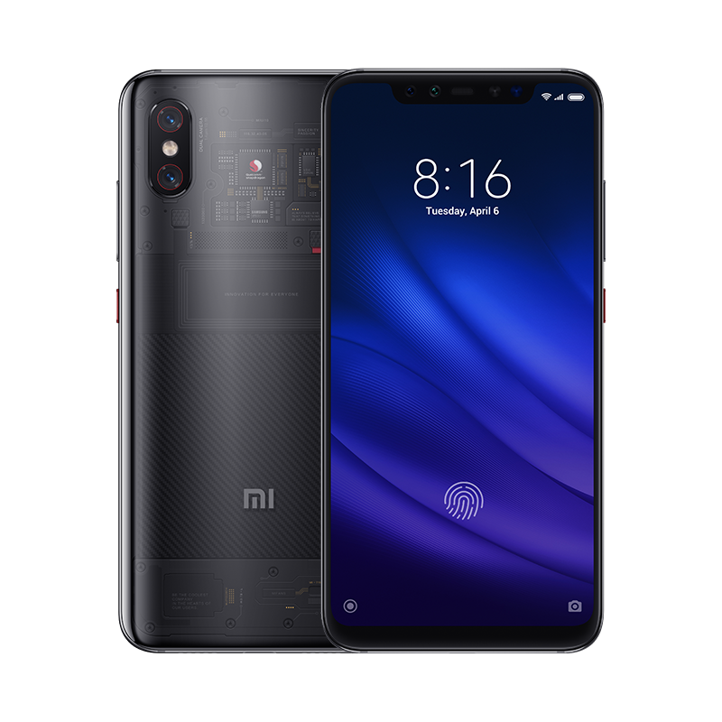

**State: Inactive**  
**Codename: equuleus**  
**Contributors: [index986](https://github.com/index986/)**

### UEFI Status

| Feature            | Description       | State |
|:-------------------|:------------------|:-----:|
| Display            |                   | ✅    |
| Internal Storage   |                   | ✅    |
| Side Buttons       |                   | ✅    |
| USB Host Mode      |                   | ✅    |
| USB Device Mode    |                   | ❌    |
| USB Power Delivery |                   | ❌    |
| Mass Storage       | Needs Device Mode | ❌    |
| Windows Boot       |                   | ❌    |
| Linux Boot         |                   | ❌    |

## Xiaomi Mi Mix 2S

**State: Inactive**  
**Codename: polaris**  
**Contributors: [Daniel224455](https://github.com/Daniel224455/), [TrustedFloppa](https://github.com/TrustedFloppa/)**

### UEFI Status

| Feature            | Description       | State |
|:-------------------|:------------------|:-----:|
| Display            |                   | ✅    |
| Internal Storage   |                   | ✅    |
| Side Buttons       |                   | ✅    |
| USB Host Mode      |                   | ✅    |
| USB Device Mode    |                   | ❌    |
| USB Power Delivery |                   | ❌    |
| Mass Storage       | Needs Device Mode | ❌    |
| Windows Boot       |                   | ⚠️    |
| Linux Boot         |                   | ❌    |

### OS Status

<table>
<tr><th>Windows</th></tr>
<tr><td>

> [!IMPORTANT]
> Only Windows PE Boots.

| Feature              | Description | State |
|:---------------------|:------------|:-----:|
| Internal Storage     |             | ❌    |
| Side Buttons         |             | ❌    |
| Proximity Sensor     |             | ❌    |
| Light Sensor         |             | ❌    |
| Accelerometer Sensor |             | ❌    |
| Compass Sensor       |             | ❌    |
| Gyroscope Sensor     |             | ❌    |
| Fingerprint Sensor   |             | ❌    |
| NFC Sensor           |             | ❌    |
| Temperature Sensor   |             | ❌    |
| Battery              |             | ❌    |
| USB Host Mode        |             | ❌    |
| USB Device Mode      |             | ❌    |
| USB Power Delivery   |             | ❌    |
| Charging             |             | ❌    |
| WLAN                 |             | ❌    |
| CPU                  |             | ✅    |
| Touchscreen          |             | ❌    |
| Bluetooth            |             | ❌    |
| GPS                  |             | ❌    |
| Speakers             |             | ❌    |
| Microphone           |             | ❌    |
| GPU                  |             | ❌    |
| Camera               |             | ❌    |
| Mobile Data          |             | ❌    |
| Display              |             | ✅    |
| Vibration            |             | ❌    |

</td></tr>
</table>

---

<b><strong>Snapdragon 835 Devices</strong></b>

 

<table>
<tr><td>

> [!IMPORTANT]
> Only 23H2 Windows Builds and Lower are able to Boot.

</td></tr>
</table>

<b><strong>Sony Devices</strong></b>

## Sony Xperia XZ1

**State: Inactive**  
**Codename: poplar**  
**Contributors: [Robotix](https://github.com/Robotix22/)**

### UEFI Status

| Feature            | Description              | State |
|:-------------------|:-------------------------|:-----:|
| Display            |                          | ✅    |
| Internal Storage   | Disabled to prevent Wipe | ✅    |
| Side Buttons       |                          | ✅    |
| USB Host Mode      |                          | ✅    |
| USB Device Mode    |                          | ❌    |
| USB Power Delivery | Dies on Disconnect       | ⚠️    |
| Mass Storage       | Disabled to prevent Wipe | ❌    |
| SD Card            |                          | ✅    |
| Windows Boot       |                          | ⚠️    |
| Linux Boot         |                          | ✅    |

### OS Status

<table>
<tr><th>Windows</th><th>Linux</th></tr>
<tr><td>

> [!IMPORTANT]
> Only Windows PE can Boot.

| Feature              | Description               | State |
|:---------------------|:--------------------------|:-----:|
| Internal Storage     | Probably Works if Enabled | ❔    |
| SD Card              |                           | ❌    |
| Side Buttons         |                           | ❌    |
| Proximity Sensor     |                           | ❌    |
| Light Sensor         |                           | ❌    |
| Accelerometer Sensor |                           | ❌    |
| Compass Sensor       |                           | ❌    |
| Fingerprint Sensor   |                           | ❌    |
| Hall Sensor          |                           | ❌    |
| NFC Sensor           |                           | ❌    |
| Temperature Sensor   |                           | ❌    |
| Battery              |                           | ❌    |
| USB Host Mode        |                           | ✅    |
| USB Device Mode      |                           | ❌    |
| USB Power Delivery   | Dies on Disconnect        | ⚠️    |
| Charging             |                           | ❌    |
| WLAN                 |                           | ❌    |
| CPU                  |                           | ✅    |
| Touchscreen          |                           | ❌    |
| Bluetooth            |                           | ❌    |
| GPS                  |                           | ❌    |
| Speakers             |                           | ❌    |
| 3.5mm Audio Jack     |                           | ❌    |
| Microphone           |                           | ❌    |
| GPU                  |                           | ❌    |
| Camera               |                           | ❌    |
| Mobile Data          |                           | ❌    |
| Display              |                           | ✅    |
| Vibration            |                           | ❌    |

</td><td>

> [!NOTE]
> Only Fedora Workstation and Arch Linux are Tested.

| Feature              | Description               | State |
|:---------------------|:--------------------------|:-----:|
| Internal Storage     | Probably Works if Enabled | ❔    |
| SD Card              |                           | ❌    |
| Side Buttons         |                           | ❌    |
| Proximity Sensor     |                           | ❌    |
| Light Sensor         |                           | ❌    |
| Accelerometer Sensor |                           | ❌    |
| Compass Sensor       |                           | ❌    |
| Fingerprint Sensor   |                           | ❌    |
| Hall Sensor          |                           | ❌    |
| NFC Sensor           |                           | ❌    |
| Temperature Sensor   |                           | ❌    |
| Battery              |                           | ❌    |
| USB Host Mode        |                           | ✅    |
| USB Device Mode      |                           | ❌    |
| USB Power Delivery   | Dies on Disconnect        | ⚠️    |
| Charging             |                           | ❌    |
| WLAN                 |                           | ❌    |
| CPU                  |                           | ✅    |
| Touchscreen          |                           | ❌    |
| Bluetooth            |                           | ❌    |
| GPS                  |                           | ❌    |
| Speakers             |                           | ❌    |
| 3.5mm Audio Jack     |                           | ❌    |
| Microphone           |                           | ❌    |
| GPU                  |                           | ❌    |
| Camera               |                           | ❌    |
| Mobile Data          |                           | ❌    |
| Display              |                           | ✅    |
| Vibration            |                           | ❌    |

</td></tr>
</table>

<b><strong>OnePlus Devices</strong></b>

## OnePlus 5

**State: Active**  
**Codename: cheeseburger**  
**Contributors: [index986](https://github.com/index986/)**

### UEFI Status

| Feature            | Description              | State |
|:-------------------|:-------------------------|:-----:|
| Display            |                          | ✅    |
| Internal Storage   |                          | ✅    |
| Side Buttons       |                          | ✅    |
| USB Host Mode      |                          | ❌    |
| USB Device Mode    |                          | ✅    |
| USB Power Delivery |                          | ❌    |
| Mass Storage       |                          | ✅    |
| Windows Boot       |                          | ❌    |
| Linux Boot         |                          | ✅    |

<table>
<tr><th>Linux</th>
<tr><td>

> [!NOTE]
> The PostmarketOS Site for this Device fixes can be Found [here](https://wiki.postmarketos.org/wiki/OnePlus_5_(oneplus-cheeseburger)).

> [!NOTE]
> Arch ARM seems to be most stable.

| Feature              | Description               | State |
|:---------------------|:--------------------------|:-----:|
| Internal Storage     |                           | ✅    |
| Side Buttons         |                           | ✅    |
| Proximity Sensor     |                           | ❌    |
| Light Sensor         |                           | ❌    |
| Accelerometer Sensor |                           | ❌    |
| Compass Sensor       |                           | ❌    |
| Fingerprint Sensor   |                           | ❌    |
| Hall Sensor          |                           | ✅    |
| NFC Sensor           |                           | ✅    |
| Temperature Sensor   |                           | ❌    |
| Battery              |                           | ✅    |
| USB Host Mode        |                           | ❌    |
| USB Device Mode      |                           | ✅    |
| USB Power Delivery   |                           | ❔    |
| Charging             |                           | ✅    |
| WLAN                 | Unstable                  | ⚠️    |
| CPU                  |                           | ✅    |
| Touchscreen          | Upside down, fix on wiki  | ⚠️    |
| Bluetooth            |                           | ✅    |
| GPS                  |                           | ✅    |
| Speakers             |                           | ❌    |
| 3.5mm Audio Jack     |                           | ❌    |
| Microphone           |                           | ❌    |
| GPU                  | Unstable                  | ⚠️    |
| Camera               |                           | ❌    |
| Mobile Data          |                           | ❌    |
| Display              |                           | ✅    |
| Vibration            |                           | ❌    |

</td></tr>
</table>

---

<b><strong>Snapdragon 778G/778G+/782G Devices</strong></b>

 

<table>
<tr><td>

> [!IMPORTANT]
> Only Windows Builds 26090 or higher Work.

</td></tr>
</table>

<b><strong>Nothing Devices</strong></b>

## Nothing Phone (1)

**State: Inactive**  
**Codename: spacewar**  
**Contributors: [Robotix](https://github.com/Robotix22/), [index986](https://github.com/index986/)**

### UEFI Status

| Feature            | Description                         | State |
|:-------------------|:------------------------------------|:-----:|
| Display            |                                     | ✅    |
| Internal Storage   |                                     | ✅    |
| Side Buttons       |                                     | ✅    |
| USB Host Mode      |                                     | ❌    |
| USB Device Mode    |                                     | ✅    |
| USB Power Delivery |                                     | ❌    |
| Mass Storage       | Unstable, Breaks on Large Transfers | ⚠️    |
| Windows Boot       |                                     | ❌    |
| Linux Boot         |                                     | ❌    |

<b><strong>Samsung Devices</strong></b>

## Samsung Galaxy A52s 5G

<table>
<tr><td>

> [!CAUTION]
> `BIT-11` Version is Required on this Phone!

</td></tr>
</table>

**State: Active**  
**Codename: a52sxq**  
**Contributors: [Robotix](https://github.com/Robotix22/), [arminask](https://github.com/arminask/), People from Group**  

### UEFI Status

| Feature            | Description       | State |
|:-------------------|:------------------|:-----:|
| Display            |                   | ✅    |
| Internal Storage   |                   | ✅    |
| Side Buttons       |                   | ✅    |
| USB Host Mode      |                   | ✅    |
| USB Device Mode    |                   | ❌    |
| USB Power Delivery |                   | ❌    |
| Mass Storage       | Needs Device Mode | ❌    |
| SD Card            |                   | ✅    |
| Windows Boot       |                   | ✅    |
| Linux Boot         |                   | ❌    |

### OS Status

<table>
<tr><th>Windows</th></tr>
<tr><td>

> [!IMPORTANT]
> Needs [Windows Drivers](https://github.com/woa-a52s/windows_oem_samsung_a52sxq).

| Feature              | Description           | State |
|:---------------------|:----------------------|:-----:|
| Internal Storage     |                       | ✅    |
| SD Card              |                       | ✅️    |
| Side Buttons         |                       | ✅    |
| Proximity Sensor     |                       | ✅    |
| Light Sensor         |                       | ✅    |
| Accelerometer Sensor |                       | ✅    |
| Compass Sensor       |                       | ✅    |
| Fingerprint Sensor   |                       | ❌    |
| Hall Sensor          |                       | ✅    |
| NFC Sensor           |                       | ❌    |
| Temperature Sensor   |                       | ✅    |
| Battery              |                       | ✅    |
| USB Host Mode        |                       | ✅    |
| USB Device Mode      |                       | ✅    |
| USB Power Delivery   |                       | ❌    |
| Charging             |                       | ✅    |
| WLAN                 |                       | ✅    |
| CPU                  |                       | ✅    |
| Touchscreen          |                       | ✅    |
| Bluetooth            |                       | ✅    |
| GPS                  |                       | ✅    |
| Speakers             |                       | ❌    |
| Microphone           |                       | ❌    |
| GPU                  |                       | ❌    |
| Camera               |                       | ❌    |
| Mobile Data          |                       | ❌    |
| Display              |                       | ✅    |
| Vibration            |                       | ✅    |

</td></tr>
</table>

<b><strong>Xiaomi Devices</strong></b>

## Xiaomi 11 Lite 5G NE / Xiaomi 11 Lite NE 5G / Xiaomi Mi 11 LE / Xiaomi Mi 11 Lite NE

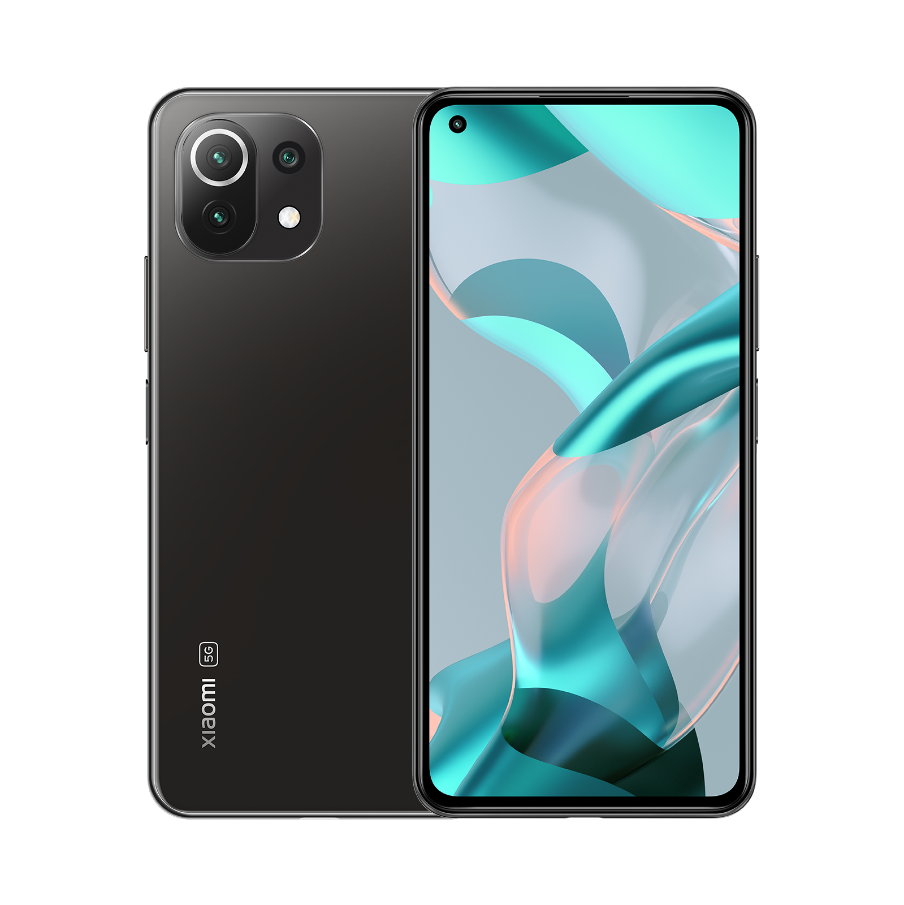

**State: Active**  
**Codename: lisa**  
**Contributors: [ETCHDEV](https://github.com/ETCHDEV/), [Nikroks](https://github.com/N1kroks/), [Aistop](https://github.com/AistopGit/)**

### UEFI Status

| Feature            | Description                         | State |
|:-------------------|:------------------------------------|:-----:|
| Display            |                                     | ✅    |
| Internal Storage   |                                     | ✅    |
| Side Buttons       |                                     | ✅    |
| USB Host Mode      |                                     | ❌    |
| USB Device Mode    |                                     | ✅    |
| USB Power Delivery |                                     | ❌    |
| Mass Storage       | Unstable, Breaks on Large Transfers | ⚠️    |
| SD Card            |                                     | ❌    |
| Windows Boot       |                                     | ✅    |
| Linux Boot         |                                     | ❌    |

### OS Status

<table>
<tr><th>Windows</th></tr>
<tr><td>

> [!IMPORTANT]
> Needs [Windows Drivers](https://github.com/AistopGit/windows_oem_xiaomi_lisa).

| Feature              | Description           | State |
|:---------------------|:----------------------|:-----:|
| Internal Storage     |                       | ✅    |
| SD Card              | SDXC cards don't work | ⚠️    |
| Side Buttons         |                       | ✅    |
| Proximity Sensor     |                       | ❌    |
| Light Sensor         |                       | ❌    |
| Accelerometer Sensor |                       | ❌    |
| Compass Sensor       |                       | ❌    |
| Fingerprint Sensor   |                       | ❌    |
| Hall Sensor          |                       | ❌    |
| NFC Sensor           |                       | ❌    |
| Temperature Sensor   |                       | ❌    |
| Battery              |                       | ✅    |
| USB Host Mode        |                       | ✅    |
| USB Device Mode      |                       | ✅    |
| USB Power Delivery   |                       | ✅    |
| Charging             |                       | ✅    |
| WLAN                 |                       | ✅    |
| CPU                  |                       | ✅    |
| Touchscreen          |                       | ✅    |
| Bluetooth            |                       | ✅    |
| GPS                  |                       | ✅    |
| Speakers             |                       | ❌    |
| Microphone           |                       | ❌    |
| GPU                  |                       | ❌    |
| Camera               |                       | ❌    |
| Mobile Data          |                       | ✅    |
| Display              |                       | ✅    |
| Vibration            |                       | ✅    |

</td></tr>
</table>

---

<b><strong>Snapdragon 730/730G/732G Devices</strong></b>

 

<b><strong>Lenovo Devices</strong></b>

## Lenovo Tab P11 Pro

**State: Inactive**  
**Codename: j706f**  
**Contributors: [hyusang](https://github.com/cloudsweets/)**

### UEFI Status

| Feature            | Description | State |
|:-------------------|:------------|:-----:|
| Display            |             | ✅    |
| Internal Storage   |             | ✅    |
| Side Buttons       |             | ✅    |
| USB Host Mode      |             | ❌    |
| USB Device Mode    |             | ✅    |
| USB Power Delivery |             | ❌    |
| Mass Storage       |             | ❔    |
| SD Card            |             | ❌    |
| Windows Boot       |             | ✅    |
| Linux Boot         |             | ❌    |

### OS Status

<table>
<tr><th>Windows</th></tr>
<tr><td>

| Feature              | Description | State |
|:---------------------|:------------|:-----:|
| Internal Storage     |             | ✅    |
| SD Card              |             | ❌    |
| Side Buttons         |             | ❌    |
| Proximity Sensor     |             | ❌    |
| Light Sensor         |             | ❌    |
| Accelerometer Sensor |             | ❌    |
| Compass Sensor       |             | ❌    |
| Gyroscope Sensor     |             | ❌    |
| Fingerprint Sensor   |             | ❌    |
| Hall Sensor          |             | ❌    |
| Temperature Sensor   |             | ❌    |
| Battery              |             | ❌    |
| USB Host Mode        |             | ❌    |
| USB Device Mode      |             | ❌    |
| USB Power Delivery   |             | ❌    |
| Charging             |             | ❌    |
| WLAN                 |             | ❌    |
| CPU                  |             | ✅    |
| Touchscreen          |             | ❌    |
| Bluetooth            |             | ❌    |
| GPS                  |             | ❌    |
| Speakers             |             | ❌    |
| Microphone           |             | ❌    |
| GPU                  |             | ❌    |
| Camera               |             | ❌    |
| Mobile Data          |             | ❌    |
| Display              |             | ✅    |
| Vibration            |             | ❌    |

</td></tr>
</table>

<b><strong>Xiaomi Devices</strong></b>

## Xiaomi Poco X3 NFC

**State: Active**  
**Codename: surya**  
**Contributors: [remtrik](https://github.com/remtrik), [Nikroks](https://github.com/N1kroks)**

### UEFI Status

| Feature            | Description       | State |
|:-------------------|:------------------|:-----:|
| Display            |                   | ✅    |
| Internal Storage   |                   | ✅    |
| Side Buttons       |                   | ✅    |
| USB Host Mode      |                   | ❌    |
| USB Device Mode    |                   | ✅    |
| USB Power Delivery |                   | ❌    |
| Mass Storage       |                   | ✅    |
| SD Card            |                   | ✅    |
| Windows Boot       |                   | ✅    |
| Linux Boot         |                   | ✅    |

### OS Status

<table>
<tr><th>Windows</th></tr>
<tr><td>

> [!IMPORTANT]
> Needs Windows Drivers.

| Feature              | Description              | State |
|:---------------------|:-------------------------|:-----:|
| Internal Storage     |                          | ✅    |
| SD Card              |                          | ✅    |
| Side Buttons         |                          | ✅    |
| Proximity Sensor     |                          | ❌    |
| Light Sensor         |                          | ❌    |
| Accelerometer Sensor |                          | ❌    |
| Compass Sensor       |                          | ❌    |
| Gyroscope Sensor     |                          | ❌    |
| Barometer Sensor     |                          | ❌    |
| Geomagnetic Sensor   |                          | ❌    |
| Fingerprint Sensor   |                          | ❌    |
| Hall Sensor          |                          | ❌    |
| Gravity Sensor       |                          | ❌    |
| NFC Sensor           |                          | ⚠️    |
| Temperature Sensor   |                          | ✅    |
| Battery              |                          | ✅    |
| USB Host Mode        |                          | ✅    |
| USB Device Mode      | Needs manual mode change | ⚠️    |
| USB Power Delivery   |                          | ✅    |
| Charging             |                          | ⚠️    |
| WLAN                 |                          | ✅    |
| CPU                  |                          | ✅    |
| Touchscreen          |                          | ✅    |
| Bluetooth            |                          | ✅    |
| GPS                  |                          | ✅    |
| Speakers             |                          | ❌    |
| Microphone           |                          | ❌    |
| GPU                  |                          | ❌    |
| Camera               |                          | ❌    |
| Mobile Data          |                          | ✅    |
| Display              |                          | ✅    |
| Vibration            |                          | ❌    |

</td></tr>
</table>

## Xiaomi Poco X2 / Redmi K30

**State: Active**  
**Codename: phoenix**  
**Contributors: [remtrik](https://github.com/remtrik)**

### UEFI Status

| Feature            | Description       | State |
|:-------------------|:------------------|:-----:|
| Display            |                   | ✅    |
| Internal Storage   |                   | ✅    |
| Side Buttons       |                   | ✅    |
| USB Host Mode      |                   | ❌    |
| USB Device Mode    |                   | ✅    |
| USB Power Delivery |                   | ❌    |
| Mass Storage       |                   | ✅    |
| SD Card            |                   | ❌    |
| Windows Boot       |                   | ❌    |
| Linux Boot         |                   | ❌    |

## Xiaomi Redmi Note 12 Pro 4G

**State: Inactive**  
**Codename: sweet_k6a**  
**Contributors: [Robotix](https://github.com/Robotix22/)**

### UEFI Status

| Feature            | Description | State |
|:-------------------|:------------|:-----:|
| Display            |             | ✅    |
| Internal Storage   |             | ✅    |
| Side Buttons       |             | ✅    |
| USB Host Mode      |             | ❌    |
| USB Device Mode    |             | ✅    |
| USB Power Delivery |             | ❌    |
| Mass Storage       |             | ❔    |
| SD Card            |             | ❌    |
| Windows Boot       |             | ❌    |
| Linux Boot         |             | ❌    |

---

<b><strong>Snapdragon 720G Devices</strong></b>

 

<b><strong>Xiaomi Devices</strong></b>

## Xiaomi Redmi Note 9 Pro / 9 Pro India / 9 Pro Max India / 10 Lite / 9S / Poco M2 Pro

**State: Active**  
**Codename: miatoll**  
**Contributors: [N1kroks](https://github.com/N1kroks/)**

### UEFI Status

| Feature            | Description       | State |
|:-------------------|:------------------|:-----:|
| Display            |                   | ✅    |
| Internal Storage   |                   | ✅    |
| Side Buttons       |                   | ✅    |
| USB Host Mode      |                   | ❌    |
| USB Device Mode    |                   | ✅    |
| USB Power Delivery |                   | ❌    |
| Mass Storage       |                   | ✅    |
| SD Card            |                   | ✅    |
| Windows Boot       |                   | ✅    |
| Linux Boot         |                   | ✅    |

### OS Status

<table>
<tr><th>Windows</th><th>Linux</th></tr>
<tr><td>

> [!IMPORTANT]
> Needs [Windows Drivers](https://github.com/woa-miatoll/Miatoll-Releases).

| Feature              | Description              | State |
|:---------------------|:-------------------------|:-----:|
| Internal Storage     |                          | ✅    |
| SD Card              |                          | ✅    |
| Side Buttons         |                          | ✅    |
| Proximity Sensor     |                          | ✅    |
| Light Sensor         |                          | ✅    |
| Accelerometer Sensor |                          | ✅    |
| Compass Sensor       |                          | ✅    |
| Gyroscope Sensor     |                          | ✅    |
| Fingerprint Sensor   |                          | ❌    |
| NFC Sensor           |                          | ❌    |
| Battery              |                          | ✅    |
| USB Host Mode        |                          | ✅    |
| USB Device Mode      | Needs manual mode change | ⚠️    |
| USB Power Delivery   |                          | ✅    |
| Charging             |                          | ❌    |
| WLAN                 |                          | ✅    |
| CPU                  |                          | ✅    |
| Touchscreen          |                          | ✅    |
| Bluetooth            |                          | ✅    |
| GPS                  |                          | ✅    |
| Speakers             |                          | ✅    |
| 3.5mm Audio Jack     |                          | ❌    |
| Microphone           |                          | ❌    |
| GPU                  |                          | ✅    |
| Camera               |                          | ❌    |
| Mobile Data          |                          | ✅    |
| Display              |                          | ✅    |
| Vibration            |                          | ❌    |

</td><td>

> [!IMPORTANT]
> Linux Requires: [Mainline Kernel](https://github.com/sm7125-mainline/linux).

| Feature              | Description | State |
|:---------------------|:------------|:-----:|
| Internal Storage     |             | ✅    |
| SD Card              |             | ✅    |
| Side Buttons         |             | ✅    |
| Proximity Sensor     |             | ✅    |
| Light Sensor         |             | ✅    |
| Accelerometer Sensor |             | ✅    |
| Compass Sensor       |             | ✅    |
| Gyroscope Sensor     |             | ✅    |
| Fingerprint Sensor   |             | ❌    |
| NFC Sensor           |             | ❌    |
| Battery              |             | ✅    |
| USB Host Mode        |             | ✅    |
| USB Device Mode      |             | ✅    |
| USB Power Delivery   |             | ✅    |
| Charging             |             | ❌    |
| WLAN                 |             | ✅    |
| CPU                  |             | ✅    |
| Touchscreen          |             | ✅    |
| Bluetooth            |             | ✅    |
| GPS                  |             | ❌    |
| Speakers             |             | ✅    |
| 3.5mm Audio Jack     |             | ✅    |
| Microphone           |             | ✅    |
| GPU                  |             | ✅    |
| Camera               |             | ⚠️    |
| Mobile Data          |             | ✅    |
| Display              |             | ✅    |
| Vibration            |             | ✅    |

</td></tr>
</table>

<b><strong>Samsung Devices</strong></b>

## Samsung Galaxy A52

<!--
<table>
<tr><td>

> [!CAUTION]
> `BIT-?` Version is Required on this Phone!

</td></tr>
</table>
-->

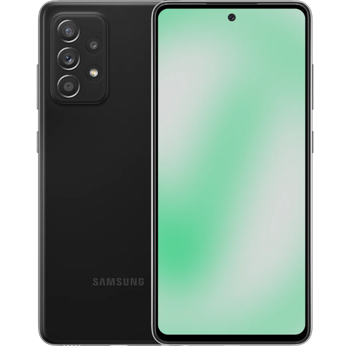

**State: Active**  
**Codename: a52q**  
**Contributors: [arminask](https://github.com/arminask/), [N1kroks](https://github.com/N1kroks/)**

### UEFI Status

| Feature            | Description       | State |
|:-------------------|:------------------|:-----:|
| Display            |                   | ✅    |
| Internal Storage   |                   | ✅    |
| Side Buttons       |                   | ✅    |
| USB Host Mode      |                   | ✅    |
| USB Device Mode    |                   | ❌    |
| USB Power Delivery |                   | ❌    |
| Mass Storage       | Needs Device Mode | ❌    |
| SD Card            |                   | ✅    |
| Windows Boot       |                   | ✅    |
| Linux Boot         |                   | ❌    |

### OS Status

<table>
<tr><th>Windows</th><th>Linux</th></tr>
<tr><td>

> [!IMPORTANT]
> Needs [Windows Drivers](https://github.com).
> (Not published yet, work in progress)

| Feature              | Description           | State |
|:---------------------|:----------------------|:-----:|
| Internal Storage     |                       | ✅    |
| SD Card              |                       | ✅    |
| Side Buttons         |                       | ✅    |
| Proximity Sensor     |                       | ❌    |
| Light Sensor         |                       | ❌    |
| Accelerometer Sensor |                       | ❌    |
| Compass Sensor       |                       | ❌    |
| Gyroscope Sensor     |                       | ❌    |
| Fingerprint Sensor   |                       | ❌    |
| NFC Sensor           |                       | ❌    |
| Battery              |                       | ✅    |
| USB Host Mode        |                       | ✅    |
| USB Device Mode      |                       | ❌    |
| USB Power Delivery   |                       | ❌    |
| Charging             |                       | ✅    |
| WLAN                 |                       | ✅    |
| CPU                  |                       | ✅    |
| Touchscreen          |                       | ✅    |
| Bluetooth            |                       | ❌    |
| GPS                  |                       | ❌    |
| Speakers             |                       | ❌    |
| 3.5mm Audio Jack     |                       | ❌    |
| Microphone           |                       | ❌    |
| GPU                  |                       | ❌    |
| Camera               |                       | ❌    |
| Mobile Data          |                       | ❌    |
| Display              |                       | ✅    |
| Vibration            |                       | ✅    |

</td><td>

| Feature              | Description | State |
|:---------------------|:------------|:-----:|
| Internal Storage     |             | ❌    |
| SD Card              |             | ❌    |
| Side Buttons         |             | ❌    |
| Proximity Sensor     |             | ❌    |
| Light Sensor         |             | ❌    |
| Accelerometer Sensor |             | ❌    |
| Compass Sensor       |             | ❌    |
| Gyroscope Sensor     |             | ❌    |
| Fingerprint Sensor   |             | ❌    |
| NFC Sensor           |             | ❌    |
| Battery              |             | ❌    |
| USB Host Mode        |             | ❌    |
| USB Device Mode      |             | ❌    |
| USB Power Delivery   |             | ❌    |
| Charging             |             | ❌    |
| WLAN                 |             | ❌    |
| CPU                  |             | ❌    |
| Touchscreen          |             | ❌    |
| Bluetooth            |             | ❌    |
| GPS                  |             | ❌    |
| Speakers             |             | ❌    |
| 3.5mm Audio Jack     |             | ❌    |
| Microphone           |             | ❌    |
| GPU                  |             | ❌    |
| Camera               |             | ❌    |
| Mobile Data          |             | ❌    |
| Display              |             | ❌    |
| Vibration            |             | ❌    |

</td></tr>
</table>

---

<b><strong>Snapdragon 695 Devices</strong></b>

 

<b><strong>Xiaomi Devices</strong></b>

## Redmi Note 11 Pro 5G

**State: Inactive**  
**Codename: veux**  
**Contributors: [Robotix](https://github.com/Robotix22/), [index986](https://github.com/index986/)**

### UEFI Status

| Feature            | Description     | State |
|:-------------------|:---------------------|:-----:|
| Display            |                      | ✅    |
| Internal Storage   |                      | ✅    |
| Side Buttons       |                      | ✅    |
| USB Host Mode      |                      | ❌    |
| USB Device Mode    |                      | ✅    |
| USB Power Delivery |                      | ❌    |
| Mass Storage       | No unplug protection | ⚠️    |
| SD Card            |                      | ❌    |
| Windows Boot       |                      | ❔    |
| Linux Boot         |                      | ❔    |

</td></tr>
</table>

---

<b><strong>Snapdragon 680/685 Devices</strong></b>

 

<b><strong>Xiaomi Devices</strong></b>

## Xiaomi Redmi 10C

**State: Inactive**  
**Codename: fog**  
**Contributors: [Statzar](https://github.com/Statzar/)**

### UEFI Status

| Feature            | Description       | State |
|:-------------------|:------------------|:-----:|
| Display            |                   | ✅    |
| Internal Storage   |                   | ✅    |
| Side Buttons       |                   | ✅    |
| USB Host Mode      |                   | ✅    |
| USB Device Mode    |                   | ❌    |
| USB Power Delivery |                   | ❌    |
| Mass Storage       | Needs Device Mode | ❌    |
| SD Card            |                   | ✅    |
| Windows Boot       |                   | ✅    |
| Linux Boot         |                   | ✅    |

### OS Status

<table>
<tr><th>Windows</th><th>Linux</th></tr>
<tr><td>

| Feature              | Description         | State |
|:---------------------|:--------------------|:-----:|
| Internal Storage     |                     | ✅    |
| SD Card              |Hot Plug doesn't work| ⚠️    |
| Side Buttons         |                     | ❌    |
| Proximity Sensor     |                     | ❌    |
| Light Sensor         |                     | ❌    |
| Accelerometer Sensor |                     | ❌    |
| Compass Sensor       |                     | ❌    |
| Fingerprint Sensor   |                     | ❌    |
| NFC Sensor           |                     | ❌    |
| Temperature Sensor   |                     | ❌    |
| Battery              |                     | ❌    |
| USB Host Mode        |                     | ✅    |
| USB Device Mode      |                     | ❌    |
| USB Power Delivery   |                     | ❌    |
| Charging             |                     | ❌    |
| WLAN                 |                     | ❌    |
| CPU                  |                     | ✅    |
| Touchscreen          |                     | ❌    |
| Bluetooth            |                     | ❌    |
| GPS                  |                     | ❌    |
| Speakers             |                     | ❌    |
| 3.5mm Audio Jack     |                     | ❌    |
| Microphone           |                     | ❌    |
| GPU                  |                     | ❌    |
| Camera               |                     | ❌    |
| Mobile Data          |                     | ❌    |
| Display              |                     | ✅    |
| Vibration            |                     | ❌    |

</td><td>

| Feature              | Description | State |
|:---------------------|:------------|:-----:|
| Internal Storage     |             | ✅    |
| SD Card              |             | ❌    |
| Side Buttons         |             | ❌    |
| Proximity Sensor     |             | ❌    |
| Light Sensor         |             | ❌    |
| Accelerometer Sensor |             | ❌    |
| Compass Sensor       |             | ❌    |
| Fingerprint Sensor   |             | ❌    |
| NFC Sensor           |             | ❌    |
| Temperature Sensor   |             | ❌    |
| Battery              |             | ❌    |
| USB Host Mode        |             | ✅    |
| USB Device Mode      |             | ❌    |
| USB Power Delivery   |             | ❌    |
| Charging             |             | ❌    |
| WLAN                 |             | ❌    |
| CPU                  |             | ✅    |
| Touchscreen          |             | ❌    |
| Bluetooth            |             | ❌    |
| GPS                  |             | ❌    |
| Speakers             |             | ❌    |
| 3.5mm Audio Jack     |             | ❌    |
| Microphone           |             | ❌    |
| GPU                  |             | ❌    |
| Camera               |             | ❌    |
| Mobile Data          |             | ❌    |
| Display              |             | ✅    |
| Vibration            |             | ❌    |

</td></tr>
</table>

## Xiaomi Redmi Note 11

**State: Inactive**  
**Codename: spes**  
**Contributors: [Statzar](https://github.com/Statzar/)**

### UEFI Status

| Feature            | Description       | State |
|:-------------------|:------------------|:-----:|
| Display            |                   | ✅    |
| Internal Storage   |                   | ✅    |
| Side Buttons       |                   | ✅    |
| USB Host Mode      |                   | ✅    |
| USB Device Mode    |                   | ❌    |
| USB Power Delivery |                   | ❌    |
| Mass Storage       | Needs Device Mode | ❌    |
| SD Card            |                   | ✅    |
| Windows Boot       |                   | ✅    |
| Linux Boot         |                   | ✅    |

### OS Status

<table>
<tr><th>Windows</th><th>Linux</th></tr>
<tr><td>

| Feature              | Description | State |
|:---------------------|:------------|:-----:|
| Internal Storage     |             | ✅    |
| SD Card              |             | ❌    |
| Side Buttons         |             | ❌    |
| Proximity Sensor     |             | ❌    |
| Light Sensor         |             | ❌    |
| Accelerometer Sensor |             | ❌    |
| Compass Sensor       |             | ❌    |
| Gyroscope Sensor     |             | ❌    |
| Fingerprint Sensor   |             | ❌    |
| NFC Sensor           |             | ❌    |
| Temperature Sensor   |             | ❌    |
| Battery              |             | ❌    |
| USB Host Mode        |             | ✅    |
| USB Device Mode      |             | ❌    |
| USB Power Delivery   |             | ❌    |
| Charging             |             | ❌    |
| WLAN                 |             | ❌    |
| CPU                  |             | ✅    |
| Touchscreen          |             | ❌    |
| Bluetooth            |             | ❌    |
| GPS                  |             | ❌    |
| Speakers             |             | ❌    |
| 3.5mm Audio Jack     |             | ❌    |
| Microphone           |             | ❌    |
| GPU                  |             | ❌    |
| Camera               |             | ❌    |
| Mobile Data          |             | ❌    |
| Display              |             | ✅    |
| Vibration            |             | ❌    |

</td><td>

| Feature              | Description | State |
|:---------------------|:------------|:-----:|
| Internal Storage     |             | ✅    |
| SD Card              |             | ❌    |
| Side Buttons         |             | ❌    |
| Proximity Sensor     |             | ❌    |
| Light Sensor         |             | ❌    |
| Accelerometer Sensor |             | ❌    |
| Compass Sensor       |             | ❌    |
| Gyroscope Sensor     |             | ❌    |
| Fingerprint Sensor   |             | ❌    |
| NFC Sensor           |             | ❌    |
| Temperature Sensor   |             | ❌    |
| Battery              |             | ❌    |
| USB Host Mode        |             | ✅    |
| USB Device Mode      |             | ❌    |
| USB Power Delivery   |             | ❌    |
| Charging             |             | ❌    |
| WLAN                 |             | ❌    |
| CPU                  |             | ✅    |
| Touchscreen          |             | ❌    |
| Bluetooth            |             | ❌    |
| GPS                  |             | ❌    |
| Speakers             |             | ❌    |
| 3.5mm Audio Jack     |             | ❌    |
| Microphone           |             | ❌    |
| GPU                  |             | ❌    |
| Camera               |             | ❌    |
| Mobile Data          |             | ❌    |
| Display              |             | ✅    |
| Vibration            |             | ❌    |

</td></tr>
</table>

## Xiaomi Redmi Note 12

**State: Inactive**  
**Codename: tapas**  
**Contributors: [Statzar](https://github.com/Statzar/), [6adp](https://github.com/6adp/)**

### UEFI Status

| Feature            | Description       | State |
|:-------------------|:------------------|:-----:|
| Display            |                   | ✅    |
| Internal Storage   |                   | ✅    |
| Side Buttons       |                   | ✅    |
| USB Host Mode      |                   | ✅    |
| USB Device Mode    |                   | ❌    |
| USB Power Delivery |                   | ❌    |
| Mass Storage       | Needs Device Mode | ❌    |
| SD Card            |                   | ✅    |
| Windows Boot       |                   | ✅    |
| Linux Boot         |                   | ✅    |

### OS Status

<table>
<tr><th>Windows</th><th>Linux</th></tr>
<tr><td>

| Feature              | Description | State |
|:---------------------|:------------|:-----:|
| Internal Storage     |             | ✅    |
| SD Card              |             | ❌    |
| Side Buttons         |             | ❌    |
| Proximity Sensor     |             | ❌    |
| Light Sensor         |             | ❌    |
| Accelerometer Sensor |             | ❌    |
| Compass Sensor       |             | ❌    |
| Fingerprint Sensor   |             | ❌    |
| NFC Sensor           |             | ❌    |
| Temperature Sensor   |             | ❌    |
| Battery              |             | ❌    |
| USB Host Mode        |             | ✅    |
| USB Device Mode      |             | ❌    |
| USB Power Delivery   |             | ❌    |
| Charging             |             | ❌    |
| WLAN                 |             | ❌    |
| CPU                  |             | ✅    |
| Touchscreen          |             | ❌    |
| Bluetooth            |             | ❌    |
| GPS                  |             | ❌    |
| Speakers             |             | ❌    |
| 3.5mm Audio Jack     |             | ❌    |
| Microphone           |             | ❌    |
| GPU                  |             | ❌    |
| Camera               |             | ❌    |
| Mobile Data          |             | ❌    |
| Display              |             | ✅    |
| Vibration            |             | ❌    |

</td><td>

| Feature              | Description | State |
|:---------------------|:------------|:-----:|
| Internal Storage     |             | ✅    |
| SD Card              |             | ❌    |
| Side Buttons         |             | ❌    |
| Proximity Sensor     |             | ❌    |
| Light Sensor         |             | ❌    |
| Accelerometer Sensor |             | ❌    |
| Compass Sensor       |             | ❌    |
| Fingerprint Sensor   |             | ❌    |
| NFC Sensor           |             | ❌    |
| Temperature Sensor   |             | ❌    |
| Battery              |             | ❌    |
| USB Host Mode        |             | ✅    |
| USB Device Mode      |             | ❌    |
| USB Power Delivery   |             | ❌    |
| Charging             |             | ❌    |
| WLAN                 |             | ❌    |
| CPU                  |             | ✅    |
| Touchscreen          |             | ❌    |
| Bluetooth            |             | ❌    |
| GPS                  |             | ❌    |
| Speakers             |             | ❌    |
| 3.5mm Audio Jack     |             | ❌    |
| Microphone           |             | ❌    |
| GPU                  |             | ❌    |
| Camera               |             | ❌    |
| Mobile Data          |             | ❌    |
| Display              |             | ✅    |
| Vibration            |             | ❌    |

</td></tr>
</table>

---

<b><strong>Snapdragon 665 Devices</strong></b>

 

<table>
<tr><td>

> [!IMPORTANT]
> Only 23H2 Windows Builds and Lower are able to Boot.

</td></tr>
</table>

<b><strong>Xiaomi Devices</strong></b>

## Xiaomi Mi A3

**State: Inactive**  
**Codename: laurel_sprout**  
**Contributors: [Kernel357](https://github.com/Kernel357/)**

### UEFI Status

| Feature            | Description | State |
|:-------------------|:------------|:-----:|
| Display            |             | ✅    |
| Internal Storage   |             | ✅    |
| Side Buttons       |             | ✅    |
| USB Host Mode      |             | ❌    |
| USB Device Mode    |             | ✅    |
| USB Power Delivery |             | ❌    |
| Mass Storage       |             | ❔    |
| SD Card            |             | ❌    |
| Windows Boot       |             | ❌    |
| Linux Boot         |             | ❌    |

## Xiaomi Redmi Note 8T

**State: Inactive**  
**Codename: willow**  
**Contributors: [SwedMlite](https://github.com/SwedMlite), [Robotix](https://github.com/Robotix22/), [Vicente Cortes](https://github.com/vicenteicc2008/)**

### UEFI Status

| Feature            | Description               | State |
|:-------------------|:--------------------------|:-----:|
| Display            |                           | ✅    |
| Internal Storage   |                           | ✅    |
| Side Buttons       |                           | ✅    |
| USB Host Mode      |                           | ✅    |
| USB Device Mode    |                           | ❌    |
| USB Power Delivery |                           | ✅    |
| Mass Storage       | Unstable with Device Mode | ⚠️    |
| SD Card            |                           | ❌    |
| Windows Boot       |                           | ✅    |
| Linux Boot         |                           | ❔    |

### OS Status

<table>
<tr><th>Windows</th></tr>
<tr><td>

| Feature              | Description  | State |
|:---------------------|:-------------|:-----:|
| Internal Storage     |              | ✅    |
| SD Card              |              | ❌    |
| Side Buttons         |              | ❌    |
| Proximity Sensor     |              | ❌    |
| Light Sensor         |              | ❌    |
| Accelerometer Sensor |              | ❌    |
| Gyroscope Sensor     |              | ❌    |
| Fingerprint Sensor   |              | ❌    |
| Temperature Sensor   |              | ❌    |
| Battery              |              | ❌    |
| USB Host Mode        |              | ✅    |
| USB Device Mode      |              | ❌    |
| USB Power Delivery   |              | ✅    |
| Charging             |              | ❌    |
| WLAN                 |              | ❌    |
| CPU                  | 4 Cores only | ⚠️    |
| Touchscreen          |              | ❌    |
| Bluetooth            |              | ❌    |
| GPS                  |              | ❌    |
| Speakers             |              | ❌    |
| 3.5mm Audio Jack     |              | ❌    |
| Microphone           |              | ❌    |
| GPU                  |              | ❌    |
| Camera               |              | ❌    |
| Mobile Data          |              | ❌    |
| Display              |              | ✅    |
| Vibration            |              | ❌    |

</td></tr> </table>

## Xiaomi Redmi Note 8

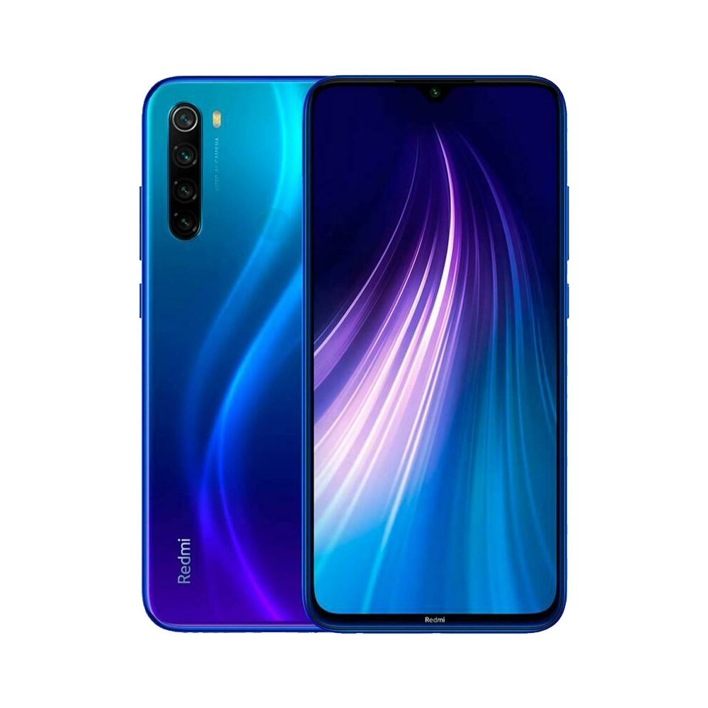

**State: Inactive**  
**Codename: ginkgo**  
**Contributors: [index986](https://github.com/index986/)**

### UEFI Status

| Feature            | Description               | State |
|:-------------------|:--------------------------|:-----:|
| Display            |                           | ✅    |
| Internal Storage   |                           | ✅    |
| Side Buttons       |                           | ✅    |
| USB Host Mode      |                           | ✅    |
| USB Device Mode    |                           | ❌    |
| USB Power Delivery |                           | ✅    |
| Mass Storage       | Needs Device mode         | ❌    |
| SD Card            |                           | ❌    |
| Windows Boot       |                           | ❌    |
| Linux Boot         |                           | ❌    |

---

<b><strong>Snapdragon 662 Devices</strong></b>

 

<table>
<tr><td>

> [!IMPORTANT]
> Only 23H2 Windows Builds and Lower are able to Boot.

</td></tr>
</table>

<b><strong>Motorola Devices</strong></b>

## Motorola Moto G30

**State: Inactive**  
**Codename: caprip**  
**Contributors: [Vicente Cortes](https://github.com/vicenteicc2008/)**

### UEFI Status

| Feature            | Description                     | State |
|:-------------------|:--------------------------------|:-----:|
| Display            |                                 | ✅    |
| Internal Storage   |                                 | ✅    |
| Side Buttons       | Pwr Button is Mapped as SUSPEND | ⚠️    |
| USB Host Mode      |                                 | ❌    |
| USB Device Mode    |                                 | ✅    |
| USB Power Delivery |                                 | ❌    |
| Mass Storage       |                                 | ❔    |
| SD Card            |                                 | ❌    |
| Windows Boot       |                                 | ✅    |
| Linux Boot         |                                 | ❌    |

### OS Status

<table>
<tr><th>Windows</th></tr>
<tr><td>

| Feature              | Description  | State |
|:---------------------|:-------------|:-----:|
| Internal Storage     |              | ✅    |
| SD Card              |              | ❌    |
| Side Buttons         |              | ❌    |
| Proximity Sensor     |              | ❌    |
| Light Sensor         |              | ❌    |
| Accelerometer Sensor |              | ❌    |
| Gyroscope Sensor     |              | ❌    |
| Fingerprint Sensor   |              | ❌    |
| NFC Sensor           |              | ❌    |
| Temperature Sensor   |              | ❌    |
| Battery              |              | ❌    |
| USB Host Mode        |              | ❌    |
| USB Device Mode      |              | ❌    |
| USB Power Delivery   |              | ❌    |
| Charging             |              | ❌    |
| WLAN                 |              | ❌    |
| CPU                  | 4 Cores only | ⚠️    |
| Touchscreen          |              | ❌    |
| Bluetooth            |              | ❌    |
| GPS                  |              | ❌    |
| Speakers             |              | ❌    |
| 3.5mm Audio Jack     |              | ❌    |
| Microphone           |              | ❌    |
| GPU                  |              | ❌    |
| Camera               |              | ❌    |
| Mobile Data          |              | ❌    |
| Display              |              | ✅    |
| Vibration            |              | ❌    |

</td></tr>
</table>

## Motorola Moto G9 Power

**State: Inactive**  
**Codename: cebu**  
**Contributors: [remtrik](https://github.com/remtrik/), [hiprivsid](https://github.com/hiprivsid/)**

### UEFI Status

| Feature            | Description       | State |
|:-------------------|:------------------|:-----:|
| Display            |                   | ✅    |
| Internal Storage   |                   | ✅    |
| Side Buttons       |                   | ✅    |
| USB Host Mode      |                   | ✅    |
| USB Device Mode    |                   | ❌    |
| USB Power Delivery |                   | ❌    |
| Mass Storage       | Needs Device Mode | ❌    |
| SD Card            |                   | ❌    |
| Windows Boot       |                   | ❌    |
| Linux Boot         |                   | ❌    |

<b><strong>Samsung Devices</strong></b>

## Samsung Galaxy Tab A7 10.4 (2020)

<table>
<tr><td>

> [!CAUTION]
> `BIT-8` Version is Required on this Phone!

</td></tr>
</table>

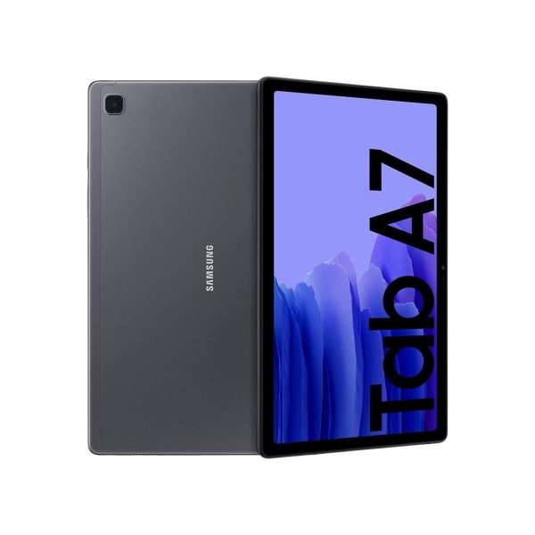

**State: Inactive**  
**Codename: gta4l**  
**Contributors: [V6lhost](https://github.com/V6lhost/)**

### UEFI Status

| Feature            | Description              | State |
|:-------------------|:-------------------------|:-----:|
| Display            |                          | ✅    |
| Internal Storage   |                          | ✅    |
| Side Buttons       | Only Volume Buttons      | ⚠️    |
| USB Host Mode      |                          | ✅    |
| USB Device Mode    |                          | ❌    |
| USB Power Delivery |                          | ✅    |
| Mass Storage       | Reboots                  | ❌    |
| SD Card            |                          | ❌    |
| Windows Boot       |                          | ❔    |
| Linux Boot         |                          | ❌    |

<b><strong>Xiaomi Devices</strong></b>

## Xiaomi Redmi 9T

**State: Inactive**  
**Codename: lime**  
**Contributors: [Robotix](https://github.com/Robotix22/)**

### UEFI Status

| Feature            | Description                              | State |
|:-------------------|:-----------------------------------------|:-----:|
| Display            |                                          | ✅    |
| Internal Storage   |                                          | ✅    |
| Side Buttons       |                                          | ✅    |
| USB Host Mode      |                                          | ❌    |
| USB Device Mode    |                                          | ✅    |
| USB Power Delivery |                                          | ❌    |
| Mass Storage       |                                          | ✅    |
| SD Card            | Tries to Init non-existent eMMC instead? | ❌    |
| Windows Boot       |                                          | ✅    |
| Linux Boot         |                                          | ❔    |

### OS Status

<table>
<tr><th>Windows</th></tr>
<tr><td>

> [!IMPORTANT]
> Widndows 11 24H2 Builds and above do not Boot!

| Feature              | Description  | State |
|:---------------------|:-------------|:-----:|
| Internal Storage     |              | ✅    |
| SD Card              |              | ❌    |
| Side Buttons         |              | ❌    |
| Proximity Sensor     |              | ❌    |
| Light Sensor         |              | ❌    |
| Accelerometer Sensor |              | ❌    |
| Compass Sensor       |              | ❌    |
| Gyroscope Sensor     |              | ❌    |
| Fingerprint Sensor   |              | ❌    |
| NFC Sensor           |              | ❌    |
| Temperature Sensor   |              | ❌    |
| Battery              |              | ❌    |
| USB Host Mode        |              | ❌    |
| USB Device Mode      |              | ❔    |
| USB Power Delivery   |              | ❌    |
| Charging             |              | ❌    |
| WLAN                 |              | ❌    |
| CPU                  | 4 Cores only | ⚠️    |
| Touchscreen          |              | ❌    |
| Bluetooth            |              | ❌    |
| GPS                  |              | ❌    |
| Speakers             |              | ❌    |
| 3.5mm Audio Jack     |              | ❌    |
| Microphone           |              | ❌    |
| GPU                  |              | ❌    |
| Camera               |              | ❌    |
| Mobile Data          |              | ❌    |
| Display              |              | ✅    |
| Vibration            |              | ❌    |

</td></tr>
</table>

## Xiaomi Poco M3

**State: Inactive**  
**Codename: citrus**  
**Contributors: [Robotix](https://github.com/Robotix22), [9.8.7.6](https://github.com/Daniel224455), [NUC](https://github.com/iNUCi), [Aistop](https://github.com/AistopGit), [All_One1](https://github.com/Ost268), [Heyylucazzz](https://github.com/heyylucazzz)**

### UEFI Status

| Feature            | Description       | State |
|:-------------------|:------------------|:-----:|
| Display            |                   | ✅    |
| Internal Storage   |                   | ✅    |
| Side Buttons       |                   | ✅    |
| USB Host Mode      |                   | ❌    |
| USB Device Mode    |                   | ✅    |
| USB Power Delivery |                   | ❌    |
| Mass Storage       |                   | ✅    |
| SD Card            |                   | ✅    |
| Windows Boot       |                   | ❌    |
| Linux Boot         |                   | ✅    |

### OS Status

<table>
<tr><th>Linux</th></tr>
<tr><td>

| Feature              | Description  | State |
|:---------------------|:-------------|:-----:|
| Internal Storage     |              | ✅    |
| SD Card              |              | ✅    |
| Side Buttons         |              | ❌    |
| Proximity Sensor     |              | ❌    |
| Light Sensor         |              | ❌    |
| Accelerometer Sensor |              | ❌    |
| Compass Sensor       |              | ❌    |
| Gyroscope Sensor     |              | ❌    |
| Fingerprint Sensor   |              | ❌    |
| NFC Sensor           |              | ❌    |
| Temperature Sensor   |              | ❌    |
| Battery              |              | ❌    |
| USB Host Mode        |              | ❌    |
| USB Device Mode      |              | ✅    |
| USB Power Delivery   |              | ❌    |
| Charging             |              | ❌    |
| WLAN                 |              | ❌    |
| CPU                  | 4 Cores only | ⚠️    |
| Touchscreen          |              | ❌    |
| Bluetooth            |              | ❌    |
| GPS                  |              | ❌    |
| Speakers             |              | ❌    |
| 3.5mm Audio Jack     |              | ❌    |
| Microphone           |              | ❌    |
| GPU                  |              | ❌    |
| Camera               |              | ❌    |
| Mobile Data          |              | ❌    |
| Display              |              | ✅    |
| Vibration            |              | ❌    |

</td></tr>
</table>

---

<b><strong>Snapdragon 660 Devices</strong></b>

 

<table>
<tr><td>

> [!IMPORTANT]
> Only 23H2 Windows Builds and Lower are able to Boot.

</td></tr>
</table>

<b><strong>Xiaomi Devices</strong></b>

## Xiaomi Redmi Note 7

**State: Inactive**  
**Codename: lavender**  
**Contributors: [index986](https://github.com/index986)**

### UEFI Status

| Feature            | Description                    | State |
|:-------------------|:-------------------------------|:-----:|
| Display            |                                | ✅    |
| Internal Storage   |                                | ✅    |
| Side Buttons       |                                | ✅    |
| USB Host Mode      |                                | ❌    |
| USB Device Mode    |                                | ✅    |
| USB Power Delivery |                                | ❌    |
| Mass Storage       |                                | ✅    |
| SD Card            |                                | ✅    |
| Windows Boot       |                                | ⚠️    |
| Linux Boot         |                                | ❔    |

### OS Status

<table>
<tr><th>Windows</th></tr>
<tr><td>

> [!IMPORTANT]
> Only Windows PE Boots.

| Feature              | Description                                | State |
|:---------------------|:-------------------------------------------|:-----:|
| Internal Storage     |                                            | ❌    |
| SD Card              |                                            | ❌    |
| Side Buttons         |                                            | ❌    |
| Proximity Sensor     |                                            | ❌    |
| Light Sensor         |                                            | ❌    |
| Accelerometer Sensor |                                            | ❌    |
| Compass Sensor       |                                            | ❌    |
| Gyroscope Sensor     |                                            | ❌    |
| Fingerprint Sensor   |                                            | ❌    |
| Hall Sensor          |                                            | ❌    |
| Temperature Sensor   |                                            | ❌    |
| Battery              |                                            | ❌    |
| USB Host Mode        |                                            | ❌    |
| USB Device Mode      |                                            | ❔    |
| USB Power Delivery   |                                            | ❌    |
| Charging             |                                            | ❌    |
| WLAN                 |                                            | ❌    |
| CPU                  |                                            | ✅    |
| Touchscreen          |                                            | ❌    |
| Bluetooth            |                                            | ❌    |
| GPS                  |                                            | ❌    |
| Speakers             |                                            | ❌    |
| 3.5mm Audio Jack     |                                            | ❌    |
| Microphone           |                                            | ❌    |
| GPU                  |                                            | ❌    |
| Camera               |                                            | ❌    |
| Mobile Data          |                                            | ❌    |
| Display              |                                            | ✅    |
| Vibration            |                                            | ❌    |

</td></tr>
</table>

---

<b><strong>Snapdragon 636 Devices</strong></b>

 

<table>
<tr><td>

> [!IMPORTANT]
> Only 23H2 Windows Builds and Lower are able to Boot.

</td></tr>
</table>

<b><strong>Xiaomi Devices</strong></b>

## Xiaomi Mi Max 3

**State: Inactive**  
**Codename: nitrogen**  
**Contributors: [Robotix](https://github.com/Robotix22/), [Aistop](https://github.com/AistopGit/)**

### UEFI Status

| Feature            | Description | State |
|:-------------------|:------------|:-----:|
| Display            |             | ✅    |
| Internal Storage   |             | ✅    |
| Side Buttons       |             | ✅    |
| USB Host Mode      |             | ❌    |
| USB Device Mode    |             | ✅    |
| USB Power Delivery |             | ❌    |
| Mass Storage       |             | ✅    |
| SD Card            |             | ✅    |
| Windows Boot       |             | ✅    |
| Linux Boot         |             | ✅    |

### OS Status

<table>
<tr><th>Windows</th><th>Linux</th></tr>
<tr><td>

> [!IMPORTANT]
> Needs [Windows Drivers](https://github.com/AistopGit/windows_oem_xiaomi_nitrogen).

| Feature              | Description                                | State |
|:---------------------|:-------------------------------------------|:-----:|
| Internal Storage     |                                            | ✅    |
| SD Card              |                                            | ❌    |
| Side Buttons         |                                            | ❌    |
| Proximity Sensor     |                                            | ❌    |
| Light Sensor         |                                            | ❌    |
| Accelerometer Sensor |                                            | ❌    |
| Compass Sensor       |                                            | ❌    |
| Gyroscope Sensor     |                                            | ❌    |
| Fingerprint Sensor   |                                            | ❌    |
| Hall Sensor          |                                            | ❌    |
| Temperature Sensor   |                                            | ❌    |
| Battery              |                                            | ❌    |
| USB Host Mode        |                                            | ❌    |
| USB Device Mode      |                                            | ❔     |
| USB Power Delivery   |                                            | ❌    |
| Charging             |                                            | ❌    |
| WLAN                 |                                            | ❌    |
| CPU                  |                                            | ✅    |
| Touchscreen          | Only Goodix GT9xx is supported             | ✅    |
| Bluetooth            |                                            | ❌    |
| GPS                  |                                            | ❌    |
| Speakers             |                                            | ❌    |
| 3.5mm Audio Jack     |                                            | ❌    |
| Microphone           |                                            | ❌    |
| GPU                  |                                            | ❌    |
| Camera               |                                            | ❌    |
| Mobile Data          |                                            | ❌    |
| Display              |                                            | ✅    |
| Vibration            |                                            | ❌    |

</td><td>

| Feature              | Description                       | State |
|:---------------------|:----------------------------------|:-----:|
| Internal Storage     |                                   | ❌    |
| SD Card              |                                   | ❌    |
| Side Buttons         |                                   | ❌    |
| Proximity Sensor     |                                   | ❌    |
| Light Sensor         |                                   | ❌    |
| Accelerometer Sensor |                                   | ❌    |
| Compass Sensor       |                                   | ❌    |
| Gyroscope Sensor     |                                   | ❌    |
| Fingerprint Sensor   |                                   | ❌    |
| Hall Sensor          |                                   | ❌    |
| Temperature Sensor   |                                   | ❌    |
| Battery              |                                   | ❌    |
| USB Host Mode        |                                   | ❌    |
| USB Device Mode      |                                   | ❔    |
| USB Power Delivery   |                                   | ❌    |
| Charging             |                                   | ❌    |
| WLAN                 |                                   | ❌    |
| CPU                  |                                   | ✅    |
| Touchscreen          |                                   | ❌    |
| Bluetooth            |                                   | ❌    |
| GPS                  |                                   | ❌    |
| Speakers             |                                   | ❌    |
| 3.5mm Audio Jack     |                                   | ❌    |
| Microphone           |                                   | ❌    |
| GPU                  |                                   | ❌    |
| Camera               |                                   | ❌    |
| Mobile Data          |                                   | ❌    |
| Display              |                                   | ✅    |
| Vibration            |                                   | ❌    |

</td></tr>
</table>

---

<b><strong>Tegra Devices</strong></b>

 

<b><strong>Tegra X1 Devices</strong></b>

 

<table>
<tr><td>

> [!IMPORTANT]
> Only 23H2 Windows Builds and Lower are able to Boot.

</td></tr>
</table>

<b><strong>Nintendo Devices</strong></b>

## Nintendo Switch (2017)

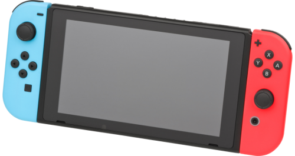

**State: Inactive**  
**Codename: nx**  
**Model: 0**  
**Contributors: [Robotix](https://github.com/Robotix22/)**

### UEFI Status

| Feature            | Description       | State |
|:-------------------|:------------------|:-----:|
| Display            | Wrong Orientation | ⚠️    |
| Internal Storage   |                   | ❌    |
| Joy Cons           |                   | ❌    |
| Side Buttons       | No Power Button   | ⚠️    |
| USB Host Mode      |                   | ❌    |
| USB Device Mode    |                   | ❌    |
| USB Power Delivery |                   | ❌    |
| SD Card            |                   | ❌    |
| Windows Boot       |                   | ❌    |
| Linux Boot         |                   | ❌    |

---

<b><strong>Tegra X1+ Devices</strong></b>

 

<table>
<tr><td>

> [!IMPORTANT]
> Only 23H2 Windows Builds and Lower are able to Boot.

</td></tr>
</table>

<b><strong>Nintendo Devices</strong></b>

## Nintendo Switch (2019)

**State: Inactive**  
**Codename: nx**  
**Model: 1**  
**Contributors: [Robotix](https://github.com/Robotix22/)**

### UEFI Status

| Feature            | Description       | State |
|:-------------------|:------------------|:-----:|
| Display            | Wrong Orientation | ⚠️    |
| Internal Storage   |                   | ❌    |
| Joy Cons           |                   | ❌    |
| Side Buttons       | No Power Button   | ⚠️    |
| USB Host Mode      |                   | ❌    |
| USB Device Mode    |                   | ❌    |
| USB Power Delivery |                   | ❌    |
| SD Card            |                   | ❌    |
| Windows Boot       |                   | ❌    |
| Linux Boot         |                   | ❌    |

